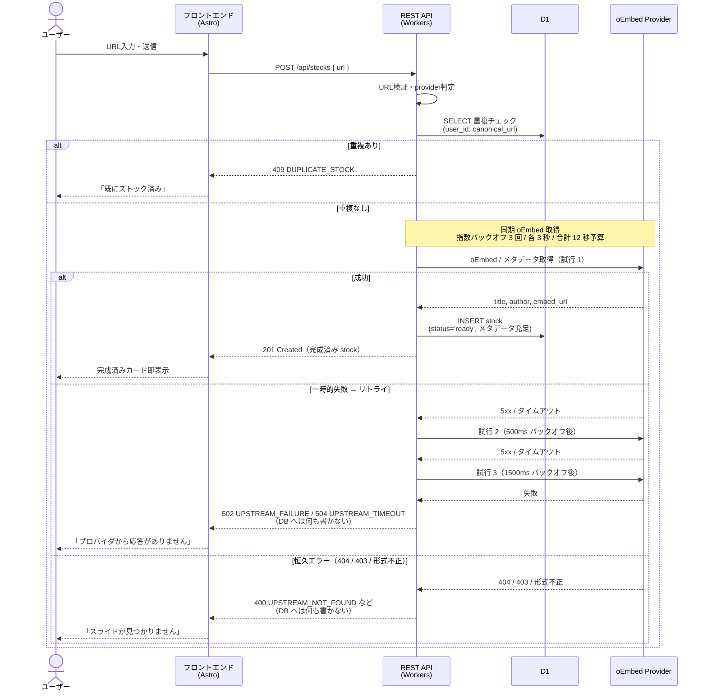
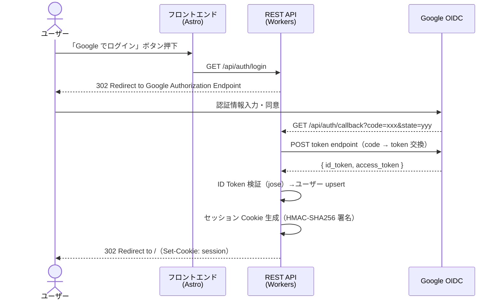
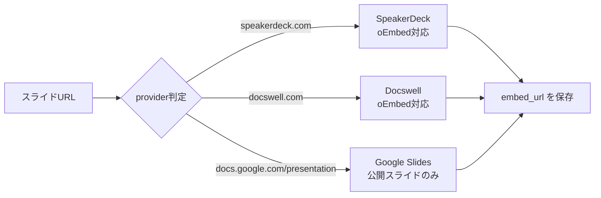

# アーキテクチャ仕様

> **インフラ層、CI/CD、Cookie・セッション管理、セキュリティ対策**

---

## §1 概要

本ドキュメントはシステムのインフラ構成、デプロイ方式、Cookie・セッション管理、オリジン構成、環境変数、およびセキュリティ対策を一元的に定義する。

認証エンドポイント（`/api/auth/*`）の処理フロー、ID Token 検証、セッション検証ミドルウェア、ユーザー upsert 等の API 実装仕様は [backend-spec.md](backend-spec.md) を参照。

---

## §2 システム全体構成

```mermaid
graph TB
    subgraph "Client"
        Browser[ブラウザ]
    end

    subgraph "Cloudflare Pages"
        Frontend["フロントエンド<br/>(Astro / TypeScript)"]
    end

    subgraph "Cloudflare Workers"
        API["REST API<br/>(Workers)"]
    end

    subgraph "Cloudflare Storage"
        D1[(D1<br/>SQLite)]
    end

    subgraph "External"
        Google["Google OIDC"]
        SpeakerDeck["SpeakerDeck<br/>oEmbed API"]
        Docswell["Docswell<br/>oEmbed API"]
        GoogleSlides["Google Slides"]
    end

    Browser -->|HTTPS| Frontend
    Browser -->|REST API| API
    API -->|SQL| D1
    API -->|oEmbed fetch (sync)| SpeakerDeck
    API -->|oEmbed fetch (sync)| Docswell
    API -->|metadata fetch (sync)| GoogleSlides
    Browser -->|OIDC| Google
    API -->|JWT検証| Google
```

> **MVP の構成方針:** Cloudflare Queues / Queue Consumer は使用しない。`POST /api/stocks` の API ハンドラ内でプロバイダの oEmbed / メタデータ取得まで同期実行してから 201 を返す（backend-spec.md）。将来の非同期化に備えて `stocks.status` カラムは `pending` / `failed` を許容するスキーマで残してあるが（data-model-spec.md）、MVP では Queue を経由する実行パスは存在しない。

### §2.1 リクエストフロー

#### スライド登録フロー（同期モデル）



> **設計判断:** 旧仕様では `INSERT stock(status=pending)` → `enqueue` → Consumer が非同期に `UPDATE` → `status=ready/failed` の流れだったが、ユーザー体験上「pending カード」「failed カード」が並ぶ複雑さを避けるため同期モデルに統一した。stock の作成は「成功 + 完成済み」または「作成しない（エラー）」の二択。詳細は frontend-spec.md §5.3.1 / §7.3、backend-spec.md を参照。

#### 認証フロー（Authorization Code Flow）



> 認証エンドポイントの詳細は [backend-spec.md](backend-spec.md) を参照。セッション Cookie の仕様は本ドキュメント §4 を参照。

---

## §3 デプロイ構成

### §3.1 技術構成

#### フロントエンド

| 項目 | 内容 |
|------|------|
| フレームワーク | Astro (TypeScript) |
| デプロイ先 | Cloudflare Pages |
| API連携 | REST API (HTTP) / 完全分離構成 |

選定理由:
- JS最小構成で高速
- 学習コストが低い
- API境界が明確で将来移植しやすい

#### API

| 項目 | 内容 |
|------|------|
| ランタイム | Cloudflare Workers |
| 設計 | REST API / JSONベース通信 |
| 認証 | セッション Cookie（HMAC-SHA256 署名） |
| オリジン | Pages と Workers は同一オリジン（`/api/*` を Workers にルーティング） |

設計原則:
- フロントからはHTTPのみ利用
- DBやCloudflare固有APIへ直接依存しない

#### 認証

| 項目 | 内容 |
|------|------|
| 方式 | Google Login (OIDC) |
| 取得情報 | sub (Google Subject ID), email, name |
| 検証 | API側でJWT検証 → セッション発行 |

#### データベース

| 項目 | 内容 |
|------|------|
| サービス | Cloudflare D1 (SQLiteベース) |
| マイグレーション | 管理あり |
| 移植性 | PostgreSQL等へ移行可能な設計 |

SQL設計方針:
- 外部キー明示
- 正規化を意識
- ベンダー依存構文を避ける

#### oEmbed メタデータ取得（同期）

| 項目 | 内容 |
|------|------|
| 実行タイミング | `POST /api/stocks` のリクエスト内で同期実行 |
| プロバイダ | SpeakerDeck oEmbed / Docswell oEmbed / Google Slides 公開 HTML |
| リトライ | 指数バックオフ 3 回（0ms → 500ms → 1500ms）/ 各 3 秒タイムアウト / 合計 12 秒予算 |
| 失敗時の扱い | DB へ INSERT しない（ロールバック相当）。502 `UPSTREAM_FAILURE` / 504 `UPSTREAM_TIMEOUT` を返す |

設計方針:
- API レスポンスは「成功 + 完成済みストック」または「作成しない（エラー）」の二択
- `pending` / `failed` 状態を UI に持ち込まないことを優先（ポーリング・再取得 UI が不要になる）
- 将来非同期化（Cloudflare Queues 等）に切り替える余地は `stocks.status` カラムをスキーマに残すことで確保（data-model-spec.md）

詳細は backend-spec.md を参照。

### §3.2 対応プロバイダ



処理方針:
- URLからprovider判定
- 可能な場合はoEmbed利用
- embed_urlのみ保存 (embed_htmlは保存しない)
- サムネイル画像の再配信は行わない

### §3.3 コスト最適化方針

| 方針 | 内容 |
|------|------|
| R2 | 使用しない (サムネ保存しない) |
| 画像 | 元URL参照 |
| Workers | 無料枠活用 |
| D1 | 無料枠活用 |
| Cloudflare Queues | MVP では使用しない（同期モデル） |
| 転送量 | JSを最小化して削減 |

**目標: 月額ほぼゼロ〜数百円以内**

### §3.4 設計原則

1. フロントとAPIは完全分離
2. APIは純粋なHTTPインターフェース
3. Cloudflare固有機能への依存は最小化
4. 将来的なクラウド移行を想定した抽象化
5. MVPは小さく作り、後から拡張可能にする

---

## §4 Cookie・セッション管理

### §4.1 方式: 署名付き Cookie（Stateless）

| 方式 | メリット | デメリット |
|------|---------|-----------|
| **署名付き Cookie** | D1アクセス不要で高速。実装シンプル。 | サーバー側でセッション無効化が即座にできない。 |
| D1 セッションテーブル | 個別セッション無効化が可能。 | 毎リクエストD1クエリが必要。D1の無料枠消費。 |

**署名付き Cookie（HMAC-SHA256）を採用する。** 理由:
1. MVP ではセッション即時無効化の要件がない（個人利用想定）
2. D1 の読み取りクエリを削減し、無料枠を温存できる
3. Workers の Web Crypto API で HMAC 署名/検証が可能
4. 将来、セッションテーブルへの移行も容易（Cookie のペイロードを session_id に差し替えるだけ）

### §4.2 Cookie ペイロード形式

```
{base64url(payload)}.{base64url(signature)}
```

**payload（JSON）:**
```json
{
  "uid": "user-uuid",
  "exp": 1700000000
}
```

- `uid`: `users.id`（UUID）— ユーザーテーブル定義は [data-model-spec.md](data-model-spec.md) を参照
- `exp`: 有効期限（Unix timestamp）

**署名:**
```
HMAC-SHA256(base64url(payload), SESSION_SECRET)
```

### §4.3 セッション Cookie 属性

| 属性 | 値 | 理由 |
|------|-----|------|
| Name | `session` | シンプルで明確 |
| Value | `{payload}.{signature}` | 上記ペイロード形式 |
| HttpOnly | `true` | JS からアクセス不可にし XSS 対策 |
| Secure | 環境依存 | 本番: `true`（HTTPS）。ローカル: `false`（HTTP）。`CALLBACK_URL` のスキームで判定 |
| SameSite | `Lax` | CSRF 対策。GET リダイレクト（OAuth callback）は許可 |
| Path | `/api` | API エンドポイントのみに送信。フロントエンドの静的配信に不要な Cookie を付与しない |
| Max-Age | `604800` | 7日間（= 7 × 24 × 60 × 60） |
| Domain | 省略 | 発行元ドメインに自動適用 |

### §4.4 セッション有効期限

- **有効期限: 7日間**
- ペイロードの `exp` で制御
- Cookie の `Max-Age` とペイロードの `exp` は同じ有効期限を示す
- `exp` を過ぎたセッションは無効として 401 を返す

> セッション検証ミドルウェアの処理フロー（署名検証・`exp` チェック・ユーザー存在確認）および `TEST_MODE` との共存方式は [backend-spec.md](backend-spec.md) を参照。

---

## §5 オリジン構成・ローカル開発

### §5.1 オリジン構成

| 環境 | フロントエンド | API | 構成 |
|------|-------------|-----|------|
| 本番 | `https://slide-stock.gorou.dev` | `https://slide-stock.gorou.dev/api/*` | 同一オリジン（Pages + Workers） |
| ローカル | `http://localhost:4321` | `http://localhost:8787/api/*` | Vite プロキシで同一オリジン化 |

### §5.2 ローカル開発のプロキシ構成

ローカルでは Astro（:4321）と Workers（:8787）が別ポートで起動するため、
`astro.config.mjs` に Vite プロキシを設定し、ブラウザからは `:4321` のみでアクセスする。

```javascript
// astro.config.mjs
export default defineConfig({
  vite: {
    server: {
      proxy: {
        '/api': 'http://localhost:8787',
      },
    },
  },
});
```

**ローカルでの Google ログインフロー:**

```
1. ブラウザ: http://localhost:4321 でフロントエンドにアクセス
2. 「Google でログイン」→ GET http://localhost:4321/api/auth/login
3. Vite プロキシが :8787 に転送 → Worker が Google にリダイレクト
4. Google 認証後 → http://localhost:4321/api/auth/callback?code=xxx&state=yyy
5. Vite プロキシが :8787 に転送 → Worker が Cookie 発行 + 302 /
6. ブラウザが http://localhost:4321/ に遷移（Astro フロントエンド）✓
```

> **ポイント:** Cookie は `:4321` のレスポンスとしてブラウザに届くため、
> 以降の `/api/*` リクエストにも Cookie が自動付与される。

> 認証エンドポイント（`GET /api/auth/login`、`GET /api/auth/callback`）の処理仕様は [backend-spec.md](backend-spec.md) を参照。

### §5.3 コールバック URL

| 環境 | CALLBACK_URL |
|------|-------------|
| ローカル | `http://localhost:4321/api/auth/callback` |
| 本番 | `https://slide-stock.gorou.dev/api/auth/callback` |

### §5.4 Google Cloud Console 設定

- **承認済みの JavaScript オリジン:**
  - `http://localhost:4321`（開発）
  - `https://slide-stock.gorou.dev`（本番）
- **承認済みのリダイレクト URI:**
  - `http://localhost:4321/api/auth/callback`（開発）
  - `https://slide-stock.gorou.dev/api/auth/callback`（本番）

### §5.5 ローカル起動手順

```bash
# ターミナル 1: API
npm run dev:worker      # → http://localhost:8787

# ターミナル 2: フロントエンド（プロキシ込み）
npm run dev             # → http://localhost:4321
                        #   /api/* は :8787 に自動転送
```

---

## §6 環境変数・Secrets

| 変数名 | 種類 | 説明 | 取得元 |
|--------|------|------|--------|
| `GOOGLE_CLIENT_ID` | Secret | Google OAuth Client ID | Google Cloud Console |
| `GOOGLE_CLIENT_SECRET` | Secret | Google OAuth Client Secret | Google Cloud Console |
| `SESSION_SECRET` | Secret | セッション Cookie 署名用キー（32バイト以上のランダム文字列） | 自分で生成（`openssl rand -hex 32`） |
| `CALLBACK_URL` | 環境変数 | コールバック URL（環境ごとに異なる） | wrangler.toml / .dev.vars |
| `TEST_MODE` | 環境変数 | テストモードフラグ（`"true"` で bypass 有効） | .dev.vars のみ |

> **注:** `FRONTEND_URL` は不要。本番は同一オリジン、ローカルは Vite プロキシで同一オリジン化するため、
> コールバック後のリダイレクトは相対パス（`/`）で行う。

### §6.1 .dev.vars（開発環境 / gitignore 対象）

```
GOOGLE_CLIENT_ID=xxx.apps.googleusercontent.com
GOOGLE_CLIENT_SECRET=GOCSPX-xxx
SESSION_SECRET=<openssl rand -hex 32 の出力>
CALLBACK_URL=http://localhost:4321/api/auth/callback
TEST_MODE=true
```

### §6.2 本番環境（Cloudflare Pages）

本プロジェクトの本番は **Cloudflare Pages**（`wrangler pages deploy dist/`）で動く。
そのため `wrangler.toml` には `pages_build_output_dir = "./dist"` が必須。これを忘れると
Wrangler は本ファイルを `Ignoring configuration file for now` として完全に無視し、
`[vars]` も `[[d1_databases]]` も本番に反映されず、`env.GOOGLE_CLIENT_ID` 等が
`undefined` になる（→ `?client_id=undefined` で Google が 404 を返す事故が起こる、
0.0.7.1 のリグレッション対象）。

#### Plain な環境変数（`wrangler.toml` の `[vars]` 経由）

| 変数 | 設定場所 |
|------|---------|
| `CALLBACK_URL` | `wrangler.toml` の `[vars]` |
| `SESSION_MAX_AGE`（任意） | 同上 |

#### Secrets（`wrangler.toml` には書けない、別建てで設定する）

Cloudflare Dashboard（Pages プロジェクト → Settings → Environment variables / Secrets）か
CLI で個別に登録する:

```bash
wrangler pages secret put GOOGLE_CLIENT_ID --project-name=slide-stock
wrangler pages secret put GOOGLE_CLIENT_SECRET --project-name=slide-stock
wrangler pages secret put SESSION_SECRET --project-name=slide-stock
```

Pages プロジェクト名は Cloudflare Dashboard で確認（`slide-stock.pages.dev` であれば
プロジェクト名は `slide-stock`）。

### §6.3 早期検証（防御）

`worker/handlers/auth.ts` の `handleLogin` / `handleCallback` 冒頭で
`findMissingAuthEnv(env)` を呼び、上記 4 つの値が `string` で空文字列でないことを
検証する。1 つでも欠けたら **500 `CONFIG_ERROR`** を返し、欠けたキー名を
`auth_config_error` ログに記録する。これで万一 Secrets を再設定し忘れて再デプロイ
しても「Google にブロークン URL を返す」ことはなく、サーバーログから即修正できる。

> 認証ハンドラの実装詳細は [backend-spec.md](backend-spec.md) を参照。

---

## §7 セキュリティ対策

### §7.1 CSRF 対策

- `state` パラメータ + Cookie 照合で Authorization Code Flow の CSRF を防止
- セッション Cookie は `SameSite=Lax` で通常の CSRF 攻撃を防止
- 状態変更 API（POST/PUT/DELETE）は Cookie ベースの認証のみで呼び出されるため、`SameSite=Lax` で十分

### §7.2 XSS 対策

- セッション Cookie は `HttpOnly` で JS からアクセス不可
- ID Token やセッション情報をブラウザの localStorage/sessionStorage に保存しない

### §7.3 Token 漏洩対策

- Authorization Code は一度使い切り（Google 側で管理）
- ID Token は API 内でのみ使用し、フロントエンドに返却しない
- SESSION_SECRET は環境変数で管理し、コードにハードコードしない

### §7.4 署名キーのローテーション

- MVP では SESSION_SECRET の手動ローテーションで対応
- ローテーション時は新しいキーで署名し、検証時は旧キーもフォールバックで確認する仕組みを将来検討
