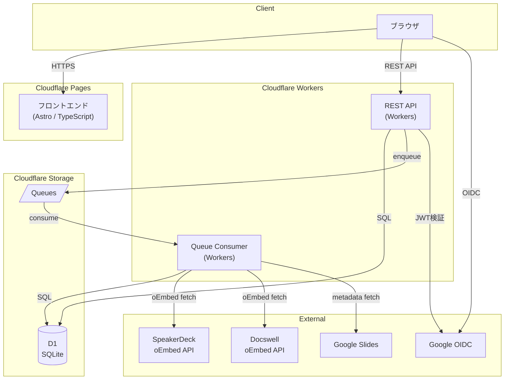
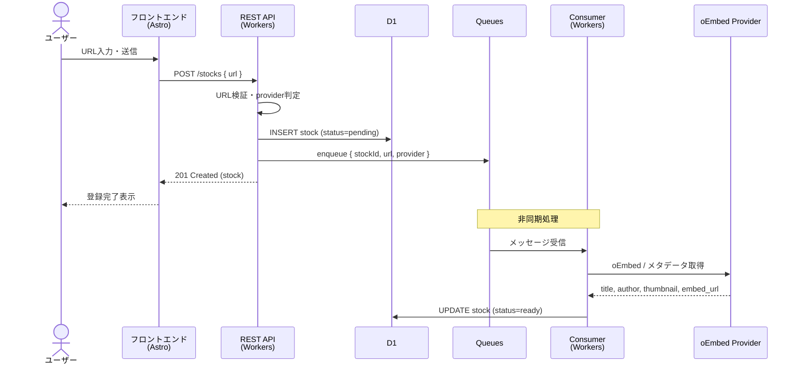
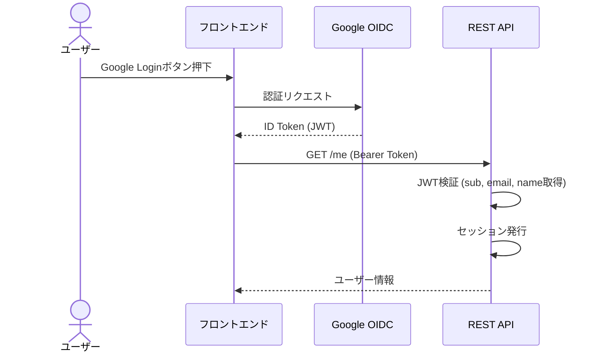
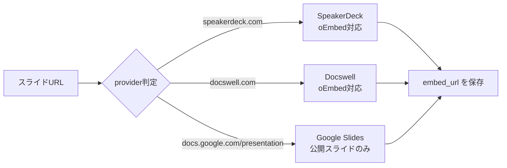

# アーキテクチャ仕様

## システム全体構成

---

## リクエストフロー

### スライド登録フロー

### 認証フロー

---

## 技術構成

### フロントエンド

| 項目 | 内容 |
|------|------|
| フレームワーク | Astro (TypeScript) |
| デプロイ先 | Cloudflare Pages |
| API連携 | REST API (HTTP) / 完全分離構成 |

選定理由:
- JS最小構成で高速
- 学習コストが低い
- API境界が明確で将来移植しやすい

### API

| 項目 | 内容 |
|------|------|
| ランタイム | Cloudflare Workers |
| 設計 | REST API / JSONベース通信 |
| 認証 | Bearer トークン前提 (Cookie併用可) |

設計原則:
- フロントからはHTTPのみ利用
- DBやCloudflare固有APIへ直接依存しない

### 認証

| 項目 | 内容 |
|------|------|
| 方式 | Google Login (OIDC) |
| 取得情報 | sub (Google Subject ID), email, name |
| 検証 | API側でJWT検証 → セッション発行 |

### データベース

| 項目 | 内容 |
|------|------|
| サービス | Cloudflare D1 (SQLiteベース) |
| マイグレーション | 管理あり |
| 移植性 | PostgreSQL等へ移行可能な設計 |

SQL設計方針:
- 外部キー明示
- 正規化を意識
- ベンダー依存構文を避ける

### 非同期処理

| 項目 | 内容 |
|------|------|
| サービス | Cloudflare Queues |
| 処理内容 | URL登録後のメタデータ取得 (oEmbed) |
| メッセージ形式 | JSON (schemaVersion付き) |

設計方針:
- APIは即時レスポンス
- メタデータ取得はQueue経由でWorker Consumerが処理

---

## 対応プロバイダ

処理方針:
- URLからprovider判定
- 可能な場合はoEmbed利用
- embed_urlのみ保存 (embed_htmlは保存しない)
- サムネイル画像の再配信は行わない

---

## コスト最適化方針

| 方針 | 内容 |
|------|------|
| R2 | 使用しない (サムネ保存しない) |
| 画像 | 元URL参照 |
| Workers | 無料枠活用 |
| D1 | 無料枠活用 |
| Queues | 無料枠活用 |
| 転送量 | JSを最小化して削減 |

**目標: 月額ほぼゼロ〜数百円以内**

---

## 設計原則

1. フロントとAPIは完全分離
2. APIは純粋なHTTPインターフェース
3. Cloudflare固有機能への依存は最小化
4. 将来的なクラウド移行を想定した抽象化
5. MVPは小さく作り、後から拡張可能にする
