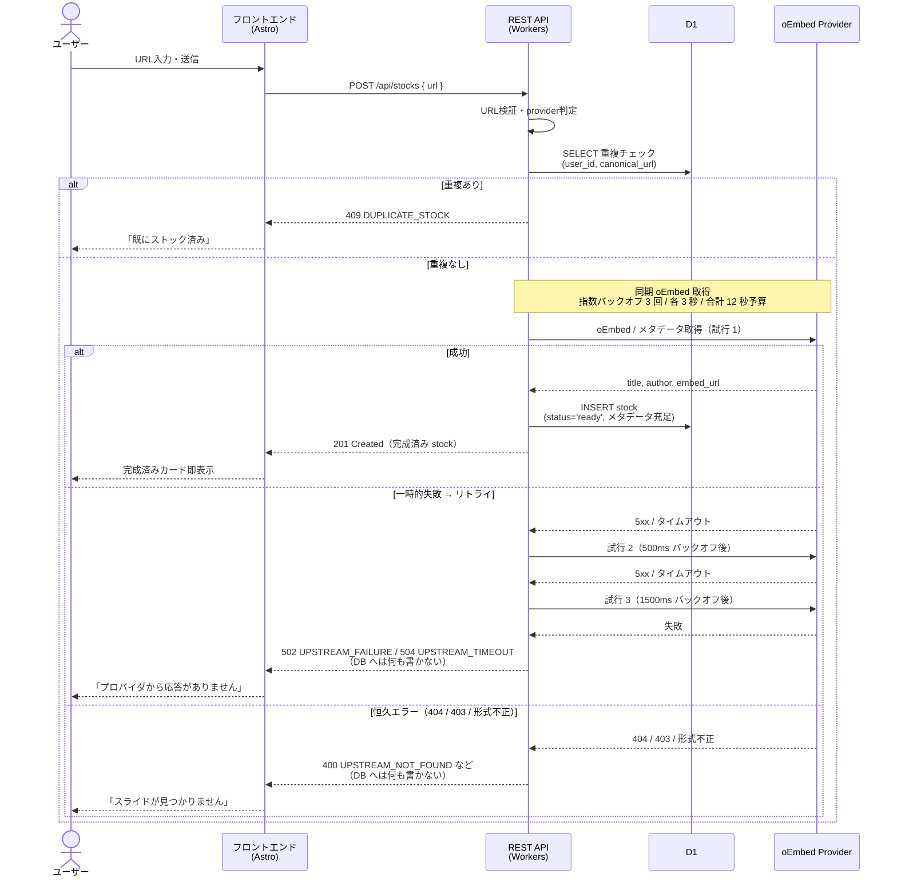
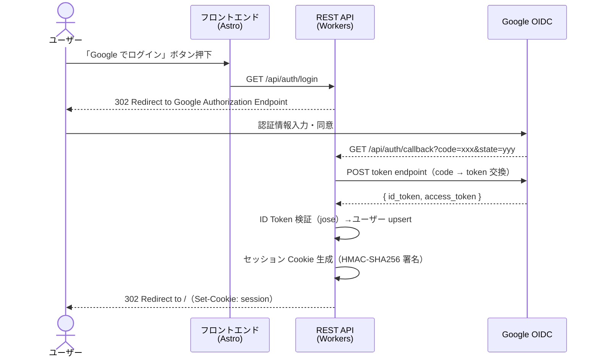
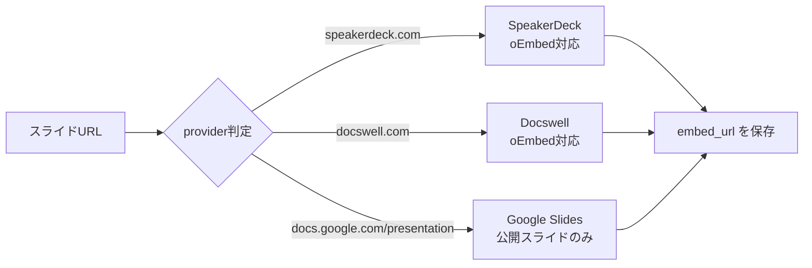

# アーキテクチャ仕様

## システム全体構成

```mermaid
graph TB
    subgraph "Client"
        Browser[ブラウザ]
    end

    subgraph "Cloudflare Pages"
        Frontend["フロントエンド<br/>(Astro / TypeScript)"]
    end

    subgraph "Cloudflare Workers"
        API["REST API<br/>(Workers)"]
    end

    subgraph "Cloudflare Storage"
        D1[(D1<br/>SQLite)]
    end

    subgraph "External"
        Google["Google OIDC"]
        SpeakerDeck["SpeakerDeck<br/>oEmbed API"]
        Docswell["Docswell<br/>oEmbed API"]
        GoogleSlides["Google Slides"]
    end

    Browser -->|HTTPS| Frontend
    Browser -->|REST API| API
    API -->|SQL| D1
    API -->|oEmbed fetch (sync)| SpeakerDeck
    API -->|oEmbed fetch (sync)| Docswell
    API -->|metadata fetch (sync)| GoogleSlides
    Browser -->|OIDC| Google
    API -->|JWT検証| Google
```

> **MVP の構成方針:** Cloudflare Queues / Queue Consumer は使用しない。`POST /api/stocks` の API ハンドラ内でプロバイダの oEmbed / メタデータ取得まで同期実行してから 201 を返す（oembed-spec.md §5 / stock-api-spec.md §3）。将来の非同期化に備えて `stocks.status` カラムは `pending` / `failed` を許容するスキーマで残してあるが（database.md）、MVP では Queue を経由する実行パスは存在しない。

---

## リクエストフロー

### スライド登録フロー（同期モデル）

```mermaid
sequenceDiagram
    actor User as ユーザー
    participant FE as フロントエンド<br/>(Astro)
    participant API as REST API<br/>(Workers)
    participant D1 as D1
    participant P as oEmbed Provider

    User->>FE: URL入力・送信
    FE->>API: POST /api/stocks { url }
    API->>API: URL検証・provider判定
    API->>D1: SELECT 重複チェック<br/>(user_id, canonical_url)
    alt 重複あり
        API-->>FE: 409 DUPLICATE_STOCK
        FE-->>User: 「既にストック済み」
    else 重複なし
        Note over API,P: 同期 oEmbed 取得<br/>指数バックオフ 3 回 / 各 3 秒 / 合計 12 秒予算
        API->>P: oEmbed / メタデータ取得（試行 1）
        alt 成功
            P-->>API: title, author, embed_url
            API->>D1: INSERT stock<br/>(status='ready', メタデータ充足)
            API-->>FE: 201 Created（完成済み stock）
            FE-->>User: 完成済みカード即表示
        else 一時的失敗 → リトライ
            P-->>API: 5xx / タイムアウト
            API->>P: 試行 2（500ms バックオフ後）
            P-->>API: 5xx / タイムアウト
            API->>P: 試行 3（1500ms バックオフ後）
            P-->>API: 失敗
            API-->>FE: 502 UPSTREAM_FAILURE / 504 UPSTREAM_TIMEOUT<br/>（DB へは何も書かない）
            FE-->>User: 「プロバイダから応答がありません」
        else 恒久エラー（404 / 403 / 形式不正）
            P-->>API: 404 / 403 / 形式不正
            API-->>FE: 400 UPSTREAM_NOT_FOUND など<br/>（DB へは何も書かない）
            FE-->>User: 「スライドが見つかりません」
        end
    end
```

> **設計判断:** 旧仕様では `INSERT stock(status=pending)` → `enqueue` → Consumer が非同期に `UPDATE` → `status=ready/failed` の流れだったが、ユーザー体験上「pending カード」「failed カード」が並ぶ複雑さを避けるため同期モデルに統一した。stock の作成は「成功 + 完成済み」または「作成しない（エラー）」の二択。詳細は ui-spec.md §5.3.1 / §7.3、oembed-spec.md §5 / §6 / §7、stock-api-spec.md §3 を参照。

### 認証フロー（Authorization Code Flow）

```mermaid
sequenceDiagram
    actor User as ユーザー
    participant FE as フロントエンド<br/>(Astro)
    participant API as REST API<br/>(Workers)
    participant Google as Google OIDC

    User->>FE: 「Google でログイン」ボタン押下
    FE->>API: GET /api/auth/login
    API-->>User: 302 Redirect to Google Authorization Endpoint
    User->>Google: 認証情報入力・同意
    Google-->>API: GET /api/auth/callback?code=xxx&state=yyy
    API->>Google: POST token endpoint（code → token 交換）
    Google-->>API: { id_token, access_token }
    API->>API: ID Token 検証（jose）→ユーザー upsert
    API->>API: セッション Cookie 生成（HMAC-SHA256 署名）
    API-->>User: 302 Redirect to /（Set-Cookie: session）
```

> 詳細は [docs/auth-spec.md](auth-spec.md) を参照。

---

## 技術構成

### フロントエンド

| 項目 | 内容 |
|------|------|
| フレームワーク | Astro (TypeScript) |
| デプロイ先 | Cloudflare Pages |
| API連携 | REST API (HTTP) / 完全分離構成 |

選定理由:
- JS最小構成で高速
- 学習コストが低い
- API境界が明確で将来移植しやすい

### API

| 項目 | 内容 |
|------|------|
| ランタイム | Cloudflare Workers |
| 設計 | REST API / JSONベース通信 |
| 認証 | セッション Cookie（HMAC-SHA256 署名） |
| オリジン | Pages と Workers は同一オリジン（`/api/*` を Workers にルーティング） |

設計原則:
- フロントからはHTTPのみ利用
- DBやCloudflare固有APIへ直接依存しない

### 認証

| 項目 | 内容 |
|------|------|
| 方式 | Google Login (OIDC) |
| 取得情報 | sub (Google Subject ID), email, name |
| 検証 | API側でJWT検証 → セッション発行 |

### データベース

| 項目 | 内容 |
|------|------|
| サービス | Cloudflare D1 (SQLiteベース) |
| マイグレーション | 管理あり |
| 移植性 | PostgreSQL等へ移行可能な設計 |

SQL設計方針:
- 外部キー明示
- 正規化を意識
- ベンダー依存構文を避ける

### oEmbed メタデータ取得（同期）

| 項目 | 内容 |
|------|------|
| 実行タイミング | `POST /api/stocks` のリクエスト内で同期実行 |
| プロバイダ | SpeakerDeck oEmbed / Docswell oEmbed / Google Slides 公開 HTML |
| リトライ | 指数バックオフ 3 回（0ms → 500ms → 1500ms）/ 各 3 秒タイムアウト / 合計 12 秒予算 |
| 失敗時の扱い | DB へ INSERT しない（ロールバック相当）。502 `UPSTREAM_FAILURE` / 504 `UPSTREAM_TIMEOUT` を返す |

設計方針:
- API レスポンスは「成功 + 完成済みストック」または「作成しない（エラー）」の二択
- `pending` / `failed` 状態を UI に持ち込まないことを優先（ポーリング・再取得 UI が不要になる）
- 将来非同期化（Cloudflare Queues 等）に切り替える余地は `stocks.status` カラムをスキーマに残すことで確保（database.md）

詳細は oembed-spec.md §5 / §6 / §7、stock-api-spec.md §3 を参照。

---

## 対応プロバイダ

```mermaid
graph LR
    URL[スライドURL] --> Judge{provider判定}
    Judge -->|speakerdeck.com| SD["SpeakerDeck<br/>oEmbed対応"]
    Judge -->|docswell.com| DW["Docswell<br/>oEmbed対応"]
    Judge -->|docs.google.com/presentation| GS["Google Slides<br/>公開スライドのみ"]

    SD --> Save[embed_url を保存]
    DW --> Save
    GS --> Save
```

処理方針:
- URLからprovider判定
- 可能な場合はoEmbed利用
- embed_urlのみ保存 (embed_htmlは保存しない)
- サムネイル画像の再配信は行わない

---

## コスト最適化方針

| 方針 | 内容 |
|------|------|
| R2 | 使用しない (サムネ保存しない) |
| 画像 | 元URL参照 |
| Workers | 無料枠活用 |
| D1 | 無料枠活用 |
| Cloudflare Queues | MVP では使用しない（同期モデル） |
| 転送量 | JSを最小化して削減 |

**目標: 月額ほぼゼロ〜数百円以内**

---

## 設計原則

1. フロントとAPIは完全分離
2. APIは純粋なHTTPインターフェース
3. Cloudflare固有機能への依存は最小化
4. 将来的なクラウド移行を想定した抽象化
5. MVPは小さく作り、後から拡張可能にする
