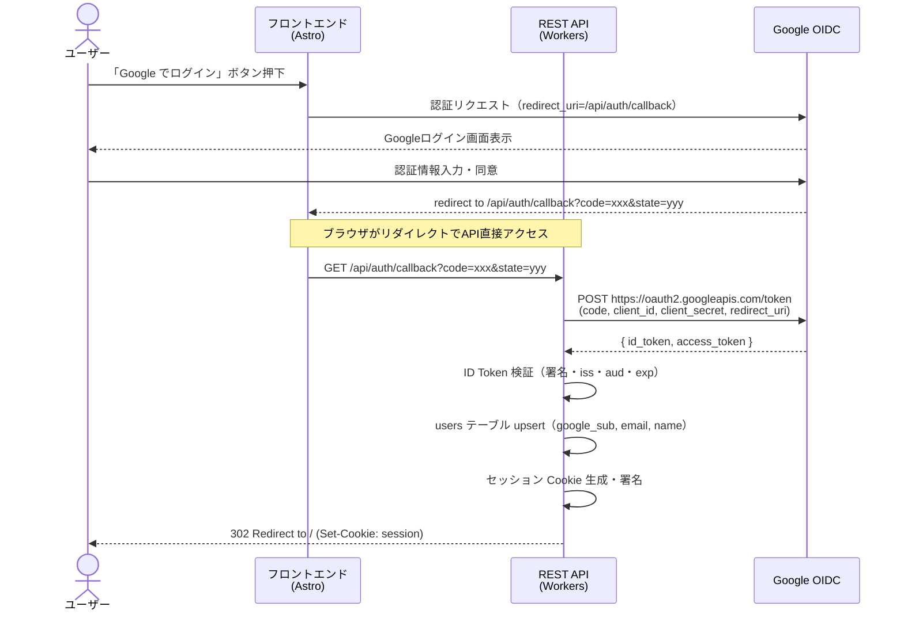
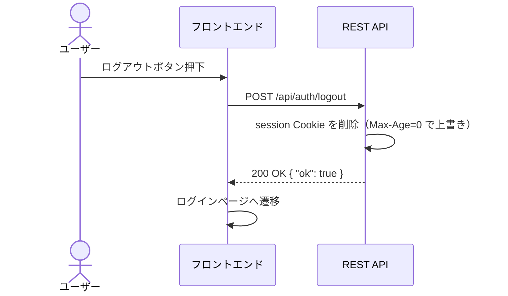

# Google OIDC 認証仕様

## 1. 概要

本サービスの認証は Google Login (OIDC) を使用する。
ユーザーはフロントエンドで Google Sign-In を行い、取得した Authorization Code を
API に送信してセッションを確立する。

---

## 2. 認証フロー: Authorization Code Flow（サーバーサイド交換）

### 選択理由

| 方式 | 特徴 |
|------|------|
| **Authorization Code Flow** | Code をサーバーサイドで Token に交換。Client Secret がブラウザに露出しない。 |
| Implicit Flow | ID Token がブラウザに直接渡る。Client Secret 不要だが、Token がURLフラグメントに露出。非推奨化が進行中。 |

**Authorization Code Flow を採用する。** 理由:
1. Client Secret がサーバー側に留まり安全
2. OAuth 2.1 / OIDC Best Current Practice で推奨
3. Workers 側で Token 交換を行うため、ID Token の検証と Session 発行を一箇所で完結できる

### フローの全体像



---

## 3. エンドポイント定義

### 3.1 GET /api/auth/login

認証開始エンドポイント。Google の Authorization Endpoint にリダイレクトする。

**処理:**
1. CSRF対策用の `state` パラメータを生成（ランダム文字列 32バイト hex）
2. `state` を署名付き Cookie (`auth_state`) にセット（Max-Age: 300秒）
3. Google Authorization Endpoint にリダイレクト

**Google Authorization URL 構成:**
```
https://accounts.google.com/o/oauth2/v2/auth
  ?client_id={GOOGLE_CLIENT_ID}
  &redirect_uri={CALLBACK_URL}
  &response_type=code
  &scope=openid email profile
  &state={state}
  &prompt=consent
```

パラメータ:
- `client_id`: Google Cloud Console で発行した Client ID
- `redirect_uri`: `/api/auth/callback` の完全修飾URL
- `response_type`: `code`（Authorization Code Flow）
- `scope`: `openid email profile`（ID Token に email, name を含めるため）
- `state`: CSRF 対策（Cookie と照合する）
- `prompt`: `consent`（初回同意後は `select_account` でも可）

### 3.2 GET /api/auth/callback

Google からのコールバックを処理するエンドポイント。

**パスパラメータ（クエリ）:**
- `code` — Authorization Code
- `state` — CSRF 対策パラメータ

**処理:**
1. `state` を Cookie (`auth_state`) と照合。不一致なら 403 を返却
2. `auth_state` Cookie を削除
3. `code` を使って Google Token Endpoint に POST し、ID Token を取得
4. ID Token を検証（→ セクション 4）
5. `google_sub`, `email`, `name` を抽出
6. `users` テーブルに upsert（`google_sub` で検索、存在すれば email/name 更新）
7. セッション Cookie を発行（→ セクション 5）
8. `302 Redirect` でフロントエンドのトップページ（`/`）にリダイレクト

**Google Token Endpoint:**
```
POST https://oauth2.googleapis.com/token
Content-Type: application/x-www-form-urlencoded

code={code}
&client_id={GOOGLE_CLIENT_ID}
&client_secret={GOOGLE_CLIENT_SECRET}
&redirect_uri={CALLBACK_URL}
&grant_type=authorization_code
```

**エラーハンドリング:**

| ケース | レスポンス |
|--------|-----------|
| `state` 不一致 | 403 Forbidden + ログインページへリダイレクト |
| `code` が無い / 空 | 400 Bad Request |
| Token 交換失敗 | 500 Internal Server Error（ログに詳細記録） |
| ID Token 検証失敗 | 401 Unauthorized |

### 3.3 POST /api/auth/logout

セッションを無効化しログアウトする。

**処理:**
1. `session` Cookie を削除（Max-Age: 0 で上書き）
2. 200 OK を返却

**レスポンス:**
```json
{ "ok": true }
```

### 3.4 GET /api/me

現在のセッションに紐づくユーザー情報を返却する。

**処理:**
1. セッション Cookie を検証（→ セクション 5.3）
2. 有効であれば users テーブルからユーザー情報を取得
3. ユーザー情報を返却

**レスポンス（200 OK）:**
```json
{
  "id": "uuid",
  "email": "user@example.com",
  "name": "User Name"
}
```

**エラー:**
- セッション無効 / 未認証 → 401 Unauthorized

---

## 4. ID Token 検証

### 検証手順

1. **JWT デコード**: ヘッダー、ペイロード、署名の3パートに分離
2. **署名検証**: Google の JWKS エンドポイントから公開鍵を取得し、RS256 署名を検証
3. **Claims 検証**:
   - `iss` が `https://accounts.google.com` または `accounts.google.com` であること
   - `aud` が `GOOGLE_CLIENT_ID` と一致すること
   - `exp` が現在時刻より未来であること（clock skew 許容: 60秒）
   - `iat` が極端に古くないこと（発行から10分以内）

### Google JWKS エンドポイント

```
GET https://www.googleapis.com/oauth2/v3/certs
```

- レスポンスの `Cache-Control` ヘッダーに従いキャッシュする
- Workers 側で Cache API を使い、JWKS レスポンスをキャッシュすることを推奨
- キャッシュ無効時は毎リクエストで取得（初回 or 鍵ローテーション時）

### 抽出する Claims

| Claim | 用途 |
|-------|------|
| `sub` | Google Subject ID → `users.google_sub` |
| `email` | メールアドレス → `users.email` |
| `name` | 表示名 → `users.name` |

### 実装ライブラリ

Workers 環境では Web Crypto API が利用可能。
軽量な JWT 検証ライブラリ（jose 等）の利用を推奨する。

---

## 5. セッション管理

### 5.1 方式: 署名付き Cookie（Stateless）

| 方式 | メリット | デメリット |
|------|---------|-----------|
| **署名付き Cookie** | D1アクセス不要で高速。実装シンプル。 | サーバー側でセッション無効化が即座にできない。 |
| D1 セッションテーブル | 個別セッション無効化が可能。 | 毎リクエストD1クエリが必要。D1の無料枠消費。 |

**署名付き Cookie（HMAC-SHA256）を採用する。** 理由:
1. MVP ではセッション即時無効化の要件がない（個人利用想定）
2. D1 の読み取りクエリを削減し、無料枠を温存できる
3. Workers の Web Crypto API で HMAC 署名/検証が可能
4. 将来、セッションテーブルへの移行も容易（Cookie のペイロードを session_id に差し替えるだけ）

### 5.2 Cookie ペイロード形式

```
{base64url(payload)}.{base64url(signature)}
```

**payload（JSON）:**
```json
{
  "uid": "user-uuid",
  "exp": 1700000000
}
```

- `uid`: users.id（UUID）
- `exp`: 有効期限（Unix timestamp）

**署名:**
```
HMAC-SHA256(base64url(payload), SESSION_SECRET)
```

### 5.3 セッション Cookie 属性

| 属性 | 値 | 理由 |
|------|-----|------|
| Name | `session` | シンプルで明確 |
| Value | `{payload}.{signature}` | 上記ペイロード形式 |
| HttpOnly | `true` | JS からアクセス不可にし XSS 対策 |
| Secure | `true` | HTTPS のみ送信（本番前提） |
| SameSite | `Lax` | CSRF 対策。GET リダイレクト（OAuth callback）は許可 |
| Path | `/api` | API エンドポイントのみに送信。フロントエンドの静的配信に不要な Cookie を付与しない |
| Max-Age | `604800` | 7日間（= 7 × 24 × 60 × 60） |
| Domain | 省略 | 発行元ドメインに自動適用 |

### 5.4 セッション有効期限

- **有効期限: 7日間**
- ペイロードの `exp` で制御
- Cookie の `Max-Age` とペイロードの `exp` は同じ有効期限を示す
- `exp` を過ぎたセッションは無効として 401 を返す

### 5.5 セッション検証フロー（認証ミドルウェア）

```
1. Request から Cookie "session" を取得
2. Cookie が無い → 401 Unauthorized
3. {payload}.{signature} に分離
4. HMAC-SHA256(payload, SESSION_SECRET) を計算し signature と一致確認
5. 不一致 → 401 Unauthorized（改ざん検知）
6. payload をデコードし exp を確認
7. exp < 現在時刻 → 401 Unauthorized（有効期限切れ）
8. uid で users テーブルを検索（ユーザーが存在するか確認）
9. ユーザー不存在 → 401 Unauthorized
10. AuthContext { userId, email, name } を後続ハンドラに渡す
```

> **ステップ 8 について:** 毎リクエストで D1 を引くかどうかは実装判断に委ねる。
> MVP では省略してペイロードの uid を信頼してもよい（署名で改ざんは防止されている）。
> ユーザー削除機能がないため、署名が有効かつ exp 内であれば uid は有効と見なせる。

### 5.6 TEST_MODE との共存

- `TEST_MODE=true` 時は既存の `testAuthBypass` ミドルウェアが優先される
- 本番用認証ミドルウェアは `TEST_MODE !== "true"` の場合に動作する
- ミドルウェアの実行順序:
  1. `TEST_MODE` チェック
  2. true → `testAuthBypass` で AuthContext を生成
  3. false → セッション Cookie 検証で AuthContext を生成

---

## 6. ユーザー upsert

### 処理

callback で ID Token から `sub`, `email`, `name` を取得した後:

```sql
-- google_sub で検索
SELECT id, google_sub, email, name, created_at
FROM users
WHERE google_sub = ?;
```

- **存在しない場合（新規ユーザー）:**
  ```sql
  INSERT INTO users (id, google_sub, email, name, created_at)
  VALUES (?, ?, ?, ?, ?);
  ```
  - `id` は UUID v4 を生成

- **存在する場合（既存ユーザー）:**
  ```sql
  UPDATE users SET email = ?, name = ?
  WHERE google_sub = ?;
  ```
  - email / name が変更されている可能性があるため更新する

---

## 7. ログアウトフロー



Cookie 削除時の Set-Cookie:
```
Set-Cookie: session=; HttpOnly; Secure; SameSite=Lax; Path=/api; Max-Age=0
```

---

## 8. コールバック URL

### 開発環境

```
http://localhost:8787/api/auth/callback
```

### 本番環境

```
https://slide-stock.gorou.dev/api/auth/callback
```

### Google Cloud Console 設定

- **承認済みの JavaScript オリジン:**
  - `http://localhost:8787`（開発）
  - `https://slide-stock.gorou.dev`（本番）
- **承認済みのリダイレクト URI:**
  - `http://localhost:8787/api/auth/callback`（開発）
  - `https://slide-stock.gorou.dev/api/auth/callback`（本番）

---

## 9. 必要な環境変数・Secrets

| 変数名 | 種類 | 説明 | 取得元 |
|--------|------|------|--------|
| `GOOGLE_CLIENT_ID` | Secret | Google OAuth Client ID | Google Cloud Console |
| `GOOGLE_CLIENT_SECRET` | Secret | Google OAuth Client Secret | Google Cloud Console |
| `SESSION_SECRET` | Secret | セッション Cookie 署名用キー（32バイト以上のランダム文字列） | 自分で生成（`openssl rand -hex 32`） |
| `CALLBACK_URL` | 環境変数 | コールバック URL（環境ごとに異なる） | wrangler.toml / .dev.vars |
| `FRONTEND_URL` | 環境変数 | フロントエンド URL（リダイレクト先） | wrangler.toml / .dev.vars |
| `TEST_MODE` | 環境変数 | テストモードフラグ（`"true"` で bypass 有効） | .dev.vars のみ |

### .dev.vars（開発環境 / gitignore 対象）

```
GOOGLE_CLIENT_ID=xxx.apps.googleusercontent.com
GOOGLE_CLIENT_SECRET=GOCSPX-xxx
SESSION_SECRET=<openssl rand -hex 32 の出力>
CALLBACK_URL=http://localhost:8787/api/auth/callback
FRONTEND_URL=http://localhost:4321
TEST_MODE=true
```

### 本番環境

- `GOOGLE_CLIENT_ID`, `GOOGLE_CLIENT_SECRET`, `SESSION_SECRET` は `wrangler secret put` で設定
- `CALLBACK_URL`, `FRONTEND_URL` は `wrangler.toml` の `[vars]` で設定

---

## 10. セキュリティ考慮事項

### CSRF 対策

- `state` パラメータ + Cookie 照合で Authorization Code Flow の CSRF を防止
- セッション Cookie は `SameSite=Lax` で通常の CSRF 攻撃を防止
- 状態変更 API（POST/PUT/DELETE）は Cookie ベースの認証のみで呼び出されるため、`SameSite=Lax` で十分

### XSS 対策

- セッション Cookie は `HttpOnly` で JS からアクセス不可
- ID Token やセッション情報をブラウザの localStorage/sessionStorage に保存しない

### Token 漏洩対策

- Authorization Code は一度使い切り（Google 側で管理）
- ID Token は API 内でのみ使用し、フロントエンドに返却しない
- SESSION_SECRET は環境変数で管理し、コードにハードコードしない

### 署名キーのローテーション

- MVP では SESSION_SECRET の手動ローテーションで対応
- ローテーション時は新しいキーで署名し、検証時は旧キーもフォールバックで確認する仕組みを将来検討

---

## 11. 実装タスクとの対応

| タスク | 本仕様の該当セクション |
|--------|----------------------|
| T-501 OIDCログインエンドポイント | セクション 3.1, 3.2, 4, 6 |
| T-502 本番用認証ミドルウェア | セクション 5.3, 5.5, 5.6 |
| T-503 ログアウトエンドポイント | セクション 3.3, 7 |
| T-504 フロントエンドGoogle Sign-In統合 | セクション 2（フロー全体）, 8 |
| T-505 認証フローのテスト | 全セクション |
| T-506 環境変数・Secrets設定 | セクション 9 |
