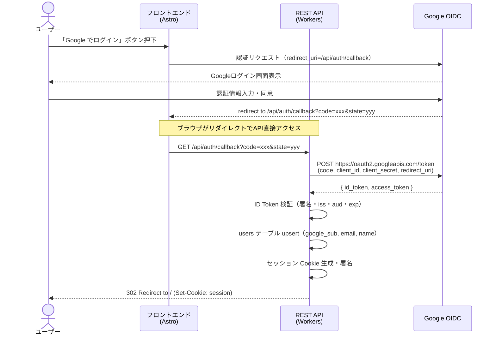
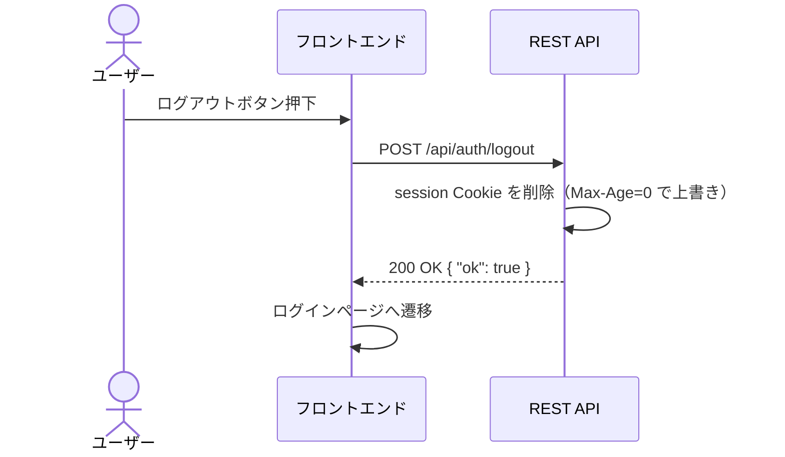
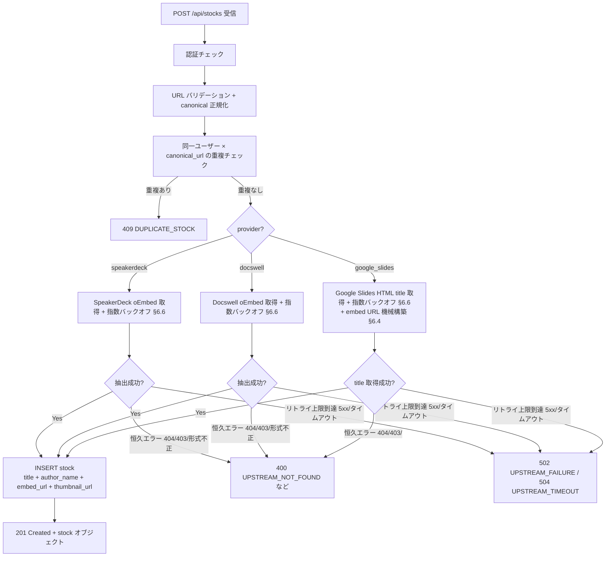

# バックエンド仕様

> API 仕様、認証と認可、oEmbed とプロバイダ

## 1. 概要

本ドキュメントはバックエンド（Cloudflare Workers）の仕様を統合的に定義する。対象は以下のとおり:

- **認証**（§2）— Google OIDC による認証フロー、エンドポイント定義、ID Token 検証、セッション検証ミドルウェア、ユーザー upsert
- **Stock API**（§3）— スライドのストック（登録・一覧・詳細・削除）を管理する CRUD API
- **Memo API**（§4）— ストックに対するテキストメモの作成・更新・取得 API
- **プロバイダ検出**（§5）— ユーザー入力 URL からプロバイダ識別・canonical URL 正規化
- **oEmbed メタデータ取得**（§6）— プロバイダ別 oEmbed / メタデータ取得、同期取得フロー、リトライポリシー

セッション管理（署名付き Cookie 方式・Cookie 属性・ペイロード形式・有効期限）、コールバック URL 構成、環境変数・Secrets、セキュリティ考慮事項については [architecture-spec.md](architecture-spec.md) を参照。
データモデル（テーブル定義・マイグレーション）については [data-model-spec.md](data-model-spec.md) を参照。

---

## 2. 認証

### 2.1 概要

本サービスの認証は Google Login (OIDC) を使用する。
ユーザーはフロントエンドで Google Sign-In を行い、取得した Authorization Code を
API に送信してセッションを確立する。

---

### 2.2 認証フロー: Authorization Code Flow（サーバーサイド交換）

#### 選択理由

| 方式 | 特徴 |
|------|------|
| **Authorization Code Flow** | Code をサーバーサイドで Token に交換。Client Secret がブラウザに露出しない。 |
| Implicit Flow | ID Token がブラウザに直接渡る。Client Secret 不要だが、Token がURLフラグメントに露出。非推奨化が進行中。 |

**Authorization Code Flow を採用する。** 理由:
1. Client Secret がサーバー側に留まり安全
2. OAuth 2.1 / OIDC Best Current Practice で推奨
3. Workers 側で Token 交換を行うため、ID Token の検証と Session 発行を一箇所で完結できる

#### フローの全体像



---

### 2.3 エンドポイント定義

#### 2.3.1 GET /api/auth/login

認証開始エンドポイント。Google の Authorization Endpoint にリダイレクトする。

**クエリパラメータ:**
- `return_to`（任意） — 認証完了後の戻り先パス。同一オリジン内の相対パス（`/` で始まり `//` で始まらない、改行文字を含まない）のみ採用する。それ以外は無視して `/` をデフォルト戻り先とする（オープンリダイレクト対策）。

**処理:**
1. CSRF対策用の `state` パラメータを生成（ランダム文字列 32バイト hex）
2. `state` を平文 Cookie (`__Host-auth_state`) にセット（HttpOnly; Secure; SameSite=Lax; Max-Age: 300 秒）
3. `return_to` が有効な値ならば `__Host-auth_return_to` Cookie に `encodeURIComponent` で URL エンコードして保存（同じ Cookie 属性）。無効ならば Cookie をセットしない
4. Google Authorization Endpoint にリダイレクト

> **設計判断:** `auth_state` Cookie は署名しない（平文）。理由:
> - `state` はワンタイムのランダム値であり、予測困難（32バイト hex = 256ビットエントロピー）
> - Cookie と Query パラメータの `state` が一致することのみを検証すれば CSRF 対策として十分
> - 攻撃者が Cookie を改ざんしても、Google から返却される `state` と一致しないため無害
> - 署名を省略することで実装をシンプルに保つ

**Google Authorization URL 構成:**
```
https://accounts.google.com/o/oauth2/v2/auth
  ?client_id={GOOGLE_CLIENT_ID}
  &redirect_uri={CALLBACK_URL}
  &response_type=code
  &scope=openid email profile
  &state={state}
  &prompt=consent
```

パラメータ:
- `client_id`: Google Cloud Console で発行した Client ID
- `redirect_uri`: `/api/auth/callback` の完全修飾URL
- `response_type`: `code`（Authorization Code Flow）
- `scope`: `openid email profile`（ID Token に email, name を含めるため）
- `state`: CSRF 対策（Cookie と照合する）
- `prompt`: `consent`（初回同意後は `select_account` でも可）

#### 2.3.2 GET /api/auth/callback

Google からのコールバックを処理するエンドポイント。

**パスパラメータ（クエリ）:**
- `code` — Authorization Code
- `state` — CSRF 対策パラメータ

**処理:**
1. `state` を Cookie (`__Host-auth_state`) と照合。不一致なら 403 を返却
2. `__Host-auth_state` Cookie を削除
3. `__Host-auth_return_to` Cookie を読み、`decodeURIComponent` 後にサーバー側で再検証（§2.3.1 と同じルール）。有効ならばリダイレクト先として採用、無効ならば `/` を採用。`__Host-auth_return_to` Cookie は採用したかどうかにかかわらず常に削除（Max-Age=0）
4. `code` を使って Google Token Endpoint に POST し、ID Token を取得
5. ID Token を検証（→ §2.4）
6. `google_sub`, `email`, `name` を抽出
7. `users` テーブルに upsert（`google_sub` で検索、存在すれば email/name 更新）
8. セッション Cookie を発行（署名付き Cookie 方式の詳細は architecture-spec.md を参照）
9. `302 Redirect` で §2.3 の戻り先（デフォルト `/`、§2.3.1 で保存された return_to があればそちら）にリダイレクト

**Google Token Endpoint:**
```
POST https://oauth2.googleapis.com/token
Content-Type: application/x-www-form-urlencoded

code={code}
&client_id={GOOGLE_CLIENT_ID}
&client_secret={GOOGLE_CLIENT_SECRET}
&redirect_uri={CALLBACK_URL}
&grant_type=authorization_code
```

**エラーハンドリング:**

| ケース | レスポンス |
|--------|-----------|
| `state` 不一致 | 403 Forbidden + ログインページへリダイレクト |
| `code` が無い / 空 | 400 Bad Request |
| Token 交換失敗 | 500 Internal Server Error（ログに詳細記録） |
| ID Token 検証失敗 | 401 Unauthorized |

#### 2.3.3 POST /api/auth/logout

セッションを無効化しログアウトする。

**処理:**
1. `session` Cookie を削除（Max-Age: 0 で上書き）
2. 200 OK を返却

**レスポンス:**
```json
{ "ok": true }
```

#### 2.3.4 GET /api/me

現在のセッションに紐づくユーザー情報を返却する。

**処理:**
1. セッション Cookie を検証（→ §2.5。Cookie 属性の詳細は architecture-spec.md を参照）
2. 有効であれば users テーブルからユーザー情報を取得
3. ユーザー情報を返却

**レスポンス（200 OK）:**
```json
{
  "id": "uuid",
  "email": "user@example.com",
  "name": "User Name"
}
```

**エラー:**
- セッション無効 / 未認証 → 401 Unauthorized

---

### 2.4 ID Token 検証

#### 検証手順

1. **JWT デコード**: ヘッダー、ペイロード、署名の3パートに分離
2. **署名検証**: Google の JWKS エンドポイントから公開鍵を取得し、RS256 署名を検証
3. **Claims 検証**:
   - `iss` が `https://accounts.google.com` または `accounts.google.com` であること
   - `aud` が `GOOGLE_CLIENT_ID` と一致すること
   - `exp` が現在時刻より未来であること（clock skew 許容: 60秒）
   - `iat` が極端に古くないこと（発行から10分以内）

#### Google JWKS エンドポイント

```
GET https://www.googleapis.com/oauth2/v3/certs
```

- レスポンスの `Cache-Control` ヘッダーに従いキャッシュする
- Workers 側で Cache API を使い、JWKS レスポンスをキャッシュすることを推奨
- キャッシュ無効時は毎リクエストで取得（初回 or 鍵ローテーション時）

#### 抽出する Claims

| Claim | 用途 |
|-------|------|
| `sub` | Google Subject ID → `users.google_sub` |
| `email` | メールアドレス → `users.email` |
| `name` | 表示名 → `users.name` |

#### 実装ライブラリ

Workers 環境では Web Crypto API が利用可能。
**JWT 検証には [jose](https://github.com/panva/jose) ライブラリを使用する。**

選定理由:
- Web Crypto API ベースで Workers 環境に完全対応
- JWKS エンドポイントからの公開鍵取得・キャッシュ機能を内蔵（`createRemoteJWKSet`）
- Edge Runtime / Cloudflare Workers での実績が豊富
- 軽量かつ依存ゼロ

---

### 2.5 セッション検証フロー（認証ミドルウェア）

> **注:** セッション Cookie の方式（署名付き Cookie / HMAC-SHA256）、Cookie ペイロード形式、Cookie 属性、セッション有効期限の詳細は architecture-spec.md を参照。

```
1. Request から Cookie "session" を取得
2. Cookie が無い → 401 Unauthorized
3. {payload}.{signature} に分離
4. HMAC-SHA256(payload, SESSION_SECRET) を計算し signature と一致確認
5. 不一致 → 401 Unauthorized（改ざん検知）
6. payload をデコードし exp を確認
7. exp < 現在時刻 → 401 Unauthorized（有効期限切れ）
8. uid で users テーブルを検索（ユーザーが存在するか確認）
9. ユーザー不存在 → 401 Unauthorized
10. AuthContext { userId, email, name } を後続ハンドラに渡す
```

> **ステップ 8 について:** 毎リクエストで D1 を引くかどうかは実装判断に委ねる。
> MVP では省略してペイロードの uid を信頼してもよい（署名で改ざんは防止されている）。
> ユーザー削除機能がないため、署名が有効かつ exp 内であれば uid は有効と見なせる。

---

### 2.6 TEST_MODE との共存

- `TEST_MODE=true` 時は既存の `testAuthBypass` ミドルウェアが優先される
- 本番用認証ミドルウェアは `TEST_MODE !== "true"` の場合に動作する
- ミドルウェアの実行順序:
  1. `TEST_MODE` チェック
  2. true → `testAuthBypass` で AuthContext を生成
  3. false → セッション Cookie 検証で AuthContext を生成

---

### 2.7 ユーザー upsert

#### 処理

callback で ID Token から `sub`, `email`, `name` を取得した後:

```sql
-- google_sub で検索
SELECT id, google_sub, email, name, created_at
FROM users
WHERE google_sub = ?;
```

- **存在しない場合（新規ユーザー）:**
  ```sql
  INSERT INTO users (id, google_sub, email, name, created_at)
  VALUES (?, ?, ?, ?, ?);
  ```
  - `id` は UUID v4 を生成

- **存在する場合（既存ユーザー）:**
  ```sql
  UPDATE users SET email = ?, name = ?
  WHERE google_sub = ?;
  ```
  - email / name が変更されている可能性があるため更新する

---

### 2.8 ログアウトフロー



Cookie 削除時の Set-Cookie:
```
Set-Cookie: session=; HttpOnly; Secure; SameSite=Lax; Path=/api; Max-Age=0
```

---

## 3. Stock API

### 3.1 概要

Stock API はスライドのストック（登録・一覧・詳細・削除）を管理する CRUD API である。
全エンドポイントは認証必須であり、セッション Cookie による認証ミドルウェア（§2.5）を通過した `AuthContext` が前提となる。

#### 前提ドキュメント

- [architecture-spec.md](architecture-spec.md) — スライド登録フロー（シーケンス図）
- [data-model-spec.md](data-model-spec.md) — stocks / memos テーブル定義
- §5 プロバイダ検出 — プロバイダ検出・URL 正規化
- §6 oEmbed メタデータ取得 — oEmbed / 同期取得処理

#### エンドポイント一覧

| メソッド | パス | 説明 |
|---------|------|------|
| POST | `/api/stocks` | スライド URL を登録 |
| GET | `/api/stocks` | ストック一覧を取得 |
| GET | `/api/stocks/:id` | ストック詳細を取得 |
| DELETE | `/api/stocks/:id` | ストックを削除 |

---

### 3.2 共通仕様

#### 3.2.1 認証

全エンドポイントで認証が必須。セッション Cookie が無い、または無効な場合は以下を返す:

```
HTTP/1.1 401 Unauthorized
Content-Type: application/json

{
  "error": "認証が必要です",
  "code": "UNAUTHORIZED"
}
```

#### 3.2.2 エラーレスポンス形式

全エンドポイント共通のエラーレスポンス形式:

```typescript
interface ErrorResponse {
  error: string;   // 人間可読なエラーメッセージ（日本語）
  code: string;    // 機械処理用エラーコード（UPPER_SNAKE_CASE）
}
```

#### 3.2.3 エラーコード一覧

| HTTP ステータス | code | 説明 |
|----------------|------|------|
| 400 | `INVALID_REQUEST` | リクエストボディが不正（JSON パースエラー含む） |
| 400 | `INVALID_URL` | URL 形式が不正 |
| 400 | `UNSUPPORTED_PROVIDER` | 対応していないプロバイダの URL |
| 400 | `INVALID_FORMAT` | プロバイダは対応しているがパス形式が不正 |
| 400 | `UNSUPPORTED_URL_TYPE` | embed URL やプロフィール URL などストック対象外 |
| 400 | `UPSTREAM_NOT_FOUND` | プロバイダ側にスライドが存在しない／非公開（404 を恒久エラーとして変換） |
| 400 | `UPSTREAM_FORBIDDEN` | プロバイダ側からアクセス拒否（403 を恒久エラーとして変換） |
| 401 | `UNAUTHORIZED` | 認証が必要 |
| 404 | `NOT_FOUND` | 指定されたリソースが存在しない |
| 409 | `DUPLICATE_STOCK` | 同一 URL が既にストック済み |
| 500 | `INTERNAL_ERROR` | サーバー内部エラー |
| 502 | `UPSTREAM_FAILURE` | プロバイダ取得が指数バックオフリトライ後も失敗（5xx 等の一時的エラー） |
| 502 | `UPSTREAM_INVALID_RESPONSE` | プロバイダのレスポンス形式が想定外（仕様変更を疑う恒久エラー） |
| 504 | `UPSTREAM_TIMEOUT` | プロバイダ取得が合計 12 秒タイムアウト予算を超過 |

#### 3.2.4 日時形式

全日時フィールドは ISO 8601 文字列（UTC）:

```
"2025-06-15T10:30:00.000Z"
```

#### 3.2.5 Content-Type

- リクエスト: `application/json`
- レスポンス: `application/json`

---

### 3.3 POST /api/stocks

新しいスライド URL をストックに登録する。

#### 3.3.1 リクエスト

```
POST /api/stocks
Content-Type: application/json
Cookie: session=...

{
  "url": "https://speakerdeck.com/jnunemaker/atom"
}
```

**リクエストボディ:**

| フィールド | 型 | 必須 | 説明 |
|-----------|------|------|------|
| `url` | string | Yes | ストックするスライドの URL |

#### 3.3.2 処理フロー

```
1. リクエストボディの JSON パース
2. url フィールドの存在・型チェック
3. detectProvider(url) でプロバイダ検出・URL 正規化
   → 失敗時: ProviderError に応じた 400 エラー返却
4. 重複チェック: 同一ユーザー × canonical_url で既存 stock を検索
   → 重複あり: 409 Conflict 返却
5. プロバイダ別 oEmbed / メタデータ取得を同期実行
   （指数バックオフ 3 回、各 3 秒、合計 12 秒予算 — §6.6）
   → 恒久エラー（404/403/形式不正）: 即座に 400 / 502 を返却（ストック作成なし）
   → 全リトライ失敗: 502 UPSTREAM_FAILURE / 504 UPSTREAM_TIMEOUT 返却（ストック作成なし）
6. 取得したメタデータを揃えた状態で stock を INSERT
   → UNIQUE 制約違反（並列レース）: 409 DUPLICATE_STOCK 返却
   → その他 D1 エラー: 500 INTERNAL_ERROR 返却
7. 201 Created + 完成済み stock オブジェクト返却
```

> **設計判断（同期モデル / fetch-first + insert-on-success）:** 旧仕様では status=pending で先に INSERT してから Cloudflare Queue Consumer が UPDATE していた。同期モデル化（frontend-spec.md §5.3.1 / §7.3、§6.5、ADR-009）により、取得失敗時に半端な stock を残さない設計に変更。INSERT は oEmbed 取得が成功した時点で初めて実行されるため、明示的な ROLLBACK は不要（INSERT 自体が発行されないため自然と何も書かれない）。pending / failed カードは UI から消え、ポーリング・再取得 UI も不要になる。`status` カラムも YAGNI で廃止のまま（ADR-009 §4-3）。

#### 3.3.3 バリデーション

`detectProvider(url)` が throw する `ProviderError` を HTTP エラーにマッピングする:

| ProviderErrorCode | → HTTP ステータス | → エラー code |
|-------------------|-----------------|--------------|
| `INVALID_URL` | 400 | `INVALID_URL` |
| `UNSUPPORTED_SCHEME` | 400 | `INVALID_URL` |
| `UNSUPPORTED_PROVIDER` | 400 | `UNSUPPORTED_PROVIDER` |
| `INVALID_FORMAT` | 400 | `INVALID_FORMAT` |
| `UNSUPPORTED_URL_TYPE` | 400 | `UNSUPPORTED_URL_TYPE` |

#### 3.3.4 重複チェック

同一ユーザーが同じスライドを二重登録することを防ぐ。

**SQL:**
```sql
SELECT id FROM stocks
WHERE user_id = ? AND canonical_url = ?
LIMIT 1;
```

**重複時のレスポンス:**

```
HTTP/1.1 409 Conflict
Content-Type: application/json

{
  "error": "このスライドは既にストック済みです",
  "code": "DUPLICATE_STOCK"
}
```

> **設計判断:** 既存 stock の返却（200）ではなく 409 を採用する。理由:
> - フロントエンドが「既にストック済み」であることを明確に判別できる
> - POST の冪等性を保証する必要がない（同じ URL の再送信はユーザー操作ミスとみなす）
> - 「同じ URL を同じユーザーが異なる意図でストック」するユースケースは想定しない

##### 並列リクエストでの重複（race condition）

§3.3.4 の SELECT は重複の事前チェックでしかなく、並列に走る 2 つのリクエストが両方 SELECT を通過してしまうケースがある。`(user_id, canonical_url)` の UNIQUE 制約（`uniq_stocks_user_canonical_url`、`migrations/0002_unique_stock_per_user.sql`）が最終防衛線になる。後勝ちの INSERT は UNIQUE 制約違反で D1 エラーになるため、§3.3.6 で catch して 409 `DUPLICATE_STOCK` を返す（先勝ちの stock はすでに存在するため、ユーザーから見たレスポンスは事前重複と同じ）。半端なデータは残らない（INSERT が中断するだけ）。

#### 3.3.5 同期 oEmbed 取得

重複チェックを通過したら、stock を INSERT する**前に**プロバイダ別の oEmbed / メタデータ取得を同期実行する（§6.5 / §6.6）。

```typescript
const metadata = await fetchWithRetry(
  (signal) => fetchProviderMetadata(provider, canonicalUrl, signal),
  /* totalBudgetMs = */ 12_000,
);
```

| 取得結果 | 後続処理 |
|---------|---------|
| 成功 | §3.3.6 の INSERT へ進む |
| 恒久エラー（404 / 403 / 形式不正） | INSERT せず、§3.3.8 のエラーレスポンスを即返す |
| 全リトライ失敗（5xx / タイムアウト） | INSERT せず、502 / 504 を返す |

エラー分類とリトライ判定は §6.6.3、各プロバイダ別の取得処理は §6.2 / §6.3 / §6.4 を参照。

#### 3.3.6 stock 挿入

oEmbed 取得が成功したメタデータを揃えた状態で 1 回 INSERT する。`status` カラムは廃止のため指定しない（data-model-spec.md / ADR-009 §4-3）。

```sql
INSERT INTO stocks (
  id, user_id, original_url, canonical_url, provider,
  title, author_name, thumbnail_url, embed_url,
  created_at, updated_at
)
VALUES (?, ?, ?, ?, ?, ?, ?, ?, ?, ?, ?);
```

- `id`: `uuidv7()` で生成
- `user_id`: AuthContext.userId
- `original_url`: リクエストの `url`（ユーザー入力そのまま）
- `canonical_url`: `detectProvider` が返した正規化 URL
- `provider`: `detectProvider` が返したプロバイダ識別子
- `title` / `author_name` / `thumbnail_url` / `embed_url`: §3.3.5 で取得したメタデータ（`thumbnail_url` は oEmbed の `thumbnail_url` を優先し、なければ OGP 画像を best-effort 取得。取得不可なら `null`。`embed_url` は SpeakerDeck / Docswell では必ず取れる、Google Slides では機械的構築で必ず取れる）
- `created_at`, `updated_at`: 現在時刻（ISO 8601）

##### INSERT エラーの扱い

| エラー | 判定方法 | レスポンス | 半端なデータ |
|--------|---------|-----------|------------|
| UNIQUE 制約違反（並列レース、§3.3.4「並列リクエストでの重複」） | エラーメッセージに `UNIQUE constraint failed` を含む | 409 `DUPLICATE_STOCK` | 残らない（INSERT が中断、先勝ちの stock のみ存在） |
| その他 D1 エラー（接続切断・容量上限・SQL 構文違反等） | 上記以外の例外 | 500 `INTERNAL_ERROR`、`console.error` でログ | 残らない（INSERT が中断） |

```typescript
try {
  await env.DB.prepare(/* INSERT 文 */).bind(/* ... */).run();
} catch (e: unknown) {
  if (e instanceof Error && e.message.includes("UNIQUE constraint failed")) {
    return jsonError(
      "このスライドは既にストック済みです",
      "DUPLICATE_STOCK",
      409,
    );
  }
  console.error(JSON.stringify({ action: "stock_insert_failed", error: String(e) }));
  return jsonError("内部エラーが発生しました", "INTERNAL_ERROR", 500);
}
```

#### 3.3.7 レスポンス（201 Created）

```json
{
  "id": "550e8400-e29b-41d4-a716-446655440000",
  "original_url": "https://speakerdeck.com/jnunemaker/atom",
  "canonical_url": "https://speakerdeck.com/jnunemaker/atom",
  "provider": "speakerdeck",
  "title": "Atom",
  "author_name": "John Nunemaker",
  "thumbnail_url": null,
  "embed_url": "https://speakerdeck.com/player/31f86a9069ae0132dede22511952b5a3",
  "memo_text": null,
  "created_at": "2025-06-15T10:30:00.000Z",
  "updated_at": "2025-06-15T10:30:00.000Z"
}
```

> **注意:** 同期モデルでは登録時点で oEmbed 取得が完了しているため、`title` / `author_name` / `embed_url` は揃った状態で返る（Google Slides の `author_name` は仕様上 `null`、`thumbnail_url` は取得できない場合 `null`）。レスポンスに `status` フィールドは含まれない（ADR-009 §4-3 で廃止）。

#### 3.3.8 エラーレスポンス例

**URL 形式不正（400）:**
```json
{
  "error": "入力された文字列は有効な URL ではありません",
  "code": "INVALID_URL"
}
```

**未対応プロバイダ（400）:**
```json
{
  "error": "対応していないサービスの URL です。SpeakerDeck / Docswell / Google Slides の URL を入力してください",
  "code": "UNSUPPORTED_PROVIDER"
}
```

**プロバイダ側にスライドがない／非公開（400）:**
```json
{
  "error": "スライドが見つかりません。URL が正しいか、スライドが公開されているか確認してください",
  "code": "UPSTREAM_NOT_FOUND"
}
```

**プロバイダ取得が指数バックオフ後も失敗（502）:**
```json
{
  "error": "プロバイダから応答がありません。時間をおいて再度お試しください",
  "code": "UPSTREAM_FAILURE"
}
```

**プロバイダ取得が合計タイムアウトを超過（504）:**
```json
{
  "error": "プロバイダ応答がタイムアウトしました。時間をおいて再度お試しください",
  "code": "UPSTREAM_TIMEOUT"
}
```

**重複（409、事前重複チェック / 並列レース両方）:**
```json
{
  "error": "このスライドは既にストック済みです",
  "code": "DUPLICATE_STOCK"
}
```

**D1 INSERT 失敗（500）:**
```json
{
  "error": "内部エラーが発生しました",
  "code": "INTERNAL_ERROR"
}
```

---

### 3.4 GET /api/stocks

認証ユーザーのストック一覧を取得する。

#### 3.4.1 リクエスト

```
GET /api/stocks?limit=20&cursor=2025-06-14T08:00:00.000Z_550e8400-...
Cookie: session=...
```

#### 3.4.2 クエリパラメータ

| パラメータ | 型 | 必須 | デフォルト | 説明 |
|-----------|------|------|-----------|------|
| `limit` | number | No | `20` | 取得件数（1〜100） |
| `cursor` | string | No | なし | ページネーションカーソル（次ページ取得用） |

**limit のバリデーション:**
- 数値でない場合: デフォルト値 `20` を使用
- 1 未満の場合: `1` に補正
- 100 を超える場合: `100` に補正

#### 3.4.3 ページネーション方式: Cursor-based

**カーソル形式:**
```
{created_at}_{id}
```
例: `2025-06-14T08:00:00.000Z_550e8400-e29b-41d4-a716-446655440000`

**選択理由:**

| 方式 | メリット | デメリット |
|------|---------|-----------|
| **Cursor-based** | データ追加/削除時にずれない。D1 のインデックスと相性が良い。 | カーソル文字列の管理が必要。任意ページへのジャンプ不可。 |
| Offset-based | 実装がシンプル。任意ページジャンプ可能。 | データ追加/削除でページずれが発生。OFFSET が大きいとパフォーマンス低下。 |

> **採用:** Cursor-based。理由:
> - スライド登録/削除が頻繁に行われる一覧でページずれを防ぎたい
> - フロントエンドは「もっと読み込む」UI（無限スクロール or Load More ボタン）を想定
> - 任意ページジャンプは不要（個人利用でストック数は限定的）

#### 3.4.4 SQL クエリ

**カーソルなし（初回）:**
```sql
SELECT
  s.id, s.original_url, s.canonical_url, s.provider,
  s.title, s.author_name, s.thumbnail_url, s.embed_url,
  s.created_at, s.updated_at,
  m.memo_text
FROM stocks s
LEFT JOIN memos m ON m.stock_id = s.id AND m.user_id = s.user_id
WHERE s.user_id = ?
ORDER BY s.created_at DESC, s.id DESC
LIMIT ?;
```

**カーソルあり（次ページ）:**
```sql
SELECT
  s.id, s.original_url, s.canonical_url, s.provider,
  s.title, s.author_name, s.thumbnail_url, s.embed_url,
  s.created_at, s.updated_at,
  m.memo_text
FROM stocks s
LEFT JOIN memos m ON m.stock_id = s.id AND m.user_id = s.user_id
WHERE s.user_id = ?
  AND (s.created_at < ? OR (s.created_at = ? AND s.id < ?))
ORDER BY s.created_at DESC, s.id DESC
LIMIT ?;
```

> **カーソル条件の説明:**
> `created_at` が同一の場合（同時刻に複数登録）、`id` の降順で安定ソートする。
> カーソルから `created_at` と `id` を分離し、`(created_at, id)` の複合条件で WHERE を構築する。

#### 3.4.5 メモ結合

LEFT JOIN で `memos.memo_text` を結合する。メモが存在しない stock は `memo_text: null` で返却する。

> **設計判断:** 一覧 API でメモを含める理由:
> - フロントエンドの一覧画面でメモプレビューを表示するため
> - 別途メモ API を一覧の件数分呼ぶ N+1 を回避するため
> - LEFT JOIN のコストは stocks のインデックスでカバーされ、パフォーマンス影響は軽微

#### 3.4.6 レスポンス（200 OK）

```json
{
  "items": [
    {
      "id": "550e8400-e29b-41d4-a716-446655440000",
      "original_url": "https://speakerdeck.com/jnunemaker/atom",
      "canonical_url": "https://speakerdeck.com/jnunemaker/atom",
      "provider": "speakerdeck",
      "title": "Atom",
      "author_name": "John Nunemaker",
      "thumbnail_url": null,
      "embed_url": "https://speakerdeck.com/player/31f86a9069ae0132dede22511952b5a3",
      "memo_text": "良いスライド",
      "created_at": "2025-06-15T10:30:00.000Z",
      "updated_at": "2025-06-15T10:31:00.000Z"
    }
  ],
  "next_cursor": "2025-06-14T08:00:00.000Z_440e8400-e29b-41d4-a716-446655440000",
  "has_more": true
}
```

**レスポンス型:**
```typescript
interface StockListResponse {
  items: StockItem[];
  next_cursor: string | null;  // 次ページのカーソル。最終ページの場合は null
  has_more: boolean;           // 次ページが存在するか
}

interface StockItem {
  id: string;
  original_url: string;
  canonical_url: string;
  provider: "speakerdeck" | "docswell" | "google_slides";
  title: string | null;
  author_name: string | null;
  thumbnail_url: string | null;
  embed_url: string | null;
  memo_text: string | null;
  created_at: string;
  updated_at: string;
}
```

#### 3.4.7 next_cursor の生成

取得結果の件数が `limit` と一致する場合、最後のアイテムから `next_cursor` を生成する:

```typescript
const items = result.rows;
const hasMore = items.length === limit;
const nextCursor = hasMore
  ? `${items[items.length - 1].created_at}_${items[items.length - 1].id}`
  : null;
```

#### 3.4.8 空一覧

ストックが 0 件の場合:

```json
{
  "items": [],
  "next_cursor": null,
  "has_more": false
}
```

---

### 3.5 GET /api/stocks/:id

指定されたストックの詳細情報を取得する。

#### 3.5.1 リクエスト

```
GET /api/stocks/550e8400-e29b-41d4-a716-446655440000
Cookie: session=...
```

#### 3.5.2 パスパラメータ

| パラメータ | 型 | 説明 |
|-----------|------|------|
| `id` | string | stock の UUID |

#### 3.5.3 SQL クエリ

```sql
SELECT
  s.id, s.original_url, s.canonical_url, s.provider,
  s.title, s.author_name, s.thumbnail_url, s.embed_url,
  s.created_at, s.updated_at,
  m.memo_text
FROM stocks s
LEFT JOIN memos m ON m.stock_id = s.id AND m.user_id = s.user_id
WHERE s.id = ? AND s.user_id = ?;
```

#### 3.5.4 所有権チェック

WHERE 句に `s.user_id = ?`（認証ユーザーの ID）を含めることで、他ユーザーの stock へのアクセスを防ぐ。
該当なしの場合は 404 を返す（stock の存在有無を他ユーザーに漏らさないため、403 ではなく 404 を使用する）。

#### 3.5.5 レスポンス（200 OK）

```json
{
  "id": "550e8400-e29b-41d4-a716-446655440000",
  "original_url": "https://speakerdeck.com/jnunemaker/atom",
  "canonical_url": "https://speakerdeck.com/jnunemaker/atom",
  "provider": "speakerdeck",
  "title": "Atom",
  "author_name": "John Nunemaker",
  "thumbnail_url": null,
  "embed_url": "https://speakerdeck.com/player/31f86a9069ae0132dede22511952b5a3",
  "memo_text": "良いスライド",
  "created_at": "2025-06-15T10:30:00.000Z",
  "updated_at": "2025-06-15T10:31:00.000Z"
}
```

#### 3.5.6 エラーレスポンス

**stock が存在しない、または他ユーザーの stock（404）:**
```json
{
  "error": "指定されたストックが見つかりません",
  "code": "NOT_FOUND"
}
```

---

### 3.6 DELETE /api/stocks/:id

指定されたストックとその関連メモを削除する。

#### 3.6.1 リクエスト

```
DELETE /api/stocks/550e8400-e29b-41d4-a716-446655440000
Cookie: session=...
```

#### 3.6.2 パスパラメータ

| パラメータ | 型 | 説明 |
|-----------|------|------|
| `id` | string | stock の UUID |

#### 3.6.3 処理フロー

```
1. 所有権チェック: stock が存在し、認証ユーザーのものか確認
   → 該当なし: 404 返却
2. 関連メモを削除（stock 削除前に実行）
3. stock を削除
4. 204 No Content 返却
```

#### 3.6.4 関連メモの削除方針: 手動削除（アプリケーション側）

```sql
-- 1. 関連メモを削除
DELETE FROM memos WHERE stock_id = ? AND user_id = ?;

-- 2. stock を削除
DELETE FROM stocks WHERE id = ? AND user_id = ?;
```

> **設計判断:** CASCADE ではなく手動削除を採用する。理由:
> - D1 の外部キー制約 CASCADE サポートが限定的な場合を考慮
> - 削除対象を明示的に制御でき、将来の監査ログ追加などに対応しやすい
> - stock と memo は 1:1 関係のため、クエリ数の増加は 1 件のみで影響は軽微

#### 3.6.5 所有権チェック

DELETE でも GET と同様に `user_id` 条件で所有権を検証する。
stock が存在しない場合と、他ユーザーの stock の場合はどちらも 404 を返す。

```sql
SELECT id FROM stocks WHERE id = ? AND user_id = ?;
```

#### 3.6.6 レスポンス（204 No Content）

```
HTTP/1.1 204 No Content
```

レスポンスボディは空。

#### 3.6.7 エラーレスポンス

**stock が存在しない、または他ユーザーの stock（404）:**
```json
{
  "error": "指定されたストックが見つかりません",
  "code": "NOT_FOUND"
}
```

#### 3.6.8 冪等性

同じ stock に対する DELETE の二重呼び出しは、2 回目が 404 を返す。
これは意図的な動作であり、フロントエンドは 204 と 404 の両方を「削除完了」として扱ってよい。

---

### 3.7 Stock オブジェクト定義

全エンドポイントで共通の stock レスポンス型:

```typescript
interface StockResponse {
  id: string;                    // UUID v7
  original_url: string;          // ユーザー入力 URL
  canonical_url: string;         // 正規化 URL
  provider: Provider;            // プロバイダ識別子
  title: string | null;          // スライドタイトル（Google Slides で HTML 取得失敗時のみ null）
  author_name: string | null;    // 著者名（Google Slides は仕様上常に null）
  thumbnail_url: string | null;  // サムネイル URL（取得不可なら null）
  embed_url: string | null;      // 埋め込み URL（同期モデルでは原則 null にならない）
  memo_text: string | null;      // メモ本文（未作成時は null）
  created_at: string;            // 作成日時（ISO 8601）
  updated_at: string;            // 更新日時（ISO 8601）
}

type Provider = "speakerdeck" | "docswell" | "google_slides";
```

> **注意:** `user_id` はレスポンスに含めない。認証済みユーザー自身のデータのみが返るため、冗長かつセキュリティ上不要。

> **設計判断（`status` フィールド廃止）:** 同期モデル（§6.5）と fetch-first + insert-on-success ロールバックセマンティクス（ADR-009 §4-2）により、stock は「成功時のみ作成・常に完成済み」の二値しか取らない。`pending` / `failed` 状態が永続化されないため `status` カラムは現時点で意味を持たず、YAGNI 原則で廃止（ADR-009 §4-3）。クライアントは `embed_url` の有無で「メタデータ取得済みか」を判定可能（rollback semantics 下では原則常に充足）。将来非同期化したくなったら、その時点で migration を 1 本追加して再導入する。

---

### 3.8 テストケース一覧

#### 3.8.1 POST /api/stocks

##### 正常系

oEmbed のレスポンスはモック（fetch スタブ）で固定値を返す前提。`status` フィールドは存在しないこと、`title` / `author_name` / `embed_url` が埋まっていることを確認する。

| # | シナリオ | リクエスト | プロバイダ応答（モック） | 期待: ステータス | 期待: レスポンス |
|---|---------|-----------|-------------------------|-----------------|-----------------|
| P1 | SpeakerDeck URL 登録 | `{ "url": "https://speakerdeck.com/user/slide" }` | 200 + 正常な oEmbed JSON | 201 | title / author_name / embed_url 充足、`status` キーなし |
| P2 | Docswell URL 登録 | `{ "url": "https://www.docswell.com/s/user/ABC123-title" }` | 200 + 正常な oEmbed JSON | 201 | title / author_name / embed_url 充足、`status` キーなし |
| P3 | Google Slides URL 登録 | `{ "url": "https://docs.google.com/presentation/d/1abc.../edit" }` | HTML 取得 200 + 有効な `<title>` を含む | 201 | embed_url=`{canonical}/embed`、title 充足、author_name=null |
| P4 | URL 正規化の確認 | `{ "url": "http://www.speakerdeck.com/user/slide/" }` | 200 + 正常な oEmbed JSON | 201 | canonical_url が正規化されていること |

##### 異常系

| # | シナリオ | リクエスト | プロバイダ応答（モック） | 期待: ステータス | 期待: code |
|---|---------|-----------|-------------------------|-----------------|-----------|
| P5 | URL 未指定 | `{}` | — | 400 | `INVALID_REQUEST` |
| P6 | URL が空文字 | `{ "url": "" }` | — | 400 | `INVALID_URL` |
| P7 | 不正な URL 形式 | `{ "url": "not-a-url" }` | — | 400 | `INVALID_URL` |
| P8 | 未対応プロバイダ | `{ "url": "https://slideshare.net/user/slide" }` | — | 400 | `UNSUPPORTED_PROVIDER` |
| P9 | 不正なパス形式 | `{ "url": "https://speakerdeck.com/user" }` | — | 400 | `INVALID_FORMAT` |
| P10 | embed URL（対象外） | `{ "url": "https://speakerdeck.com/player/abc123" }` | — | 400 | `UNSUPPORTED_URL_TYPE` |
| P11 | 重複 URL 登録 | 既存と同じ canonical_url | — | 409 | `DUPLICATE_STOCK` |
| P12 | JSON パースエラー | 不正な JSON | — | 400 | `INVALID_REQUEST` |
| P13 | 未認証 | Cookie なし | — | 401 | `UNAUTHORIZED` |
| P14 | プロバイダ 404（恒久エラー） | 正常な SpeakerDeck URL | 404 を 1 回返す（リトライしないこと） | 400 | `UPSTREAM_NOT_FOUND` |
| P15 | プロバイダ 403（恒久エラー） | 正常な Docswell URL | 403 を 1 回返す（リトライしないこと） | 400 | `UPSTREAM_FORBIDDEN` |
| P16 | プロバイダ 5xx 連続失敗 | 正常な SpeakerDeck URL | 503 を 3 回返す | 502 | `UPSTREAM_FAILURE` |
| P17 | プロバイダ タイムアウト | 正常な Docswell URL | 各リクエストが 4 秒以上かかる | 504 | `UPSTREAM_TIMEOUT` |
| P18 | oEmbed レスポンス形式不正（恒久エラー） | 正常な SpeakerDeck URL | 200 だが `html` が iframe を含まない | 502 | `UPSTREAM_INVALID_RESPONSE` |
| P19 | プロバイダ失敗時に stock が作成されないこと | 正常な SpeakerDeck URL | 503 を 3 回返す | 502 | レスポンス後に DB を確認、該当 canonical_url の stock が存在しない |
| P20 | 並列レースの UNIQUE 制約違反 | 同一 URL の同時 2 並列リクエスト（共に重複チェックを通過するシナリオを D1 でテスト用に実現する場合は、事前重複チェックをモックでスキップさせる） | 後勝ちの INSERT が UNIQUE 制約違反 | 409 | `DUPLICATE_STOCK`（先勝ちの stock のみ DB に存在、後勝ち側のレコードは作られない） |
| P21 | D1 INSERT 失敗（一般エラー） | 正常な SpeakerDeck URL | UNIQUE 制約違反**ではない** D1 例外を INSERT 時に発生させる | 500 | `INTERNAL_ERROR`（DB に当該 canonical_url の stock が存在しないこと） |
| P22 | Google Slides の `<title>` タグ欠落（恒久エラー） | Google Slides URL | HTML 取得 200 だが `<title>` が含まれない（または抽出後が空） | 502 | `UPSTREAM_INVALID_RESPONSE`（軟性失敗の廃止後、stock は作成しない、ADR-009 §4-5） |
| P23 | Google Slides の HTML fetch 5xx 連続失敗 | Google Slides URL | 503 を 3 回返す | 502 | `UPSTREAM_FAILURE`（他プロバイダと同等、stock は作成しない） |
| P24 | Google Slides の HTML タイムアウト | Google Slides URL | 各 HTML fetch が 4 秒以上かかる | 504 | `UPSTREAM_TIMEOUT`（他プロバイダと同等、stock は作成しない） |
| P25 | Google Slides の 401/403（非公開） | 非公開 Google Slides URL | 401 / 403 を返す | 400 | `UPSTREAM_FORBIDDEN`（他プロバイダと同等、stock は作成しない） |
| P26 | Google Slides の 404 | 存在しない presentation ID | 404 を返す | 400 | `UPSTREAM_NOT_FOUND`（他プロバイダと同等、stock は作成しない） |

#### 3.8.2 GET /api/stocks

##### 正常系

| # | シナリオ | クエリ | 期待: ステータス | 期待: レスポンス |
|---|---------|-------|-----------------|-----------------|
| L1 | デフォルト一覧取得 | なし | 200 | items 配列（最大 20 件）、created_at DESC |
| L2 | limit 指定 | `?limit=5` | 200 | items 最大 5 件 |
| L3 | カーソルページネーション | `?cursor=...` | 200 | カーソル以降のアイテム |
| L4 | ストック 0 件 | なし | 200 | `{ items: [], next_cursor: null, has_more: false }` |
| L5 | メモ付きストック | なし | 200 | memo_text が結合されている |
| L6 | メモなしストック | なし | 200 | memo_text が null |
| L7 | has_more=false（最終ページ） | なし | 200 | `has_more: false`, `next_cursor: null` |

##### ユーザー間分離

| # | シナリオ | 期待 |
|---|---------|------|
| L8 | ユーザー A のストックがユーザー B の一覧に含まれない | items にユーザー A のデータが含まれない |

##### 異常系

| # | シナリオ | 期待: ステータス | 期待: code |
|---|---------|-----------------|-----------|
| L9 | 未認証 | 401 | `UNAUTHORIZED` |

#### 3.8.3 GET /api/stocks/:id

##### 正常系

| # | シナリオ | 期待: ステータス | 期待: レスポンス |
|---|---------|-----------------|-----------------|
| D1 | 自分のストック取得 | 200 | stock オブジェクト（メモ付き） |
| D2 | メモなしストック取得 | 200 | stock オブジェクト（memo_text=null） |

##### 異常系

| # | シナリオ | 期待: ステータス | 期待: code |
|---|---------|-----------------|-----------|
| D3 | 存在しない ID | 404 | `NOT_FOUND` |
| D4 | 他ユーザーのストック | 404 | `NOT_FOUND` |
| D5 | 未認証 | 401 | `UNAUTHORIZED` |

#### 3.8.4 DELETE /api/stocks/:id

##### 正常系

| # | シナリオ | 期待: ステータス | 備考 |
|---|---------|-----------------|------|
| X1 | 自分のストック削除 | 204 | レスポンスボディ空 |
| X2 | メモ付きストック削除 | 204 | 関連メモも削除される |
| X3 | 削除後の GET | 404 | 削除されたストックは取得できない |
| X4 | 削除後の一覧 | 200 | 削除されたストックが一覧に含まれない |

##### 異常系

| # | シナリオ | 期待: ステータス | 期待: code |
|---|---------|-----------------|-----------|
| X5 | 存在しない ID | 404 | `NOT_FOUND` |
| X6 | 他ユーザーのストック | 404 | `NOT_FOUND` |
| X7 | 未認証 | 401 | `UNAUTHORIZED` |

---

## 4. Memo API

### 4.1 概要

Memo API はストックしたスライドに対するテキストメモの作成・更新・取得を管理する API である。
1 つの stock に対して 1 つの memo のみ存在できる（1:1 関係）。
全エンドポイントは認証必須であり、セッション Cookie による認証ミドルウェア（§2.5）を通過した `AuthContext` が前提となる。

#### 前提ドキュメント

- [data-model-spec.md](data-model-spec.md) — memos テーブル定義（UNIQUE stock_id 制約）
- §3 Stock API — Stock API 仕様（エラーレスポンス形式）
- §2 認証 — 認証・セッション管理

#### エンドポイント一覧

| メソッド | パス | 説明 |
|---------|------|------|
| PUT | `/api/stocks/:id/memo` | メモを作成または更新（upsert） |
| GET | `/api/stocks/:id/memo` | メモを取得 |

---

### 4.2 共通仕様

#### 4.2.1 認証

全エンドポイントで認証が必須。§3.2.1 と同一。

```
HTTP/1.1 401 Unauthorized
Content-Type: application/json

{
  "error": "認証が必要です",
  "code": "UNAUTHORIZED"
}
```

#### 4.2.2 エラーレスポンス形式

§3.2.2 と同一の形式を使用:

```typescript
interface ErrorResponse {
  error: string;   // 人間可読なエラーメッセージ（日本語）
  code: string;    // 機械処理用エラーコード（UPPER_SNAKE_CASE）
}
```

#### 4.2.3 エラーコード一覧

§3.2.3 の共通コードに加え、Memo API 固有のコードを定義:

| HTTP ステータス | code | 説明 |
|----------------|------|------|
| 400 | `INVALID_REQUEST` | リクエストボディが不正（JSON パースエラー、必須フィールド欠落） |
| 400 | `MEMO_TOO_LONG` | memo_text が最大文字数を超過 |
| 401 | `UNAUTHORIZED` | 認証が必要 |
| 404 | `NOT_FOUND` | 指定された stock が存在しない、またはメモが未作成（GET 時） |
| 500 | `INTERNAL_ERROR` | サーバー内部エラー |

#### 4.2.4 所有権チェック（共通）

全エンドポイントで stock の所有権を検証する。パスパラメータ `:id` の stock が認証ユーザーのものであることを確認:

```sql
SELECT id FROM stocks WHERE id = ? AND user_id = ?;
```

- stock が存在しない場合、または他ユーザーの stock の場合は **404 を返す**
- 403 ではなく 404 を使用する理由: stock の存在有無を他ユーザーに漏らさないため（§3.5.4 と同一方針）

```json
{
  "error": "指定されたストックが見つかりません",
  "code": "NOT_FOUND"
}
```

#### 4.2.5 Content-Type

- リクエスト: `application/json`
- レスポンス: `application/json`

#### 4.2.6 日時形式

全日時フィールドは ISO 8601 文字列（UTC）:

```
"2025-06-15T10:30:00.000Z"
```

---

### 4.3 PUT /api/stocks/:id/memo

メモを作成または更新する（upsert）。

#### 4.3.1 リクエスト

```
PUT /api/stocks/550e8400-e29b-41d4-a716-446655440000/memo
Content-Type: application/json
Cookie: session=...

{
  "memo_text": "良いスライド。特にアーキテクチャ図がわかりやすい。"
}
```

**パスパラメータ:**

| パラメータ | 型 | 説明 |
|-----------|------|------|
| `id` | string | stock の UUID |

**リクエストボディ:**

| フィールド | 型 | 必須 | 説明 |
|-----------|------|------|------|
| `memo_text` | string | Yes | メモ本文 |

#### 4.3.2 バリデーション

| ルール | 条件 | エラー |
|--------|------|--------|
| JSON パース | リクエストボディが不正な JSON | 400 `INVALID_REQUEST` |
| memo_text 存在 | `memo_text` フィールドが存在しない | 400 `INVALID_REQUEST` |
| memo_text 型 | `memo_text` が string でない | 400 `INVALID_REQUEST` |
| 空文字列 | `memo_text` が空文字列 `""` または空白のみ | 400 `INVALID_REQUEST` |
| 最大文字数 | `memo_text` が 10,000 文字を超過 | 400 `MEMO_TOO_LONG` |

**バリデーション詳細:**

- **空文字列の扱い:** 空文字列 `""` および空白文字のみ（`"   "`）のメモは許可しない。メモを消したい場合は DELETE /stocks/:id でストックごと削除するか、将来のメモ削除 API で対応する。
  - trim 後に空文字列となる場合は `INVALID_REQUEST` を返す
- **最大文字数:** 10,000 文字（Unicode 文字数）。D1 の TEXT 型に物理的な上限はないが、個人メモとして合理的な上限を設定する。
- **memo_text の前後空白:** trim しない。ユーザーの入力をそのまま保存する（フロントエンドで trim するかは UI 側の判断）。ただし、空白のみかどうかの判定は trim 後の値で行う。

**バリデーションエラーレスポンス例:**

```json
{
  "error": "memo_text は必須です",
  "code": "INVALID_REQUEST"
}
```

```json
{
  "error": "メモは10,000文字以内で入力してください",
  "code": "MEMO_TOO_LONG"
}
```

#### 4.3.3 処理フロー

```
1. リクエストボディの JSON パース
2. memo_text のバリデーション（存在・型・空文字列・最大文字数）
3. 所有権チェック: stock が存在し、認証ユーザーのものか確認
   → 該当なし: 404 返却
4. memos テーブルに upsert（INSERT OR REPLACE）
5. 200 OK + memo オブジェクト返却
```

#### 4.3.4 Upsert SQL

memos テーブルの `stock_id` に UNIQUE 制約があるため、`INSERT ... ON CONFLICT` を使用する:

```sql
INSERT INTO memos (id, stock_id, user_id, memo_text, created_at, updated_at)
VALUES (?, ?, ?, ?, ?, ?)
ON CONFLICT (stock_id) DO UPDATE SET
  memo_text = excluded.memo_text,
  updated_at = excluded.updated_at;
```

- `id`: UUID v4 を生成（新規作成時のみ使用。既存レコードがある場合は id は更新されない）
- `stock_id`: パスパラメータの `:id`
- `user_id`: AuthContext.userId
- `memo_text`: リクエストボディの `memo_text`
- `created_at`: 現在時刻（新規作成時のみ使用）
- `updated_at`: 現在時刻

> **設計判断:** `INSERT OR REPLACE` ではなく `ON CONFLICT ... DO UPDATE` を採用する。理由:
> - `INSERT OR REPLACE` は既存行を DELETE → INSERT するため、`id` と `created_at` が変わってしまう
> - `ON CONFLICT ... DO UPDATE` は既存行の `id` と `created_at` を保持しつつ `memo_text` と `updated_at` のみ更新できる

#### 4.3.5 upsert 後のレコード取得

upsert 後、レスポンス用にメモレコードを取得する:

```sql
SELECT id, stock_id, memo_text, created_at, updated_at
FROM memos
WHERE stock_id = ? AND user_id = ?;
```

#### 4.3.6 レスポンス（200 OK）

新規作成・更新いずれの場合も 200 を返す。

```json
{
  "id": "660e8400-e29b-41d4-a716-446655440001",
  "stock_id": "550e8400-e29b-41d4-a716-446655440000",
  "memo_text": "良いスライド。特にアーキテクチャ図がわかりやすい。",
  "created_at": "2025-06-15T10:30:00.000Z",
  "updated_at": "2025-06-15T12:00:00.000Z"
}
```

> **設計判断:** PUT の新規作成時も 201 ではなく 200 を返す。理由:
> - upsert 動作のため、クライアント側で新規/更新を区別する必要がない
> - フロントエンドは「メモが保存された」ことだけを知ればよい
> - 実装をシンプルに保つ（INSERT か UPDATE かの判定コードが不要）

#### 4.3.7 エラーレスポンス例

**stock が存在しない（404）:**
```json
{
  "error": "指定されたストックが見つかりません",
  "code": "NOT_FOUND"
}
```

**memo_text が空（400）:**
```json
{
  "error": "メモの内容が空です",
  "code": "INVALID_REQUEST"
}
```

**memo_text が長すぎる（400）:**
```json
{
  "error": "メモは10,000文字以内で入力してください",
  "code": "MEMO_TOO_LONG"
}
```

---

### 4.4 GET /api/stocks/:id/memo

指定された stock のメモを取得する。

#### 4.4.1 リクエスト

```
GET /api/stocks/550e8400-e29b-41d4-a716-446655440000/memo
Cookie: session=...
```

**パスパラメータ:**

| パラメータ | 型 | 説明 |
|-----------|------|------|
| `id` | string | stock の UUID |

#### 4.4.2 処理フロー

```
1. 所有権チェック: stock が存在し、認証ユーザーのものか確認
   → 該当なし: 404 返却（"指定されたストックが見つかりません"）
2. memos テーブルから stock_id でメモを検索
   → メモが存在しない: 404 返却（"メモが見つかりません"）
3. 200 OK + memo オブジェクト返却
```

#### 4.4.3 SQL クエリ

所有権チェックとメモ取得を 1 クエリで実行する:

```sql
SELECT m.id, m.stock_id, m.memo_text, m.created_at, m.updated_at
FROM memos m
INNER JOIN stocks s ON s.id = m.stock_id
WHERE m.stock_id = ? AND s.user_id = ?;
```

- `stock_id`: パスパラメータの `:id`
- `user_id`: AuthContext.userId

**結果の判定:**

| INNER JOIN の結果 | 意味 | レスポンス |
|------------------|------|-----------|
| 行あり | stock が認証ユーザーのもので、メモも存在する | 200 + memo オブジェクト |
| 行なし | stock が存在しない / 他ユーザー / メモ未作成のいずれか | 下記の 2 段階判定へ |

**行なしの場合の判定:**

メモ未作成と stock 不存在/権限エラーを区別するため、stock の存在チェックを追加で行う:

```sql
SELECT id FROM stocks WHERE id = ? AND user_id = ?;
```

| stock 存在チェック | 意味 | レスポンス |
|-------------------|------|-----------|
| stock あり | stock は存在するがメモが未作成 | 404 `NOT_FOUND`（"メモが見つかりません"） |
| stock なし | stock が存在しない or 他ユーザー | 404 `NOT_FOUND`（"指定されたストックが見つかりません"） |

> **設計判断:** stock 不存在とメモ未作成で同じ 404 ステータスを返すが、エラーメッセージを区別する。
> これにより、フロントエンドは `error` メッセージで状態を判別でき、`code` での機械処理も一貫性を保てる。

#### 4.4.4 レスポンス（200 OK）

```json
{
  "id": "660e8400-e29b-41d4-a716-446655440001",
  "stock_id": "550e8400-e29b-41d4-a716-446655440000",
  "memo_text": "良いスライド。特にアーキテクチャ図がわかりやすい。",
  "created_at": "2025-06-15T10:30:00.000Z",
  "updated_at": "2025-06-15T12:00:00.000Z"
}
```

#### 4.4.5 エラーレスポンス

**stock が存在しない / 他ユーザーの stock（404）:**
```json
{
  "error": "指定されたストックが見つかりません",
  "code": "NOT_FOUND"
}
```

**メモが未作成（404）:**
```json
{
  "error": "メモが見つかりません",
  "code": "NOT_FOUND"
}
```

---

### 4.5 Memo オブジェクト定義

全エンドポイントで共通の memo レスポンス型:

```typescript
interface MemoResponse {
  id: string;         // UUID
  stock_id: string;   // 対象 stock の UUID
  memo_text: string;  // メモ本文
  created_at: string; // 作成日時（ISO 8601）
  updated_at: string; // 更新日時（ISO 8601）
}
```

> **注意:** `user_id` はレスポンスに含めない。認証済みユーザー自身のデータのみが返るため、冗長かつセキュリティ上不要（§3.7 と同一方針）。

---

### 4.6 バリデーション定数

| 定数名 | 値 | 説明 |
|--------|-----|------|
| `MEMO_MAX_LENGTH` | `10000` | memo_text の最大文字数 |

---

### 4.7 Stock API との関係

#### 4.7.1 一覧・詳細 API でのメモ表示

GET /api/stocks および GET /api/stocks/:id では、LEFT JOIN で `memo_text` を結合して返却する（§3.4.5, §3.5.3）。
これにより、一覧画面でのメモプレビュー表示に追加の API コールが不要となる。

#### 4.7.2 stock 削除時のメモ連動削除

DELETE /api/stocks/:id では、stock 削除前に関連メモも削除する（§3.6.4）。
Memo API 側では stock 削除のハンドリングは不要。

---

### 4.8 テストケース一覧

#### 4.8.1 PUT /api/stocks/:id/memo

##### 正常系

| # | シナリオ | リクエスト | 期待: ステータス | 期待: レスポンス |
|---|---------|-----------|-----------------|-----------------|
| M1 | 新規メモ作成 | `{ "memo_text": "良いスライド" }` | 200 | memo オブジェクト（created_at = updated_at） |
| M2 | メモ更新（既存メモあり） | `{ "memo_text": "更新したメモ" }` | 200 | memo オブジェクト（updated_at が更新、created_at は変わらない） |
| M3 | 最大文字数ぴったり（10,000文字） | `{ "memo_text": "あ"×10000 }` | 200 | memo オブジェクト |
| M4 | マルチバイト文字を含むメモ | `{ "memo_text": "日本語のメモ" }` | 200 | memo オブジェクト |

##### 異常系

| # | シナリオ | リクエスト | 期待: ステータス | 期待: code |
|---|---------|-----------|-----------------|-----------|
| M5 | memo_text 未指定 | `{}` | 400 | `INVALID_REQUEST` |
| M6 | memo_text が空文字列 | `{ "memo_text": "" }` | 400 | `INVALID_REQUEST` |
| M7 | memo_text が空白のみ | `{ "memo_text": "   " }` | 400 | `INVALID_REQUEST` |
| M8 | memo_text が 10,001 文字 | `{ "memo_text": "あ"×10001 }` | 400 | `MEMO_TOO_LONG` |
| M9 | memo_text が string でない | `{ "memo_text": 123 }` | 400 | `INVALID_REQUEST` |
| M10 | JSON パースエラー | 不正な JSON | 400 | `INVALID_REQUEST` |
| M11 | stock が存在しない | 存在しない UUID | 404 | `NOT_FOUND` |
| M12 | 他ユーザーの stock | 他ユーザーの stock ID | 404 | `NOT_FOUND` |
| M13 | 未認証 | Cookie なし | 401 | `UNAUTHORIZED` |

#### 4.8.2 GET /api/stocks/:id/memo

##### 正常系

| # | シナリオ | 期待: ステータス | 期待: レスポンス |
|---|---------|-----------------|-----------------|
| G1 | メモが存在する stock | 200 | memo オブジェクト |

##### 異常系

| # | シナリオ | 期待: ステータス | 期待: code | 期待: error |
|---|---------|-----------------|-----------|-------------|
| G2 | メモが未作成の stock | 404 | `NOT_FOUND` | "メモが見つかりません" |
| G3 | stock が存在しない | 404 | `NOT_FOUND` | "指定されたストックが見つかりません" |
| G4 | 他ユーザーの stock | 404 | `NOT_FOUND` | "指定されたストックが見つかりません" |
| G5 | 未認証 | 401 | `UNAUTHORIZED` | — |

#### 4.8.3 Stock API との連携

| # | シナリオ | 期待 |
|---|---------|------|
| I1 | PUT でメモ作成後、GET /api/stocks/:id の memo_text にメモが反映される | memo_text が一致 |
| I2 | PUT でメモ更新後、GET /api/stocks の一覧の memo_text にメモが反映される | memo_text が一致 |
| I3 | DELETE /api/stocks/:id で stock 削除後、GET /api/stocks/:id/memo が 404 を返す | 404 |

---

## 5. プロバイダ検出

### 5.1 概要

ユーザーが入力した URL から対応プロバイダを検出し、canonical URL に正規化する。
このモジュールは `worker/lib/provider.ts` に `detectProvider(url)` として実装する。

#### 対応プロバイダ

| provider 識別子 | サービス名 | oEmbed 対応 |
|-----------------|-----------|-------------|
| `speakerdeck` | SpeakerDeck | Yes |
| `docswell` | Docswell | Yes |
| `google_slides` | Google Slides | No（embed URL を自前構築） |

#### 関数シグネチャ

```typescript
type Provider = "speakerdeck" | "docswell" | "google_slides";

interface DetectResult {
  provider: Provider;
  canonicalUrl: string;
}

function detectProvider(url: string): DetectResult;
// 未対応 URL や無効な形式の場合は ProviderError を throw する
```

---

### 5.2 SpeakerDeck

#### 5.2.1 URL パターン

**公開スライド URL:**
```
https://speakerdeck.com/{username}/{slug}
```

例:
- `https://speakerdeck.com/jnunemaker/atom`
- `https://speakerdeck.com/aaronpk/securing-your-apis-with-oauth-2-dot-0`

**プレイヤー URL（embed 用）:**
```
https://speakerdeck.com/player/{hex_id}
```
- `hex_id` は 32 文字の 16 進数（UUID ハイフンなし）
- oEmbed レスポンスの `html` フィールド内 iframe src に含まれる

#### 5.2.2 URL マッチング正規表現

```typescript
const SPEAKERDECK_RE = /^https?:\/\/(www\.)?speakerdeck\.com\/([a-zA-Z0-9_-]+)\/([a-zA-Z0-9_-]+)\/?$/;
```

**グループ:**
1. `www.` プレフィックス（optional）
2. `username` — `[a-zA-Z0-9_-]+`
3. `slug` — `[a-zA-Z0-9_-]+`

#### 5.2.3 正規化ルール

| 項目 | ルール |
|------|--------|
| スキーム | `https` に統一 |
| ホスト | `speakerdeck.com`（`www.` を除去） |
| パス | `/{username}/{slug}` のみ保持 |
| クエリパラメータ | すべて除去 |
| フラグメント | すべて除去 |
| 末尾スラッシュ | 除去 |

**正規化例:**

| 入力 | canonical URL |
|------|---------------|
| `https://speakerdeck.com/jnunemaker/atom` | `https://speakerdeck.com/jnunemaker/atom` |
| `http://www.speakerdeck.com/jnunemaker/atom/` | `https://speakerdeck.com/jnunemaker/atom` |
| `https://speakerdeck.com/jnunemaker/atom?slide=3` | `https://speakerdeck.com/jnunemaker/atom` |

#### 5.2.4 oEmbed エンドポイント

```
GET https://speakerdeck.com/oembed.json?url={canonical_url}
```

**レスポンス例:**
```json
{
  "type": "rich",
  "version": "1.0",
  "provider_name": "Speaker Deck",
  "provider_url": "https://speakerdeck.com/",
  "title": "Atom",
  "author_name": "John Nunemaker",
  "author_url": "https://speakerdeck.com/jnunemaker",
  "html": "<iframe ... src=\"https://speakerdeck.com/player/31f86a9069ae0132dede22511952b5a3\" ...></iframe>",
  "width": 710,
  "height": 399,
  "ratio": 1.7777777777777777
}
```

**抽出するフィールド:**

| oEmbed フィールド | → stocks カラム |
|-------------------|-----------------|
| `title` | `title` |
| `author_name` | `author_name` |
| `html` 内 iframe `src` | `embed_url` |
| （なし） | `thumbnail_url`（oEmbed に含まれない） |

> **注意:** SpeakerDeck の oEmbed レスポンスには `thumbnail_url` が含まれない。
> サムネイルが必要な場合は、プレゼンページの OGP メタタグから取得する必要がある（MVP では null 許容）。

#### 5.2.5 エッジケース

| ケース | 判定 | 理由 |
|--------|------|------|
| `https://speakerdeck.com/player/abc123` | **拒否** | embed URL であり、公開 URL ではない |
| `https://speakerdeck.com/jnunemaker` | **拒否** | ユーザープロフィールページ（slug がない） |
| `https://speakerdeck.com/c/technology` | **拒否** | カテゴリページ |
| `https://speakerdeck.com/features/pro` | **拒否** | 機能ページ |

---

### 5.3 Docswell

#### 5.3.1 URL パターン

**公開スライド URL:**
```
https://www.docswell.com/s/{username}/{slideId}-{title_slug}
```

構造:
- `username` — `[A-Za-z0-9_]+`
- `slideId` — `[A-Z0-9]{6}`（6 文字の英大文字 + 数字）
- `title_slug` — `[A-Za-z0-9_-]+`（タイトルのスラッグ、省略可）

例:
- `https://www.docswell.com/s/takai/59VDWM-Recap-Windows-Server-2025`
- `https://www.docswell.com/s/kromiii/ZL1Q8G-notion-to-slides`
- `https://www.docswell.com/s/kdk_wakaba/ZXE6GM-2024-12-06-154613`

**短縮形（title_slug なし）:**
```
https://www.docswell.com/s/{username}/{slideId}
```
- サーバーは 302 で canonical URL にリダイレクトする
- 例: `https://www.docswell.com/s/takai/59VDWM` → `https://www.docswell.com/s/takai/59VDWM-Recap-Windows-Server-2025`

**埋め込み URL:**
```
https://www.docswell.com/slide/{slideId}/embed
```

#### 5.3.2 URL マッチング正規表現

```typescript
const DOCSWELL_RE = /^https?:\/\/(www\.)?docswell\.com\/s\/([A-Za-z0-9_]+)\/([A-Z0-9]{6})(-[A-Za-z0-9_-]+)?\/?$/;
```

**グループ:**
1. `www.` プレフィックス（optional）
2. `username` — `[A-Za-z0-9_]+`
3. `slideId` — `[A-Z0-9]{6}`
4. `title_slug` — `-[A-Za-z0-9_-]+`（optional、先頭のハイフンを含む）

#### 5.3.3 正規化ルール

| 項目 | ルール |
|------|--------|
| スキーム | `https` に統一 |
| ホスト | `www.docswell.com`（`www.` を付与） |
| パス | `/s/{username}/{slideId}` のみ保持（title_slug を除去） |
| クエリパラメータ | すべて除去 |
| フラグメント | すべて除去 |
| 末尾スラッシュ | 除去 |

> **設計判断:** canonical URL に title_slug を含めない理由:
> - slideId（6 文字）でスライドは一意に識別できる
> - タイトル変更時に title_slug が変わる可能性があるため、永続的な識別子として不適切
> - oEmbed エンドポイントは title_slug 有無どちらでも正しく動作する

**正規化例:**

| 入力 | canonical URL |
|------|---------------|
| `https://www.docswell.com/s/takai/59VDWM-Recap-Windows-Server-2025` | `https://www.docswell.com/s/takai/59VDWM` |
| `https://docswell.com/s/takai/59VDWM-Recap-Windows-Server-2025` | `https://www.docswell.com/s/takai/59VDWM` |
| `https://www.docswell.com/s/takai/59VDWM` | `https://www.docswell.com/s/takai/59VDWM` |
| `http://docswell.com/s/takai/59VDWM/` | `https://www.docswell.com/s/takai/59VDWM` |

#### 5.3.4 oEmbed エンドポイント

```
GET https://www.docswell.com/service/oembed?url={canonical_url}&format=json
```

**レスポンス例:**
```json
{
  "type": "rich",
  "version": 1,
  "provider_name": "ドクセル",
  "provider_url": "https://www.docswell.com/",
  "title": "Windows Server 2025 新機能おさらい",
  "url": "https://www.docswell.com/slide/59VDWM/embed",
  "author_name": "Kazuki Takai",
  "author_url": "https://www.docswell.com/user/takai",
  "html": "<iframe src=\"https://www.docswell.com/slide/59VDWM/embed\" ...></iframe>",
  "width": 620,
  "height": 349
}
```

**抽出するフィールド:**

| oEmbed フィールド | → stocks カラム |
|-------------------|-----------------|
| `title` | `title` |
| `author_name` | `author_name` |
| `url` | `embed_url` |
| （なし） | `thumbnail_url`（oEmbed に含まれない） |

**エラーレスポンス（存在しない / 非公開）:**
```json
{"status": 404, "errors": "Slide not found or private"}
```

#### 5.3.5 エッジケース

| ケース | 判定 | 理由 |
|--------|------|------|
| `https://www.docswell.com/slide/59VDWM/embed` | **拒否** | embed URL であり、公開 URL ではない |
| `https://www.docswell.com/user/takai` | **拒否** | ユーザープロフィールページ |
| `https://www.docswell.com/s/takai/xxxxx` | **拒否** | slideId が 6 文字でない |
| `https://www.docswell.com/s/takai/abcdef-test` | **拒否** | slideId が小文字（大文字 + 数字のみ） |

---

### 5.4 Google Slides

#### 5.4.1 URL パターン

**公開プレゼンテーション URL:**
```
https://docs.google.com/presentation/d/{presentationId}/{suffix}
```

構造:
- `presentationId` — `[a-zA-Z0-9_-]{25,}` （通常 44 文字、最低 25 文字以上）
- `suffix` — `edit` / `preview` / `present` / `embed` / `pub` / `copy` / `export` 等（任意）

例:
- `https://docs.google.com/presentation/d/1EAYk18WDjIG-zp_0vLm3CsfQh_i8eXc67Jo2O9C6Vuc/edit`
- `https://docs.google.com/presentation/d/1EAYk18WDjIG-zp_0vLm3CsfQh_i8eXc67Jo2O9C6Vuc/edit?usp=sharing`
- `https://docs.google.com/presentation/d/1EAYk18WDjIG-zp_0vLm3CsfQh_i8eXc67Jo2O9C6Vuc/preview`
- `https://docs.google.com/presentation/d/1EAYk18WDjIG-zp_0vLm3CsfQh_i8eXc67Jo2O9C6Vuc/embed`
- `https://docs.google.com/presentation/d/1EAYk18WDjIG-zp_0vLm3CsfQh_i8eXc67Jo2O9C6Vuc/pub`

**「ウェブに公開」URL（published）:**
```
https://docs.google.com/presentation/d/e/{publishedId}/pub
```
- `publishedId` は `2PACX-` で始まる長い文字列
- 元の presentationId とは異なるオペーク ID

#### 5.4.2 URL マッチング正規表現

```typescript
// 通常の公開 URL
const GOOGLE_SLIDES_RE = /^https?:\/\/docs\.google\.com\/presentation\/d\/([a-zA-Z0-9_-]{25,})(?:\/[a-z]*)?(?:[?#].*)?$/;

// 「ウェブに公開」URL
const GOOGLE_SLIDES_PUBLISHED_RE = /^https?:\/\/docs\.google\.com\/presentation\/d\/e\/(2PACX-[a-zA-Z0-9_-]+)(?:\/[a-z]*)?(?:[?#].*)?$/;
```

**通常 URL のグループ:**
1. `presentationId` — `[a-zA-Z0-9_-]{25,}`

**Published URL のグループ:**
1. `publishedId` — `2PACX-[a-zA-Z0-9_-]+`

> **MVP 方針:** 通常の `/d/{id}` URL のみ対応する。
> Published URL（`/d/e/2PACX-...`）は MVP では非対応とし、エラーメッセージで通常の共有 URL を使うよう案内する。

#### 5.4.3 正規化ルール

| 項目 | ルール |
|------|--------|
| スキーム | `https` に統一 |
| ホスト | `docs.google.com`（固定） |
| パス | `/presentation/d/{presentationId}` のみ保持 |
| suffix | 除去（`edit`, `preview`, `embed` 等） |
| クエリパラメータ | すべて除去（`usp=sharing` 等） |
| フラグメント | すべて除去（`#slide=id.p` 等） |

**正規化例:**

| 入力 | canonical URL |
|------|---------------|
| `https://docs.google.com/presentation/d/1abc123.../edit` | `https://docs.google.com/presentation/d/1abc123...` |
| `https://docs.google.com/presentation/d/1abc123.../edit?usp=sharing` | `https://docs.google.com/presentation/d/1abc123...` |
| `https://docs.google.com/presentation/d/1abc123.../edit#slide=id.p3` | `https://docs.google.com/presentation/d/1abc123...` |
| `https://docs.google.com/presentation/d/1abc123.../embed?start=true` | `https://docs.google.com/presentation/d/1abc123...` |
| `https://docs.google.com/presentation/d/1abc123.../preview` | `https://docs.google.com/presentation/d/1abc123...` |
| `https://docs.google.com/presentation/d/1abc123...` | `https://docs.google.com/presentation/d/1abc123...` |

#### 5.4.4 メタデータ取得（oEmbed 非対応）

Google Slides は oEmbed に対応していない。以下の方式でメタデータを取得する:

**embed URL の構築:**
```
https://docs.google.com/presentation/d/{presentationId}/embed
```

**タイトル取得:**
- プレゼンページの HTML を fetch し、`<title>` タグまたは OGP `<meta property="og:title">` から抽出する
- 公開設定でない場合は取得できない（`title` は null のまま）

**サムネイル取得:**
- MVP では null とする（Google Slides はサムネイル URL を公開 API なしに取得するのが困難）

**author_name:**
- Google Slides の公開ページにはauthorが明示されないため、null とする

#### 5.4.5 エッジケース

| ケース | 判定 | 理由 |
|--------|------|------|
| `https://docs.google.com/presentation/d/e/2PACX-.../pub` | **拒否（MVP）** | Published URL は非対応 |
| `https://docs.google.com/presentation/d/1abc.../export?format=pdf` | **受理** → canonical 化 | export suffix は除去して正規化 |
| `https://docs.google.com/presentation/d/1abc.../copy` | **受理** → canonical 化 | copy suffix は除去して正規化 |
| `https://docs.google.com/spreadsheets/d/...` | **拒否** | スプレッドシートであり Slides ではない |
| `https://docs.google.com/document/d/...` | **拒否** | ドキュメントであり Slides ではない |
| `https://slides.new` | **拒否** | 新規作成ショートカット。既存スライドではない |

---

### 5.5 共通バリデーション

#### 5.5.1 入力前処理

`detectProvider` に渡す前に以下の前処理を行う:

1. 前後の空白を trim する
2. URL として有効かチェック（`new URL(input)` で parse できるか）
3. スキームが `http` または `https` であることを確認

#### 5.5.2 検出順序

```
1. SpeakerDeck の正規表現にマッチ → provider: "speakerdeck"
2. Docswell の正規表現にマッチ    → provider: "docswell"
3. Google Slides の正規表現にマッチ → provider: "google_slides"
4. いずれにもマッチしない          → ProviderError を throw
```

#### 5.5.3 エラー定義

```typescript
class ProviderError extends Error {
  constructor(
    public readonly code: ProviderErrorCode,
    message: string,
  ) {
    super(message);
    this.name = "ProviderError";
  }
}

type ProviderErrorCode =
  | "INVALID_URL"         // URL として無効（parse 不可）
  | "UNSUPPORTED_SCHEME"  // http/https 以外のスキーム
  | "UNSUPPORTED_PROVIDER"// 対応プロバイダのドメインではない
  | "INVALID_FORMAT"      // ドメインは対応しているがパス形式が不正
  | "UNSUPPORTED_URL_TYPE"// embed URL や profile URL など、ストック対象外の URL
```

**エラーメッセージ例:**

| code | メッセージ |
|------|-----------|
| `INVALID_URL` | `"入力された文字列は有効な URL ではありません"` |
| `UNSUPPORTED_SCHEME` | `"http または https の URL を入力してください"` |
| `UNSUPPORTED_PROVIDER` | `"対応していないサービスの URL です。SpeakerDeck / Docswell / Google Slides の URL を入力してください"` |
| `INVALID_FORMAT` | `"URL の形式が正しくありません。スライドの公開 URL を入力してください"` |
| `UNSUPPORTED_URL_TYPE` | `"この URL は登録できません。スライドの公開ページの URL を入力してください"` |

---

### 5.6 テストケース一覧

#### 5.6.1 SpeakerDeck

##### 正常系

| # | 入力 URL | 期待: provider | 期待: canonicalUrl |
|---|---------|---------------|-------------------|
| S1 | `https://speakerdeck.com/user/slide` | `speakerdeck` | `https://speakerdeck.com/user/slide` |
| S2 | `http://speakerdeck.com/user/slide` | `speakerdeck` | `https://speakerdeck.com/user/slide` |
| S3 | `https://www.speakerdeck.com/user/slide` | `speakerdeck` | `https://speakerdeck.com/user/slide` |
| S4 | `https://speakerdeck.com/user/slide/` | `speakerdeck` | `https://speakerdeck.com/user/slide` |
| S5 | `https://speakerdeck.com/user-name/my-slide-2024` | `speakerdeck` | `https://speakerdeck.com/user-name/my-slide-2024` |

##### 異常系

| # | 入力 URL | 期待: エラーコード |
|---|---------|------------------|
| S6 | `https://speakerdeck.com/user` | `INVALID_FORMAT` |
| S7 | `https://speakerdeck.com/player/abc123def456` | `UNSUPPORTED_URL_TYPE` |
| S8 | `https://speakerdeck.com/c/technology` | `INVALID_FORMAT` |
| S9 | `https://speakerdeck.com/features/pro` | `INVALID_FORMAT` |

#### 5.6.2 Docswell

##### 正常系

| # | 入力 URL | 期待: provider | 期待: canonicalUrl |
|---|---------|---------------|-------------------|
| D1 | `https://www.docswell.com/s/takai/59VDWM-Recap-Windows-Server-2025` | `docswell` | `https://www.docswell.com/s/takai/59VDWM` |
| D2 | `https://docswell.com/s/takai/59VDWM-Recap-Windows-Server-2025` | `docswell` | `https://www.docswell.com/s/takai/59VDWM` |
| D3 | `https://www.docswell.com/s/takai/59VDWM` | `docswell` | `https://www.docswell.com/s/takai/59VDWM` |
| D4 | `http://docswell.com/s/takai/59VDWM/` | `docswell` | `https://www.docswell.com/s/takai/59VDWM` |
| D5 | `https://www.docswell.com/s/kdk_wakaba/ZXE6GM-2024-12-06-154613` | `docswell` | `https://www.docswell.com/s/kdk_wakaba/ZXE6GM` |

##### 異常系

| # | 入力 URL | 期待: エラーコード |
|---|---------|------------------|
| D6 | `https://www.docswell.com/slide/59VDWM/embed` | `UNSUPPORTED_URL_TYPE` |
| D7 | `https://www.docswell.com/user/takai` | `INVALID_FORMAT` |
| D8 | `https://www.docswell.com/s/takai/abc` | `INVALID_FORMAT` |
| D9 | `https://www.docswell.com/s/takai/abcdef-test` | `INVALID_FORMAT` |

#### 5.6.3 Google Slides

##### 正常系

| # | 入力 URL | 期待: provider | 期待: canonicalUrl |
|---|---------|---------------|-------------------|
| G1 | `https://docs.google.com/presentation/d/1EAYk18WDjIG-zp_0vLm3CsfQh_i8eXc67Jo2O9C6Vuc/edit` | `google_slides` | `https://docs.google.com/presentation/d/1EAYk18WDjIG-zp_0vLm3CsfQh_i8eXc67Jo2O9C6Vuc` |
| G2 | `https://docs.google.com/presentation/d/1EAYk18WDjIG-zp_0vLm3CsfQh_i8eXc67Jo2O9C6Vuc/edit?usp=sharing` | `google_slides` | `https://docs.google.com/presentation/d/1EAYk18WDjIG-zp_0vLm3CsfQh_i8eXc67Jo2O9C6Vuc` |
| G3 | `https://docs.google.com/presentation/d/1EAYk18WDjIG-zp_0vLm3CsfQh_i8eXc67Jo2O9C6Vuc/edit#slide=id.p3` | `google_slides` | `https://docs.google.com/presentation/d/1EAYk18WDjIG-zp_0vLm3CsfQh_i8eXc67Jo2O9C6Vuc` |
| G4 | `https://docs.google.com/presentation/d/1EAYk18WDjIG-zp_0vLm3CsfQh_i8eXc67Jo2O9C6Vuc/preview` | `google_slides` | `https://docs.google.com/presentation/d/1EAYk18WDjIG-zp_0vLm3CsfQh_i8eXc67Jo2O9C6Vuc` |
| G5 | `https://docs.google.com/presentation/d/1EAYk18WDjIG-zp_0vLm3CsfQh_i8eXc67Jo2O9C6Vuc/embed?start=true` | `google_slides` | `https://docs.google.com/presentation/d/1EAYk18WDjIG-zp_0vLm3CsfQh_i8eXc67Jo2O9C6Vuc` |
| G6 | `https://docs.google.com/presentation/d/1EAYk18WDjIG-zp_0vLm3CsfQh_i8eXc67Jo2O9C6Vuc` | `google_slides` | `https://docs.google.com/presentation/d/1EAYk18WDjIG-zp_0vLm3CsfQh_i8eXc67Jo2O9C6Vuc` |

##### 異常系

| # | 入力 URL | 期待: エラーコード |
|---|---------|------------------|
| G7 | `https://docs.google.com/presentation/d/e/2PACX-abc123/pub` | `UNSUPPORTED_URL_TYPE` |
| G8 | `https://docs.google.com/spreadsheets/d/1abc123.../edit` | `UNSUPPORTED_PROVIDER` |
| G9 | `https://docs.google.com/document/d/1abc123.../edit` | `UNSUPPORTED_PROVIDER` |
| G10 | `https://docs.google.com/presentation/d/short` | `INVALID_FORMAT` |

#### 5.6.4 共通異常系

| # | 入力 URL | 期待: エラーコード |
|---|---------|------------------|
| C1 | `not-a-url` | `INVALID_URL` |
| C2 | `ftp://speakerdeck.com/user/slide` | `UNSUPPORTED_SCHEME` |
| C3 | `https://example.com/slides` | `UNSUPPORTED_PROVIDER` |
| C4 | `https://slideshare.net/user/slide` | `UNSUPPORTED_PROVIDER` |
| C5 | `` (空文字) | `INVALID_URL` |
| C6 | `   ` (空白のみ) | `INVALID_URL` |

---

## 6. oEmbed メタデータ取得

### 6.1 概要

ユーザーが URL を登録すると、`POST /api/stocks` のリクエスト内で oEmbed / メタデータ取得を**同期実行**してから 201 を返す。取得が成功した時点で stock は `title` / `author_name` / `embed_url` が揃った状態で永続化される。取得が失敗した場合は DB ロールバックでストックを作成せず、502 / 504 をクライアントに返す。

Cloudflare Queues / Queue Consumer / `pending` / `failed` ステータスは MVP では使用しない。`stocks.status` カラム自体も廃止（migration 0003 / ADR-009 §4-3）。同期モデル + rollback semantics + status 廃止の根拠は frontend-spec.md §5.3.1 / §7.3、§3.3、docs/adr/009-spec-ssot-and-sync-rollback.md を参照。

本セクションでは以下を定義する:
1. 各プロバイダの oEmbed エンドポイントとレスポンス仕様（§6.2 / §6.3）
2. Google Slides の embed URL 構築ルール（§6.4）
3. 同期取得処理フロー（§6.5）
4. 指数バックオフリトライポリシー（§6.6）
5. 失敗時の DB ロールバックとユーザー応答（§6.7）

#### 前提ドキュメント

- [architecture-spec.md](architecture-spec.md) — スライド登録フロー（シーケンス図）
- [data-model-spec.md](data-model-spec.md) — stocks テーブル（status カラムは廃止）
- §5 プロバイダ検出 — プロバイダ検出・URL 正規化
- §3 Stock API — `POST /api/stocks` の処理フロー

---

### 6.2 SpeakerDeck oEmbed

#### 6.2.1 エンドポイント

```
GET https://speakerdeck.com/oembed.json?url={canonical_url}
```

| パラメータ | 必須 | 説明 |
|-----------|------|------|
| `url` | Yes | 公開スライドの canonical URL（`https://speakerdeck.com/{user}/{slug}`） |

- 認証不要（パブリックエンドポイント）
- レスポンス形式は JSON 固定（`.json` サフィックス）
- `maxwidth` / `maxheight` パラメータは送信しない（デフォルトサイズを使用）

#### 6.2.2 レスポンス例

```json
{
  "type": "rich",
  "version": "1.0",
  "provider_name": "Speaker Deck",
  "provider_url": "https://speakerdeck.com/",
  "title": "Atom",
  "author_name": "John Nunemaker",
  "author_url": "https://speakerdeck.com/jnunemaker",
  "html": "<iframe id=\"talk_frame_282032\" class=\"speakerdeck-iframe\" src=\"https://speakerdeck.com/player/31f86a9069ae0132dede22511952b5a3\" width=\"710\" height=\"399\" style=\"aspect-ratio:710/399; border:0; padding:0; margin:0; background:transparent;\" frameborder=\"0\" allowtransparency=\"true\" allowfullscreen=\"allowfullscreen\"></iframe>",
  "width": 710,
  "height": 399,
  "ratio": 1.7777777777777777
}
```

#### 6.2.3 フィールド抽出マッピング

| oEmbed フィールド | 抽出方法 | → stocks カラム |
|-------------------|---------|-----------------|
| `title` | 直接取得 | `title` |
| `author_name` | 直接取得 | `author_name` |
| `html` 内の iframe `src` 属性 | 正規表現で抽出 | `embed_url` |
| `thumbnail_url` | 直接取得。ない場合は公開ページ HTML の OGP fallback | `thumbnail_url` |

#### 6.2.4 embed_url の抽出

`html` フィールドから iframe の `src` 属性を正規表現で抽出する:

```typescript
function extractEmbedUrl(html: string): string | null {
  const match = html.match(/src="(https:\/\/speakerdeck\.com\/player\/[a-f0-9]+)"/);
  return match ? match[1] : null;
}
```

抽出結果例: `https://speakerdeck.com/player/31f86a9069ae0132dede22511952b5a3`

#### 6.2.5 エラーケース

| HTTP ステータス | 意味 | 処理 |
|----------------|------|------|
| 200 | 正常 | フィールド抽出 → 後続フローで stock を INSERT（§6.5） |
| 404 | スライドが存在しない / 非公開 | 恒久エラー: リトライ不要、即座に 400 `UPSTREAM_NOT_FOUND` を返す（§6.6 / §6.7） |
| 5xx | SpeakerDeck 側障害 | 一時的エラー: 指数バックオフでリトライ（§6.6） |
| タイムアウト | ネットワーク／プロバイダ遅延 | 一時的エラー: 指数バックオフでリトライ（§6.6） |

---

### 6.3 Docswell oEmbed

#### 6.3.1 エンドポイント

```
GET https://www.docswell.com/service/oembed?url={canonical_url}&format=json
```

| パラメータ | 必須 | 説明 |
|-----------|------|------|
| `url` | Yes | 公開スライドの canonical URL（`https://www.docswell.com/s/{user}/{slideId}`） |
| `format` | No | `json`（明示的に指定する） |

- 認証不要（パブリックエンドポイント）

#### 6.3.2 レスポンス例

```json
{
  "type": "rich",
  "version": 1,
  "provider_name": "ドクセル",
  "provider_url": "https://www.docswell.com/",
  "title": "Windows Server 2025 新機能おさらい",
  "url": "https://www.docswell.com/slide/59VDWM/embed",
  "author_name": "Kazuki Takai",
  "author_url": "https://www.docswell.com/user/takai",
  "html": "<iframe src=\"https://www.docswell.com/slide/59VDWM/embed\" allowfullscreen=\"true\" class=\"docswell-iframe\" width=\"620\" height=\"349\" style=\"border: 1px solid #ccc; display: block; margin: 0px auto; padding: 0px; aspect-ratio: 620/349;\"></iframe>",
  "width": 620,
  "height": 349
}
```

> **注意:** `version` が数値 `1` で返る（oEmbed 仕様では文字列 `"1.0"` が正式）。実装では両方許容すること。

#### 6.3.3 フィールド抽出マッピング

| oEmbed フィールド | 抽出方法 | → stocks カラム |
|-------------------|---------|-----------------|
| `title` | 直接取得 | `title` |
| `author_name` | 直接取得 | `author_name` |
| `url` | 直接取得 | `embed_url` |
| `thumbnail_url` | 直接取得。ない場合は公開ページ HTML の OGP fallback | `thumbnail_url` |

> **設計判断:** Docswell は `url` フィールドに embed URL（`https://www.docswell.com/slide/{slideId}/embed`）を返す。
> `html` 内の iframe `src` からも同じ URL を取得できるが、`url` フィールドを優先使用する（パースが不要でシンプル）。

#### 6.3.4 エラーケース

| HTTP ステータス | レスポンス | 処理 |
|----------------|-----------|------|
| 200 | 正常な oEmbed JSON | フィールド抽出 → 後続フローで stock を INSERT（§6.5） |
| 404 | `{"status": 404, "errors": "Slide not found or private"}` | 恒久エラー: リトライ不要、即座に 400 `UPSTREAM_NOT_FOUND` を返す（§6.6 / §6.7） |
| 5xx | サーバーエラー | 一時的エラー: 指数バックオフでリトライ（§6.6） |
| タイムアウト | ネットワーク／プロバイダ遅延 | 一時的エラー: 指数バックオフでリトライ（§6.6） |

---

### 6.4 Google Slides（oEmbed 非対応）

#### 6.4.1 方針

Google Slides は oEmbed に対応していない。以下の方法でメタデータを取得する。**title は SpeakerDeck / Docswell と同様に必須情報として扱い、取得できなければ stock を作成しない**（ADR-009 §4-5、軟性失敗の廃止）。

1. **embed_url**: canonical URL から機械的に構築（外部リクエスト不要）
2. **title**: 公開ページの HTML `<title>` タグから取得（**必須**、取得失敗時は他プロバイダと同じく throw → リトライ / エラー）
3. **author_name**: 公開ページには含まれないため、常に `null`
4. **thumbnail_url**: 公開ページ HTML の `og:image` / `twitter:image` から best-effort で取得。取得不可なら `null`

#### 6.4.2 embed URL 構築ルール

```
https://docs.google.com/presentation/d/{presentationId}/embed
```

`presentationId` は canonical URL（`https://docs.google.com/presentation/d/{presentationId}`）から取得済み。

```typescript
function buildGoogleSlidesEmbedUrl(canonicalUrl: string): string {
  // canonicalUrl = "https://docs.google.com/presentation/d/{presentationId}"
  return `${canonicalUrl}/embed`;
}
```

> **注意:** embed パラメータ（`start`, `loop`, `delayms`）は付与しない。
> フロントエンドの iframe 生成時に必要に応じてパラメータを追加する設計とする。
>
> **注意:** embed URL を機械構築できる事実だけでは stock 作成の成功条件にはならない（§6.4.5）。

#### 6.4.3 タイトル取得

公開設定の Google Slides ページの `<title>` タグからタイトルを取得する。**取得失敗は throw して呼び出し元のリトライ / エラー処理に委ねる**（§6.6.3）。

**取得手順:**

1. canonical URL に対して HTTP GET を実行（§6.8 の 3 秒タイムアウト + AbortSignal、§6.6 の合計 12 秒予算）
2. レスポンス HTML から `<title>` タグの内容を抽出
3. ` - Google スライド` または ` - Google Slides` サフィックスを除去
4. 抽出後の文字列が空でない場合は `title` として返す。それ以外は `PermanentError` を throw

```typescript
async function fetchGoogleSlidesTitle(
  canonicalUrl: string,
  signal: AbortSignal,
): Promise<string> {
  const res = await fetch(canonicalUrl, {
    headers: { "Accept-Language": "ja" },
    redirect: "follow",
    signal,
  });

  if (res.status === 401 || res.status === 403) {
    throw new PermanentError(
      `Google Slides returned ${res.status}: slide private or access denied`,
    );
  }
  if (res.status === 404) {
    throw new PermanentError("Google Slides returned 404: presentation not found");
  }
  if (!res.ok) {
    // 5xx / その他 → 一般 Error（リトライ対象）
    throw new Error(`Google Slides returned ${res.status}`);
  }

  const html = await res.text();
  const match = html.match(/<title>(.+?)<\/title>/);
  if (!match) {
    throw new PermanentError("Google Slides response missing <title> tag");
  }

  const title = match[1]
    .replace(/ - Google (スライド|Slides)$/, "")
    .trim();

  if (!title) {
    throw new PermanentError("Google Slides title is empty after suffix strip");
  }

  return title;
}
```

**エラーケース（§6.6.3 と整合）:**

| HTTP / 状況 | 扱い | レスポンス |
|------------|------|-----------|
| 200 + 有効な `<title>` | 成功 | title 文字列を返す |
| 200 だが `<title>` タグなし / 抽出後が空文字 | 恒久エラー（`PermanentError`） | 502 `UPSTREAM_INVALID_RESPONSE` |
| 404 | 恒久エラー（`PermanentError`） | 400 `UPSTREAM_NOT_FOUND` |
| 401 / 403（非公開） | 恒久エラー（`PermanentError`） | 400 `UPSTREAM_FORBIDDEN` |
| 5xx | 一般エラー | リトライ対象、上限到達で 502 `UPSTREAM_FAILURE` |
| ネットワーク失敗 / タイムアウト | 一般エラー | 同上 / 504 `UPSTREAM_TIMEOUT` |

> **設計判断（旧軟性失敗の廃止）:** title は検索性・一覧性の中核情報のため、取得不能なら stock を作らない（ADR-009 §4-5）。JavaScript レンダリング前提でしか `<title>` が出ないプレゼンは MVP では取り込めず、ユーザーには `UPSTREAM_INVALID_RESPONSE` が返る。代替: ユーザー側で公開設定 + タイトル明記を確認する運用とする。ブラウザレンダリングは MVP のコスト方針（architecture-spec.md）に反するため見送り。

#### 6.4.4 処理まとめ

| 項目 | 値 | 取得方法 |
|------|----|---------|
| `embed_url` | `{canonicalUrl}/embed` | 機械的構築（外部リクエスト不要） |
| `title` | プレゼンタイトル | HTML `<title>` スクレイピング（必須、失敗時は throw） |
| `author_name` | `null` | 取得手段なし |
| `thumbnail_url` | `string \| null` | oEmbed の `thumbnail_url` を優先し、なければ OGP 画像を best-effort 取得。取得不可なら `null` |

#### 6.4.5 成功判定

Google Slides の stock 作成成功条件は **title 取得が成功すること**（§6.4.3）。embed URL は title 取得後に canonical URL から機械的に構築するため、title さえ取れれば一緒に書き込まれる。title 取得が失敗した場合は他プロバイダと同じく §6.6.3 のエラー分類に従って `UPSTREAM_*` エラーを返し、stock は作成しない（軟性失敗の概念は ADR-009 §4-5 で撤回済み）。

---

### 6.5 同期取得処理フロー

#### 6.5.1 全体フロー

`POST /api/stocks` のハンドラは、認証・URL バリデーション・重複チェックを通過した後、**stock を INSERT する前に**プロバイダ別の oEmbed / メタデータ取得を実行する。取得が成功したらメタデータを揃えた状態で stock を INSERT して 201 を返す。リトライ上限まで取得できなかった場合は INSERT せず（DB ロールバック相当の効果）502 / 504 を返す。



#### 6.5.2 取得処理のシグネチャ

```typescript
async function fetchProviderMetadata(
  provider: Provider,
  canonicalUrl: string,
  signal: AbortSignal,
): Promise<StockMetadata> {
  switch (provider) {
    case "speakerdeck":
      return await fetchSpeakerDeckMetadata(canonicalUrl, signal);
    case "docswell":
      return await fetchDocswellMetadata(canonicalUrl, signal);
    case "google_slides":
      return await fetchGoogleSlidesMetadata(canonicalUrl, signal);
  }
}

interface StockMetadata {
  title: string | null;
  authorName: string | null;
  thumbnailUrl: string | null;
  embedUrl: string | null;
}
```

`signal` は §6.6.2 の合計タイムアウト制御に使う `AbortController` のもの。

#### 6.5.3 INSERT のタイミング

メタデータ取得が成功した時点で `stocks` を INSERT する。`status` カラムは廃止のため指定しない（data-model-spec.md / ADR-009 §4-3）。

```sql
INSERT INTO stocks (
  id, user_id, original_url, canonical_url, provider,
  title, author_name, thumbnail_url, embed_url,
  created_at, updated_at
)
VALUES (?, ?, ?, ?, ?, ?, ?, ?, ?, ?, ?);
```

> **設計判断（INSERT を最後に置く）:** 旧仕様では status=pending で先に INSERT してから Queue Consumer が UPDATE していた。同期モデル + rollback semantics（ADR-009 §4-2）では取得失敗時に stock を残さない（ユーザー一覧に「失敗カード」が並ばない）ことを優先し、INSERT を最後に置く。これにより明示的な DELETE / UPDATE は不要で、失敗時は単に何も書かない。INSERT 時の UNIQUE 制約違反（並列レース）と一般 D1 エラーの扱いは §3.3.6 を参照。

#### 6.5.4 oEmbed レスポンス検証

oEmbed レスポンスを受信した際、以下を検証する:

1. HTTP ステータスが 200 であること
2. Content-Type が `application/json` であること
3. `type` フィールドが `"rich"` であること
4. embed URL が抽出できること（SpeakerDeck: `html` 内 iframe src、Docswell: `url` フィールド）

検証失敗の扱いは §6.6.3 のエラー分類に従う（5xx / タイムアウトは一時的エラー、404 / 403 / 形式不正は恒久エラー）。

---

### 6.6 リトライポリシー（同期内・指数バックオフ）

#### 6.6.1 リトライ機構

Cloudflare Queues は使用しない。`POST /api/stocks` のハンドラ内で `for` ループ + `setTimeout` による指数バックオフを実装する。

| 項目 | 値 | 備考 |
|------|----|------|
| 最大試行回数 | **3** | 初回 + 2 リトライ |
| バックオフ間隔 | 0ms → 500ms → 1500ms | 1回目失敗後 500ms wait、2回目失敗後 1500ms wait |
| 1 回あたりタイムアウト | **3 秒** | プロバイダごとの `fetch` に `AbortSignal.timeout(3000)` を渡す |
| **合計タイムアウト予算** | **12 秒** | 試行 3×3秒 + バックオフ 0.5+1.5秒 = 11秒 + 余裕 |
| 最終失敗時のレスポンス | 502 `UPSTREAM_FAILURE` / 504 `UPSTREAM_TIMEOUT` | DB ロールバック相当（INSERT しない、§6.7） |

```typescript
async function fetchWithRetry(
  fetcher: (signal: AbortSignal) => Promise<StockMetadata>,
  totalBudgetMs: number = 12_000,
): Promise<StockMetadata> {
  const totalDeadline = AbortSignal.timeout(totalBudgetMs);
  const backoffsMs = [0, 500, 1500];

  let lastError: unknown;
  for (let attempt = 0; attempt < 3; attempt++) {
    if (attempt > 0) {
      await sleep(backoffsMs[attempt]);
    }
    if (totalDeadline.aborted) {
      throw new UpstreamTimeoutError("total budget exhausted");
    }
    try {
      const perAttemptSignal = AbortSignal.any([
        AbortSignal.timeout(3_000),
        totalDeadline,
      ]);
      return await fetcher(perAttemptSignal);
    } catch (err) {
      if (err instanceof PermanentError) {
        // 404 / 403 / 形式不正 → リトライしない
        throw err;
      }
      lastError = err;
    }
  }
  throw new UpstreamFailureError("max retries exhausted", { cause: lastError });
}
```

> **設計判断:** Workers の CPU 時間制限（無料枠で 10ms / 有料枠で 30 秒）を考慮しても、`fetch` 自体は CPU 時間に計上されないため 12 秒の wall-clock 予算は実装可能。ユーザー側の体感は frontend-spec.md §7.3（3 秒で進捗表示、8 秒で「もう少々お待ちください」）でカバーする。

#### 6.6.2 合計タイムアウトの実装

`AbortSignal.timeout(12_000)` を 1 つ作り、各試行の `fetch` に組み合わせて渡す。`AbortSignal.any([...])` で「個別タイムアウト」と「合計タイムアウト」のどちらかが先に切れた時点で abort する。

#### 6.6.3 エラー分類

| ケース | 分類 | 処理 | レスポンス |
|--------|------|------|-----------|
| oEmbed エンドポイント 5xx | 一時的 | リトライ | リトライ上限到達時 502 `UPSTREAM_FAILURE` |
| oEmbed エンドポイント タイムアウト | 一時的 | リトライ | リトライ上限／合計予算到達時 504 `UPSTREAM_TIMEOUT` |
| ネットワークエラー（DNS 失敗等） | 一時的 | リトライ | リトライ上限到達時 502 `UPSTREAM_FAILURE` |
| oEmbed エンドポイント 404 | 恒久 | リトライしない | 即座に 400 `UPSTREAM_NOT_FOUND`（スライドが存在しない／非公開） |
| oEmbed エンドポイント 403 | 恒久 | リトライしない | 即座に 400 `UPSTREAM_FORBIDDEN`（アクセス拒否） |
| oEmbed レスポンスパース失敗 | 恒久 | リトライしない | 即座に 502 `UPSTREAM_INVALID_RESPONSE`（プロバイダの仕様変更を疑う） |
| Google Slides の HTML タイトル取得失敗 | 他プロバイダと同等（§6.4.3） | 5xx / ネットワーク → リトライ、404/403/`<title>` 欠落 → 即恒久エラー | リトライ上限到達で 502 `UPSTREAM_FAILURE` / 504 `UPSTREAM_TIMEOUT`、恒久エラー時 400 `UPSTREAM_NOT_FOUND` / `UPSTREAM_FORBIDDEN` / 502 `UPSTREAM_INVALID_RESPONSE`。stock は作成しない |

> **設計判断:** 旧仕様では DLQ に積んで運用者が後追いで対処する想定だったが、同期モデルではユーザーが即座にエラーメッセージを受け取り再操作する形になるため、DLQ は不要。ログ（`console.error`）でプロバイダ仕様変更などを検知する運用に変える。

---

### 6.7 失敗時の処理

#### 6.7.1 DB ロールバック（実態は INSERT しない）

§6.5.3 のとおり、メタデータ取得が成功するまで `stocks` への INSERT は実行しない。失敗時は単に INSERT が走らず、ユーザーには 4xx / 5xx を返すだけで「半端なレコード」は残らない。

> **設計判断:** トランザクションでの明示的 ROLLBACK は不要（INSERT がそもそも発行されないため）。`status` カラムは ADR-009 §4-3 で廃止のまま（data-model-spec.md の状態を canonical とする）。将来非同期化に切り替える場合はその時点で migration を 1 本足して `status` を再導入する（YAGNI）。

#### 6.7.2 ユーザーへの表示

stock 作成は成功か失敗の二択。`pending` / `failed` カードは存在しない。

| API レスポンス | クライアントの表示（frontend-spec.md §7.4） |
|---------------|--------------------------------------|
| 201 Created | 完成済みカード（title / author_name / embed_url が揃った状態）を一覧の先頭に追加 |
| 400 `INVALID_URL` / `UNSUPPORTED_PROVIDER` 等 | フォーム下に API の `error` 文をそのまま表示 |
| 400 `UPSTREAM_NOT_FOUND` / `UPSTREAM_FORBIDDEN` | 「スライドが見つかりません／公開されていません。URL を確認してください」 |
| 409 `DUPLICATE_STOCK` | 「このスライドは既にストック済みです」 |
| 502 `UPSTREAM_FAILURE` / `UPSTREAM_INVALID_RESPONSE` / 504 `UPSTREAM_TIMEOUT` | 「プロバイダから応答がありません。時間をおいて再度お試しください」+ 入力値はフォームに保持 |

#### 6.7.3 再取得 UI は不要

旧仕様の「failed → pending 再取得ボタン」は同期モデルで不要になった（失敗時はそもそも stock が存在しない）。ユーザーは同じ URL を再送信するだけで再試行できる。

---

### 6.8 oEmbed 取得のタイムアウト

§6.6.1 に記載のとおり、同期モデルでは個別リクエストのタイムアウトを **3 秒**、合計予算を **12 秒** で運用する。プロバイダ別の値は以下:

| 対象 | 1 回あたり | 合計予算（試行 3 回） |
|------|-----------|---------------------|
| SpeakerDeck oEmbed | 3 秒 | 12 秒 |
| Docswell oEmbed | 3 秒 | 12 秒 |
| Google Slides HTML fetch（タイトル取得） | 3 秒 | 12 秒（他プロバイダと同等、§6.4.3 / §6.6） |

`AbortSignal.timeout(3_000)` と合計予算用の `AbortSignal.timeout(12_000)` を `AbortSignal.any([...])` で合成して `fetch` に渡す（§6.6.2）。タイムアウト発生時は一時的エラーとしてリトライ対象（§6.6.3）。

---

### 6.9 セキュリティ考慮事項

#### 6.9.1 SSRF 対策

API ハンドラが外部 URL にリクエストを送信するため、以下を考慮する:

- oEmbed エンドポイントのホスト名は固定（`speakerdeck.com`, `www.docswell.com`, `docs.google.com`）
- API ハンドラは **canonical URL のみ** を使用してリクエストを送信する
- canonical URL は `detectProvider` でバリデーション済みのため、任意 URL へのリクエストは発生しない

#### 6.9.2 レスポンスサイズ制限

oEmbed レスポンスが異常に大きい場合に備え、レスポンスボディの最大サイズを制限する:

- oEmbed JSON: 最大 **100 KB**
- Google Slides HTML（タイトル取得用）: 最大 **500 KB**（HTML 全体を読む必要はなく、`<title>` が含まれる先頭部分のみ必要）

```typescript
const MAX_OEMBED_RESPONSE_SIZE = 100 * 1024;  // 100 KB
const MAX_HTML_RESPONSE_SIZE = 500 * 1024;     // 500 KB
```
