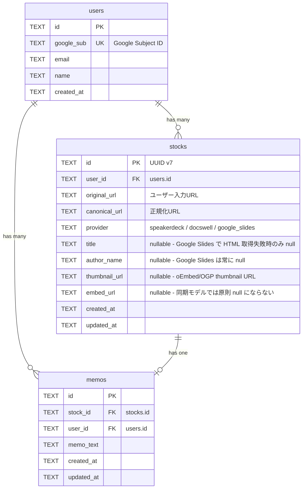
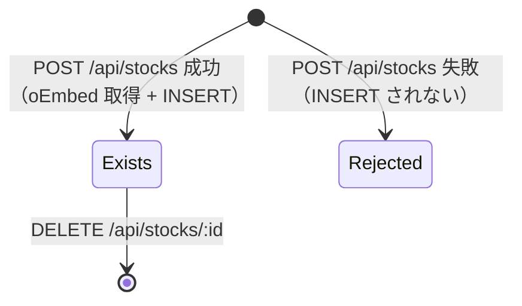

# データモデル仕様

ER図、リレーション、マイグレーション

---

## 目次

- [&sect;1 概要](#1-概要)
- [&sect;2 ER図](#2-er図)
- [&sect;3 テーブル定義](#3-テーブル定義)
- [&sect;4 リレーションと制約](#4-リレーションと制約)
- [&sect;5 型の設計方針](#5-型の設計方針)
- [&sect;6 マイグレーション](#6-マイグレーション)

---

## &sect;1 概要

Slide Stock のデータは Cloudflare D1（SQLite ベース）に格納する。テーブルは **users** / **stocks** / **memos** の 3 つで構成され、ユーザーがスライド URL をストックし、各スライドにメモを付ける、というドメインモデルを表現する。

設計原則:

- 全 ID は UUID（TEXT 型）を使用 --- D1 / PostgreSQL 双方で互換性あり
- 日時は ISO 8601 文字列（TEXT 型）--- SQLite 互換かつ可読性確保
- 外部キー制約を明示 --- 参照整合性を維持
- ベンダー依存構文を避ける --- 将来の PostgreSQL 等への移行を考慮

システム全体のアーキテクチャについては [architecture-spec.md](architecture-spec.md) を参照。

---

## &sect;2 ER図



---

## &sect;3 テーブル定義

### 3.1 users

ユーザー情報を管理する。Google OIDC で取得した情報を格納。認証フローの詳細は [backend-spec.md](backend-spec.md) を参照。

| カラム | 型 | 制約 | 説明 |
|--------|------|------|------|
| id | TEXT | PK | UUID |
| google_sub | TEXT | UNIQUE, NOT NULL | Google Subject ID |
| email | TEXT | NOT NULL | メールアドレス |
| name | TEXT | NOT NULL | 表示名 |
| created_at | TEXT | NOT NULL | 作成日時 (ISO 8601) |

### 3.2 stocks

ストックしたスライド情報を管理する。MVP では同期モデル + rollback semantics（backend-spec.md / ADR-009 &sect;4-2）により、`POST /api/stocks` のリクエスト内で oEmbed 取得まで完了してから INSERT する。取得失敗時は INSERT せず、`pending` / `failed` のレコードは存在しない。

| カラム | 型 | 制約 | 説明 |
|--------|------|------|------|
| id | TEXT | PK | UUID v7（時系列ソート可能、`uuidv7` パッケージ） |
| user_id | TEXT | FK &rarr; users.id, NOT NULL | 所有ユーザー |
| original_url | TEXT | NOT NULL | ユーザーが入力した元 URL |
| canonical_url | TEXT | NOT NULL | 正規化された URL |
| provider | TEXT | NOT NULL | `speakerdeck` / `docswell` / `google_slides` |
| title | TEXT | nullable | スライドタイトル（Google Slides の HTML 取得失敗時のみ null） |
| author_name | TEXT | nullable | 著者名（Google Slides は仕様上常に null） |
| thumbnail_url | TEXT | nullable | サムネイル URL。oEmbed の `thumbnail_url` を優先し、なければ公開ページ HTML の `og:image` / `twitter:image` から取得。取得不可なら `null` |
| embed_url | TEXT | nullable | 埋め込み用 URL（同期モデル + rollback semantics 下では原則 null にならない） |
| created_at | TEXT | NOT NULL | 作成日時 (ISO 8601) |
| updated_at | TEXT | NOT NULL | 更新日時 (ISO 8601) |

> **`status` カラムの履歴と方針:** 当初は `'pending' / 'ready' / 'failed'` を持つカラムだったが、ADR-004 で同期化した後 migration 0003 (`drop_status.sql`) で物理削除済み。ADR-009 &sect;4-3 でも YAGNI 原則により再導入しないことを確定（rollback semantics 下では `status` の値が `'ready'` 以外になる経路がないため意味を持たない）。クライアントもメタデータの有無を `embed_url` / `title` で判定する（frontend-spec.md &sect;5.3.3）。

#### stock のライフサイクル

`status` カラムは廃止されているため明示的な遷移図はない。実装上のライフサイクルは「存在しない &rarr; 存在する（メタデータ充足）」のみ:



stock は INSERT 後、ユーザーが DELETE するまで残る。同期モデル + rollback semantics（ADR-009 &sect;4-2）と Google Slides 軟性失敗の撤回（ADR-009 &sect;4-5）により、INSERT が成功した stock は `title` / `embed_url` ともに充足が保証される（`author_name` のみ Google Slides では仕様上 `null`、`thumbnail_url` は取得できない場合 `null`）。

将来 Cloudflare Queues 等で非同期化したくなった場合は、その時点で migration を 1 本足して `status` カラムを再導入する（YAGNI、ADR-009 &sect;4-3）。

### 3.3 memos

各スライドに対するテキストメモ。1 つの stock に対して 1 つの memo。API 仕様の詳細は [backend-spec.md](backend-spec.md) を参照。

| カラム | 型 | 制約 | 説明 |
|--------|------|------|------|
| id | TEXT | PK | UUID |
| stock_id | TEXT | FK &rarr; stocks.id, NOT NULL | 対象スライド |
| user_id | TEXT | FK &rarr; users.id, NOT NULL | メモ作成者 |
| memo_text | TEXT | NOT NULL | メモ本文 |
| created_at | TEXT | NOT NULL | 作成日時 (ISO 8601) |
| updated_at | TEXT | NOT NULL | 更新日時 (ISO 8601) |

---

## &sect;4 リレーションと制約

### 4.1 外部キー

| 子テーブル | カラム | 参照先 |
|------------|--------|--------|
| stocks | user_id | users.id |
| memos | stock_id | stocks.id |
| memos | user_id | users.id |

### 4.2 インデックス

| テーブル | カラム | 種類 | 目的 |
|----------|--------|------|------|
| users | google_sub | UNIQUE | OIDC 認証時の高速検索 |
| stocks | user_id | INDEX | ユーザー別一覧取得 |
| stocks | user_id, created_at | INDEX | ユーザー別一覧の日時ソート |
| stocks | user_id, canonical_url | UNIQUE (`uniq_stocks_user_canonical_url`、migration 0002) | 同一ユーザー内での重複登録を DB レベルで防止。並列リクエスト時の最終防衛線（backend-spec.md &sect;3.4 / &sect;3.6） |
| memos | stock_id | UNIQUE | stock 毎に 1 メモの制約 |

---

## &sect;5 型の設計方針

SQLite（D1）のスキーマ上は全カラムが TEXT 型だが、TypeScript 側では適切な型を付与して型安全性を確保する。本セクションでは DB 型に関する設計判断を記載する。

### 5.1 SQLite CHECK 制約（未実施）

D1 は SQLite ベースで CHECK 制約をサポートしており、`provider` のような enum 値は DB レベルで不正値の INSERT を防止できる。

対象カラム:

| カラム | CHECK 制約 |
|--------|------------|
| stocks.provider | `CHECK(provider IN ('speakerdeck', 'docswell', 'google_slides'))` |

> SQLite は `ALTER TABLE` で CHECK 制約を追加できないため、テーブル再作成 + データ移行が必要。実施時は新規マイグレーションとして追加する。

### 5.2 TypeScript DB Row 型

TypeScript 側では共有型定義ファイル（`worker/types/db.ts`）を用意し、DB の行型を一元管理する方針。

レイヤー別の対応方針:

| レイヤー | 対応 | 理由 |
|---------|------|------|
| **SQLite スキーマ** | CHECK 制約を追加（未実施） | DB レベルで不正値を防止 |
| **TypeScript DB Row 型** | 共有型定義ファイルを作成 | 型の一元管理、リテラル型活用 |
| **API レスポンス型** | 既存で十分（変更なし） | `StockItem`, `MemoResponse` は既に適切 |

主要な行型の定義例:

```typescript
import type { Provider } from "../lib/provider";

/** stocks テーブルの行型 */
export interface StockRow {
  id: string;
  user_id: string;
  original_url: string;
  canonical_url: string;
  provider: Provider;
  title: string | null;
  author_name: string | null;
  thumbnail_url: string | null;
  embed_url: string | null;
  created_at: string;
  updated_at: string;
}

/** stocks + memos LEFT JOIN の結果型（一覧・詳細用） */
export interface StockWithMemoRow extends StockRow {
  memo_text: string | null;
}

/** memos テーブルの行型 */
export interface MemoRow {
  id: string;
  stock_id: string;
  user_id: string;
  memo_text: string;
  created_at: string;
  updated_at: string;
}

/** users テーブルの行型 */
export interface UserRow {
  id: string;
  google_sub: string;
  email: string;
  name: string;
  created_at: string;
}
```

### 5.3 branded type を使わない理由

`UserId`, `StockId` のような branded type は以下の理由で採用しない:

- 型安全性の恩恵が小さい（UUID 文字列を間違える場面が少ない）
- D1 の `.first<T>()` との相性が悪い（型変換が煩雑）
- ISO 日付文字列も `string` のまま（テンプレートリテラル型はエディタ補完を阻害）

### 5.4 実施済みの型改善

| 項目 | 状態 | 詳細 |
|------|------|------|
| `stocks.status` カラムの削除 | 実施済み | migration 0003 (`drop_status.sql`) で物理削除。ADR-004 で同期モデルに移行後、`'ready'` 以外の値を取り得なくなったため YAGNI 原則で削除 |
| UUID v7 の採用 | 実施済み | `stocks.id` に UUID v7 を使用（`uuidv7` パッケージ）。時系列ソート可能 |

---

## &sect;6 マイグレーション

マイグレーションファイルは `migrations/` ディレクトリに格納される。Cloudflare D1 のマイグレーション機構で管理。

| Migration | ファイル | 内容 |
|-----------|----------|------|
| 0001 | `0001_init.sql` | 初期スキーマ（users / stocks / memos テーブル作成）。stocks に `status TEXT NOT NULL DEFAULT 'pending'` を含む初期設計 |
| 0002 | `0002_unique_stock_per_user.sql` | `(user_id, canonical_url)` の UNIQUE 制約を追加（`uniq_stocks_user_canonical_url`）。並列リクエストでの重複登録を DB レベルで防止する最終防衛線 |
| 0003 | `0003_drop_status.sql` | ADR-004 による同期モデル移行後、不要となった `stocks.status` カラムを `ALTER TABLE ... DROP COLUMN status` で削除。ADR-009 でも維持 |

---

*統合元: `database.md`, `plan-db-types.md`*
