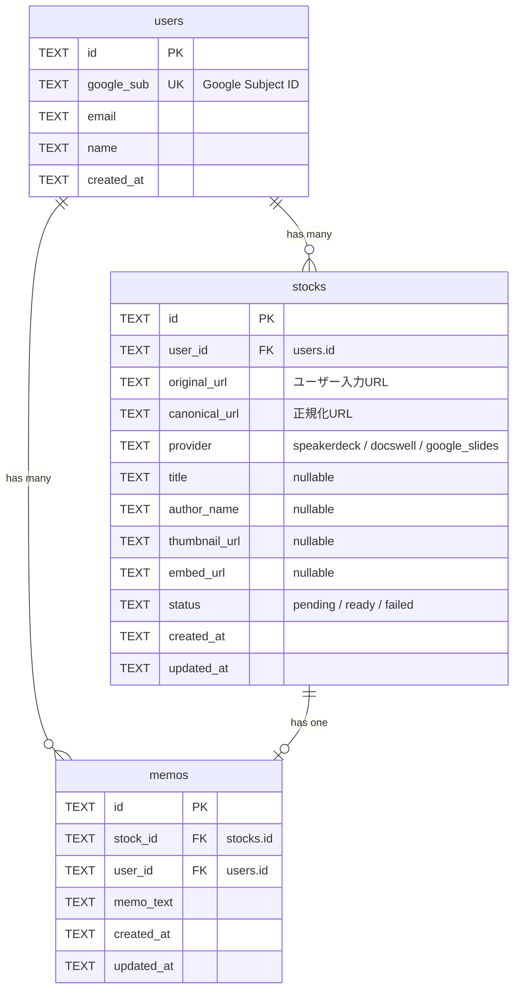
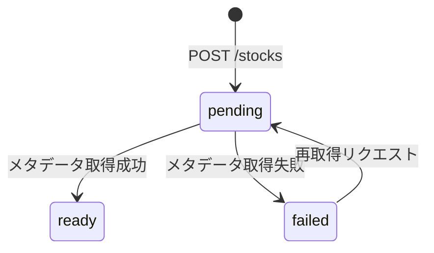

# データベース定義

## ER図

---

## テーブル定義

### users

ユーザー情報を管理する。Google OIDCで取得した情報を格納。

| カラム | 型 | 制約 | 説明 |
|--------|------|------|------|
| id | TEXT | PK | UUID |
| google_sub | TEXT | UNIQUE, NOT NULL | Google Subject ID |
| email | TEXT | NOT NULL | メールアドレス |
| name | TEXT | NOT NULL | 表示名 |
| created_at | TEXT | NOT NULL | 作成日時 (ISO 8601) |

### stocks

ストックしたスライド情報を管理する。登録時は `pending` 状態で作成され、Queue Consumer によるメタデータ取得後に `ready` になる。

| カラム | 型 | 制約 | 説明 |
|--------|------|------|------|
| id | TEXT | PK | UUID |
| user_id | TEXT | FK → users.id, NOT NULL | 所有ユーザー |
| original_url | TEXT | NOT NULL | ユーザーが入力した元URL |
| canonical_url | TEXT | NOT NULL | 正規化されたURL |
| provider | TEXT | NOT NULL | `speakerdeck` / `docswell` / `google_slides` |
| title | TEXT | nullable | スライドタイトル |
| author_name | TEXT | nullable | 著者名 |
| thumbnail_url | TEXT | nullable | サムネイルURL (外部参照) |
| embed_url | TEXT | nullable | 埋め込み用URL |
| status | TEXT | NOT NULL, DEFAULT 'pending' | `pending` / `ready` / `failed` |
| created_at | TEXT | NOT NULL | 作成日時 (ISO 8601) |
| updated_at | TEXT | NOT NULL | 更新日時 (ISO 8601) |

### memos

各スライドに対するテキストメモ。1つのstockに対して1つのmemo。

| カラム | 型 | 制約 | 説明 |
|--------|------|------|------|
| id | TEXT | PK | UUID |
| stock_id | TEXT | FK → stocks.id, NOT NULL | 対象スライド |
| user_id | TEXT | FK → users.id, NOT NULL | メモ作成者 |
| memo_text | TEXT | NOT NULL | メモ本文 |
| created_at | TEXT | NOT NULL | 作成日時 (ISO 8601) |
| updated_at | TEXT | NOT NULL | 更新日時 (ISO 8601) |

---

## ステータス遷移図

---

## インデックス方針

| テーブル | カラム | 種類 | 目的 |
|----------|--------|------|------|
| users | google_sub | UNIQUE | OIDC認証時の高速検索 |
| stocks | user_id | INDEX | ユーザー別一覧取得 |
| stocks | user_id, created_at | INDEX | ユーザー別一覧の日時ソート |
| memos | stock_id | UNIQUE | stock毎に1メモの制約 |

---

## 設計方針

- 全IDは UUID (TEXT型) を使用 — D1/PostgreSQL双方で互換性あり
- 日時は ISO 8601 文字列 (TEXT型) — SQLite互換かつ可読性確保
- 外部キー制約を明示 — 参照整合性を維持
- ベンダー依存構文を避ける — 将来のPostgreSQL等への移行を考慮
