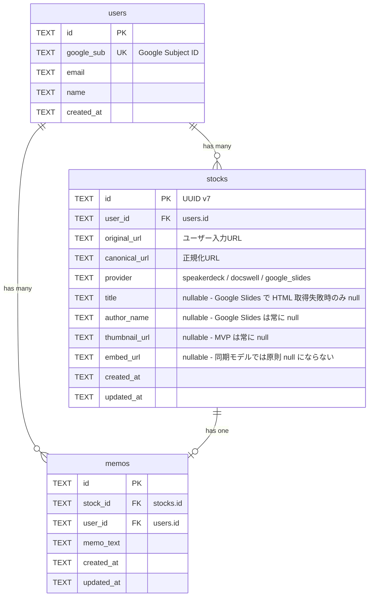
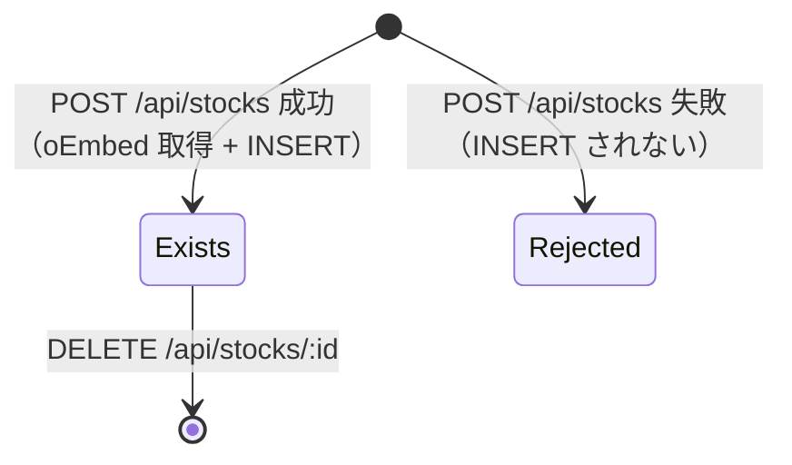

# データベース定義

## ER図

```mermaid
erDiagram
    users ||--o{ stocks : "has many"
    users ||--o{ memos : "has many"
    stocks ||--o| memos : "has one"

    users {
        TEXT id PK
        TEXT google_sub UK "Google Subject ID"
        TEXT email
        TEXT name
        TEXT created_at
    }

    stocks {
        TEXT id PK "UUID v7"
        TEXT user_id FK "users.id"
        TEXT original_url "ユーザー入力URL"
        TEXT canonical_url "正規化URL"
        TEXT provider "speakerdeck / docswell / google_slides"
        TEXT title "nullable - Google Slides で HTML 取得失敗時のみ null"
        TEXT author_name "nullable - Google Slides は常に null"
        TEXT thumbnail_url "nullable - MVP は常に null"
        TEXT embed_url "nullable - 同期モデルでは原則 null にならない"
        TEXT created_at
        TEXT updated_at
    }

    memos {
        TEXT id PK
        TEXT stock_id FK "stocks.id"
        TEXT user_id FK "users.id"
        TEXT memo_text
        TEXT created_at
        TEXT updated_at
    }
```

---

## テーブル定義

### users

ユーザー情報を管理する。Google OIDCで取得した情報を格納。

| カラム | 型 | 制約 | 説明 |
|--------|------|------|------|
| id | TEXT | PK | UUID |
| google_sub | TEXT | UNIQUE, NOT NULL | Google Subject ID |
| email | TEXT | NOT NULL | メールアドレス |
| name | TEXT | NOT NULL | 表示名 |
| created_at | TEXT | NOT NULL | 作成日時 (ISO 8601) |

### stocks

ストックしたスライド情報を管理する。MVP では同期モデル + rollback semantics（oembed-spec.md §5 / stock-api-spec.md §3 / ADR-009 §4-2）により、`POST /api/stocks` のリクエスト内で oEmbed 取得まで完了してから INSERT する。取得失敗時は INSERT せず、`pending` / `failed` のレコードは存在しない。

| カラム | 型 | 制約 | 説明 |
|--------|------|------|------|
| id | TEXT | PK | UUID v7（時系列ソート可能、`uuidv7` パッケージ） |
| user_id | TEXT | FK → users.id, NOT NULL | 所有ユーザー |
| original_url | TEXT | NOT NULL | ユーザーが入力した元URL |
| canonical_url | TEXT | NOT NULL | 正規化されたURL |
| provider | TEXT | NOT NULL | `speakerdeck` / `docswell` / `google_slides` |
| title | TEXT | nullable | スライドタイトル（Google Slides の HTML 取得失敗時のみ null） |
| author_name | TEXT | nullable | 著者名（Google Slides は仕様上常に null） |
| thumbnail_url | TEXT | nullable | サムネイルURL（MVP では常に null） |
| embed_url | TEXT | nullable | 埋め込み用URL（同期モデル + rollback semantics 下では原則 null にならない） |
| created_at | TEXT | NOT NULL | 作成日時 (ISO 8601) |
| updated_at | TEXT | NOT NULL | 更新日時 (ISO 8601) |

> **`status` カラムの履歴と方針:** 当初は `'pending' / 'ready' / 'failed'` を持つカラムだったが、ADR-004 で同期化した後 migration 0003 (`drop_status.sql`) で物理削除。ADR-009 §4-3 でも YAGNI 原則により再導入しないことを確定（rollback semantics 下では `status` の値が `'ready'` 以外になる経路がないため意味を持たない）。クライアントもメタデータの有無を `embed_url` / `title` で判定する（ui-spec.md §5.3.3）。

#### マイグレーション履歴

| Migration | 内容 |
|-----------|------|
| `0001_init.sql` | 初期スキーマ（users / stocks / memos）。stocks に `status TEXT NOT NULL DEFAULT 'pending'` を含む |
| `0002_unique_stock_per_user.sql` | `(user_id, canonical_url)` の UNIQUE 制約を追加（`uniq_stocks_user_canonical_url`）。並列リクエストの最終防衛線 |
| `0003_drop_status.sql` | ADR-004 後、`stocks.status` カラムを `ALTER TABLE ... DROP COLUMN status` で削除。ADR-009 でも維持 |

### memos

各スライドに対するテキストメモ。1つのstockに対して1つのmemo。

| カラム | 型 | 制約 | 説明 |
|--------|------|------|------|
| id | TEXT | PK | UUID |
| stock_id | TEXT | FK → stocks.id, NOT NULL | 対象スライド |
| user_id | TEXT | FK → users.id, NOT NULL | メモ作成者 |
| memo_text | TEXT | NOT NULL | メモ本文 |
| created_at | TEXT | NOT NULL | 作成日時 (ISO 8601) |
| updated_at | TEXT | NOT NULL | 更新日時 (ISO 8601) |

---

## stock のライフサイクル

`status` カラムは廃止されているため明示的な遷移図はない。実装上のライフサイクルは「存在しない → 存在する（メタデータ充足）」のみ:

```mermaid
stateDiagram-v2
    [*] --> Exists : POST /api/stocks 成功（oEmbed 取得 + INSERT）
    [*] --> Rejected : POST /api/stocks 失敗（INSERT されない）
    Exists --> [*] : DELETE /api/stocks/:id
```

stock は INSERT 後、ユーザーが DELETE するまで残る。同期モデル + rollback semantics（ADR-009 §4-2）により、INSERT が成功した stock は `embed_url` 充足が原則保証される（Google Slides で HTML タイトルが取れない軟性失敗のみ `title=null` の例外）。

将来 Cloudflare Queues 等で非同期化したくなった場合は、その時点で migration を 1 本足して `status` カラムを再導入する（YAGNI、ADR-009 §4-3）。

---

## インデックス方針

| テーブル | カラム | 種類 | 目的 |
|----------|--------|------|------|
| users | google_sub | UNIQUE | OIDC認証時の高速検索 |
| stocks | user_id | INDEX | ユーザー別一覧取得 |
| stocks | user_id, created_at | INDEX | ユーザー別一覧の日時ソート |
| stocks | user_id, canonical_url | UNIQUE (`uniq_stocks_user_canonical_url`、migration 0002) | 同一ユーザー内での重複登録を DB レベルで防止。並列リクエスト時の最終防衛線（stock-api-spec.md §3.4 / §3.6） |
| memos | stock_id | UNIQUE | stock毎に1メモの制約 |

---

## 設計方針

- 全IDは UUID (TEXT型) を使用 — D1/PostgreSQL双方で互換性あり
- 日時は ISO 8601 文字列 (TEXT型) — SQLite互換かつ可読性確保
- 外部キー制約を明示 — 参照整合性を維持
- ベンダー依存構文を避ける — 将来のPostgreSQL等への移行を考慮
