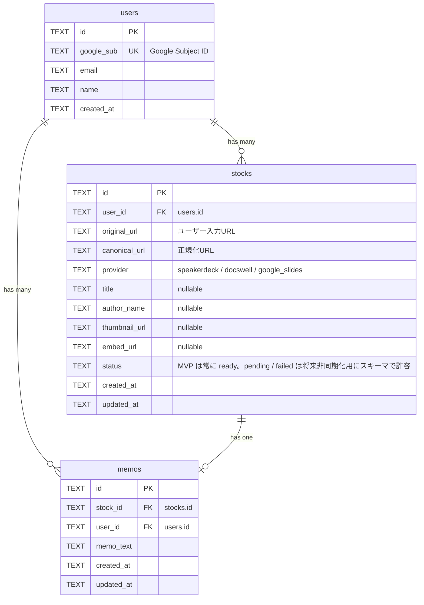
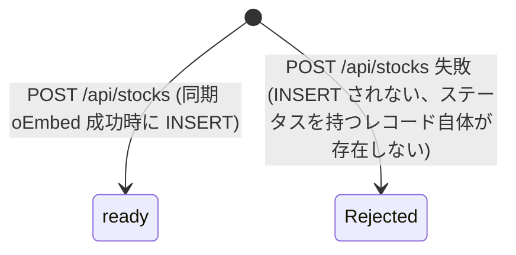
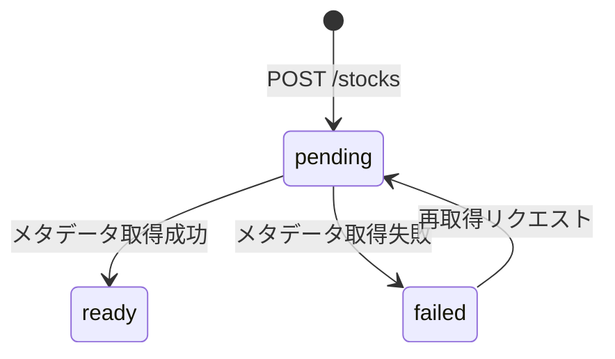

# データベース定義

## ER図

```mermaid
erDiagram
    users ||--o{ stocks : "has many"
    users ||--o{ memos : "has many"
    stocks ||--o| memos : "has one"

    users {
        TEXT id PK
        TEXT google_sub UK "Google Subject ID"
        TEXT email
        TEXT name
        TEXT created_at
    }

    stocks {
        TEXT id PK
        TEXT user_id FK "users.id"
        TEXT original_url "ユーザー入力URL"
        TEXT canonical_url "正規化URL"
        TEXT provider "speakerdeck / docswell / google_slides"
        TEXT title "nullable"
        TEXT author_name "nullable"
        TEXT thumbnail_url "nullable"
        TEXT embed_url "nullable"
        TEXT status "MVP は常に ready。pending / failed は将来非同期化用にスキーマで許容"
        TEXT created_at
        TEXT updated_at
    }

    memos {
        TEXT id PK
        TEXT stock_id FK "stocks.id"
        TEXT user_id FK "users.id"
        TEXT memo_text
        TEXT created_at
        TEXT updated_at
    }
```

---

## テーブル定義

### users

ユーザー情報を管理する。Google OIDCで取得した情報を格納。

| カラム | 型 | 制約 | 説明 |
|--------|------|------|------|
| id | TEXT | PK | UUID |
| google_sub | TEXT | UNIQUE, NOT NULL | Google Subject ID |
| email | TEXT | NOT NULL | メールアドレス |
| name | TEXT | NOT NULL | 表示名 |
| created_at | TEXT | NOT NULL | 作成日時 (ISO 8601) |

### stocks

ストックしたスライド情報を管理する。MVP では同期モデル（oembed-spec.md §5 / stock-api-spec.md §3）により、`POST /api/stocks` のリクエスト内で oEmbed 取得まで完了してから `status='ready'` で INSERT する。取得失敗時は INSERT せず（DB ロールバック相当）、`pending` / `failed` のレコードは作られない。

| カラム | 型 | 制約 | 説明 |
|--------|------|------|------|
| id | TEXT | PK | UUID |
| user_id | TEXT | FK → users.id, NOT NULL | 所有ユーザー |
| original_url | TEXT | NOT NULL | ユーザーが入力した元URL |
| canonical_url | TEXT | NOT NULL | 正規化されたURL |
| provider | TEXT | NOT NULL | `speakerdeck` / `docswell` / `google_slides` |
| title | TEXT | nullable | スライドタイトル |
| author_name | TEXT | nullable | 著者名 |
| thumbnail_url | TEXT | nullable | サムネイルURL (外部参照) |
| embed_url | TEXT | nullable | 埋め込み用URL |
| status | TEXT | NOT NULL, DEFAULT 'ready' | MVP では常に `ready`。スキーマ上は `pending` / `ready` / `failed` を許容（将来非同期化用） |
| created_at | TEXT | NOT NULL | 作成日時 (ISO 8601) |
| updated_at | TEXT | NOT NULL | 更新日時 (ISO 8601) |

> **設計判断（status カラムの扱い）:** スキーマには `pending` / `failed` を残すが、MVP では常に `ready` だけを書き込む。これは将来 Cloudflare Queues 等で非同期化する際にカラムを再利用できるようにするため（マイグレーションを増やさない）。クライアント側は `status === 'ready'` 以外を分岐する必要がない（ui-spec.md §5.3.3）。

### memos

各スライドに対するテキストメモ。1つのstockに対して1つのmemo。

| カラム | 型 | 制約 | 説明 |
|--------|------|------|------|
| id | TEXT | PK | UUID |
| stock_id | TEXT | FK → stocks.id, NOT NULL | 対象スライド |
| user_id | TEXT | FK → users.id, NOT NULL | メモ作成者 |
| memo_text | TEXT | NOT NULL | メモ本文 |
| created_at | TEXT | NOT NULL | 作成日時 (ISO 8601) |
| updated_at | TEXT | NOT NULL | 更新日時 (ISO 8601) |

---

## ステータス遷移図

### MVP（同期モデル）

```mermaid
stateDiagram-v2
    [*] --> ready : POST /api/stocks (同期 oEmbed 成功時に INSERT)
    [*] --> Rejected : POST /api/stocks 失敗 (INSERT されない、ステータスを持つレコード自体が存在しない)
```

同期モデル（oembed-spec.md §5 / stock-api-spec.md §3）では、oEmbed 取得が成功するまで `stocks` への INSERT は実行されない。結果として MVP の運用上、stock のライフサイクルは `(存在しない) → ready` のみ。`pending` / `failed` 状態は作られない。

### 将来の非同期モデル（参考、未実装）

将来 Cloudflare Queues 等で非同期化する場合は次の遷移を再導入する余地がある:

```mermaid
stateDiagram-v2
    [*] --> pending : POST /stocks
    pending --> ready : メタデータ取得成功
    pending --> failed : メタデータ取得失敗
    failed --> pending : 再取得リクエスト
```

スキーマ上 `status` カラムが `pending` / `failed` を許容しているのはこの将来拡張に備えるためで、MVP の実装からは利用されない。

---

## インデックス方針

| テーブル | カラム | 種類 | 目的 |
|----------|--------|------|------|
| users | google_sub | UNIQUE | OIDC認証時の高速検索 |
| stocks | user_id | INDEX | ユーザー別一覧取得 |
| stocks | user_id, created_at | INDEX | ユーザー別一覧の日時ソート |
| memos | stock_id | UNIQUE | stock毎に1メモの制約 |

---

## 設計方針

- 全IDは UUID (TEXT型) を使用 — D1/PostgreSQL双方で互換性あり
- 日時は ISO 8601 文字列 (TEXT型) — SQLite互換かつ可読性確保
- 外部キー制約を明示 — 参照整合性を維持
- ベンダー依存構文を避ける — 将来のPostgreSQL等への移行を考慮
