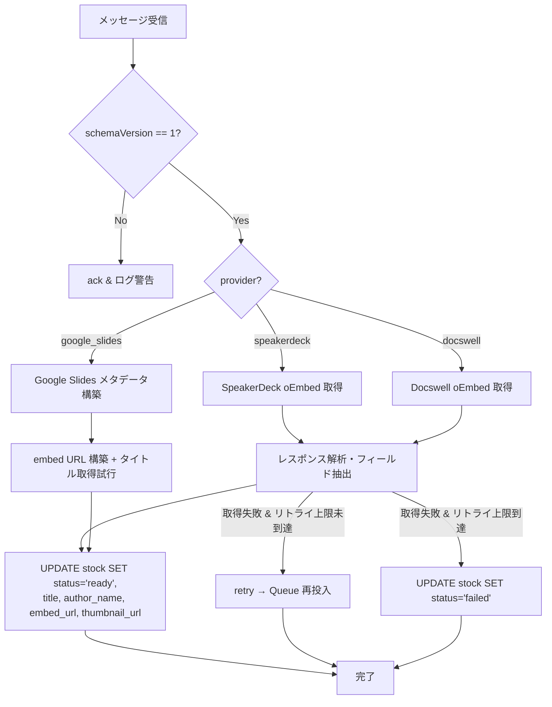

# oEmbed / Queue 処理仕様

## 1. 概要

ユーザーが URL を登録すると、API は stock を `pending` 状態で作成し、Cloudflare Queue にメッセージを送信する。
Queue Consumer がメッセージを受信し、oEmbed / メタデータ取得を行い、stock を `ready` または `failed` に更新する。

本仕様では以下を定義する:
1. 各プロバイダの oEmbed エンドポイントとレスポンス仕様
2. Google Slides の embed URL 構築ルール
3. Queue メッセージスキーマ
4. リトライポリシー
5. 失敗時の処理

### 前提ドキュメント

- [docs/architecture.md](architecture.md) — スライド登録フロー（シーケンス図）
- [docs/database.md](database.md) — stocks テーブル（status: pending → ready / failed）
- [docs/provider-spec.md](provider-spec.md) — プロバイダ検出・URL 正規化

---

## 2. SpeakerDeck oEmbed

### 2.1 エンドポイント

```
GET https://speakerdeck.com/oembed.json?url={canonical_url}
```

| パラメータ | 必須 | 説明 |
|-----------|------|------|
| `url` | Yes | 公開スライドの canonical URL（`https://speakerdeck.com/{user}/{slug}`） |

- 認証不要（パブリックエンドポイント）
- レスポンス形式は JSON 固定（`.json` サフィックス）
- `maxwidth` / `maxheight` パラメータは送信しない（デフォルトサイズを使用）

### 2.2 レスポンス例

```json
{
  "type": "rich",
  "version": "1.0",
  "provider_name": "Speaker Deck",
  "provider_url": "https://speakerdeck.com/",
  "title": "Atom",
  "author_name": "John Nunemaker",
  "author_url": "https://speakerdeck.com/jnunemaker",
  "html": "<iframe id=\"talk_frame_282032\" class=\"speakerdeck-iframe\" src=\"https://speakerdeck.com/player/31f86a9069ae0132dede22511952b5a3\" width=\"710\" height=\"399\" style=\"aspect-ratio:710/399; border:0; padding:0; margin:0; background:transparent;\" frameborder=\"0\" allowtransparency=\"true\" allowfullscreen=\"allowfullscreen\"></iframe>",
  "width": 710,
  "height": 399,
  "ratio": 1.7777777777777777
}
```

### 2.3 フィールド抽出マッピング

| oEmbed フィールド | 抽出方法 | → stocks カラム |
|-------------------|---------|-----------------|
| `title` | 直接取得 | `title` |
| `author_name` | 直接取得 | `author_name` |
| `html` 内の iframe `src` 属性 | 正規表現で抽出 | `embed_url` |
| （なし） | — | `thumbnail_url` = `null` |

### 2.4 embed_url の抽出

`html` フィールドから iframe の `src` 属性を正規表現で抽出する:

```typescript
function extractEmbedUrl(html: string): string | null {
  const match = html.match(/src="(https:\/\/speakerdeck\.com\/player\/[a-f0-9]+)"/);
  return match ? match[1] : null;
}
```

抽出結果例: `https://speakerdeck.com/player/31f86a9069ae0132dede22511952b5a3`

### 2.5 エラーケース

| HTTP ステータス | 意味 | 処理 |
|----------------|------|------|
| 200 | 正常 | フィールド抽出 → stock 更新 |
| 404 | スライドが存在しない / 非公開 | `status=failed`, `error_detail` 記録 |
| 5xx | SpeakerDeck 側障害 | リトライ対象 |

---

## 3. Docswell oEmbed

### 3.1 エンドポイント

```
GET https://www.docswell.com/service/oembed?url={canonical_url}&format=json
```

| パラメータ | 必須 | 説明 |
|-----------|------|------|
| `url` | Yes | 公開スライドの canonical URL（`https://www.docswell.com/s/{user}/{slideId}`） |
| `format` | No | `json`（明示的に指定する） |

- 認証不要（パブリックエンドポイント）

### 3.2 レスポンス例

```json
{
  "type": "rich",
  "version": 1,
  "provider_name": "ドクセル",
  "provider_url": "https://www.docswell.com/",
  "title": "Windows Server 2025 新機能おさらい",
  "url": "https://www.docswell.com/slide/59VDWM/embed",
  "author_name": "Kazuki Takai",
  "author_url": "https://www.docswell.com/user/takai",
  "html": "<iframe src=\"https://www.docswell.com/slide/59VDWM/embed\" allowfullscreen=\"true\" class=\"docswell-iframe\" width=\"620\" height=\"349\" style=\"border: 1px solid #ccc; display: block; margin: 0px auto; padding: 0px; aspect-ratio: 620/349;\"></iframe>",
  "width": 620,
  "height": 349
}
```

> **注意:** `version` が数値 `1` で返る（oEmbed 仕様では文字列 `"1.0"` が正式）。実装では両方許容すること。

### 3.3 フィールド抽出マッピング

| oEmbed フィールド | 抽出方法 | → stocks カラム |
|-------------------|---------|-----------------|
| `title` | 直接取得 | `title` |
| `author_name` | 直接取得 | `author_name` |
| `url` | 直接取得 | `embed_url` |
| （なし） | — | `thumbnail_url` = `null` |

> **設計判断:** Docswell は `url` フィールドに embed URL（`https://www.docswell.com/slide/{slideId}/embed`）を返す。
> `html` 内の iframe `src` からも同じ URL を取得できるが、`url` フィールドを優先使用する（パースが不要でシンプル）。

### 3.4 エラーケース

| HTTP ステータス | レスポンス | 処理 |
|----------------|-----------|------|
| 200 | 正常な oEmbed JSON | フィールド抽出 → stock 更新 |
| 404 | `{"status": 404, "errors": "Slide not found or private"}` | `status=failed`, `error_detail` 記録 |
| 5xx | サーバーエラー | リトライ対象 |

---

## 4. Google Slides（oEmbed 非対応）

### 4.1 方針

Google Slides は oEmbed に対応していない。以下の方法でメタデータを取得する:

1. **embed_url**: canonical URL から機械的に構築（外部リクエスト不要）
2. **title**: 公開ページの HTML `<title>` タグから取得を試みる（取得失敗時は `null`）
3. **author_name**: 公開ページには含まれないため、常に `null`
4. **thumbnail_url**: MVP では常に `null`

### 4.2 embed URL 構築ルール

```
https://docs.google.com/presentation/d/{presentationId}/embed
```

`presentationId` は canonical URL（`https://docs.google.com/presentation/d/{presentationId}`）から取得済み。

```typescript
function buildGoogleSlidesEmbedUrl(canonicalUrl: string): string {
  // canonicalUrl = "https://docs.google.com/presentation/d/{presentationId}"
  return `${canonicalUrl}/embed`;
}
```

> **注意:** embed パラメータ（`start`, `loop`, `delayms`）は付与しない。
> フロントエンドの iframe 生成時に必要に応じてパラメータを追加する設計とする。

### 4.3 タイトル取得

公開設定の Google Slides ページの `<title>` タグからタイトルを取得する。

**取得手順:**

1. canonical URL に対して HTTP GET を実行
2. レスポンス HTML から `<title>` タグの内容を抽出
3. ` - Google スライド` または ` - Google Slides` サフィックスを除去
4. 取得できた場合は `title` に設定、取得できなかった場合は `null`

```typescript
async function fetchGoogleSlidesTitle(canonicalUrl: string): Promise<string | null> {
  try {
    const res = await fetch(canonicalUrl, {
      headers: { "Accept-Language": "ja" },
      redirect: "follow",
    });
    if (!res.ok) return null;

    const html = await res.text();
    const match = html.match(/<title>(.+?)<\/title>/);
    if (!match) return null;

    return match[1]
      .replace(/ - Google (スライド|Slides)$/, "")
      .trim() || null;
  } catch {
    return null;
  }
}
```

**制約:**
- 非公開のプレゼンテーションでは 401/403 が返り、タイトル取得不可（`null`）
- Google のレスポンスは JavaScript レンダリング前提のため、`<title>` タグが空の場合がある（`null`）
- タイトル取得失敗は stock の `status` には影響しない（`embed_url` が構築できれば `ready`）

### 4.4 処理まとめ

| 項目 | 値 | 取得方法 |
|------|----|---------|
| `embed_url` | `{canonicalUrl}/embed` | 機械的構築（常に成功） |
| `title` | プレゼンタイトル or `null` | HTML `<title>` スクレイピング |
| `author_name` | `null` | 取得手段なし |
| `thumbnail_url` | `null` | MVP では取得しない |

### 4.5 成功判定

Google Slides は embed URL が機械的に構築できるため、**常に `status=ready` になる**。
タイトル取得の成否は status に影響しない。

---

## 5. Queue メッセージスキーマ

### 5.1 メッセージ構造

```typescript
interface OEmbedQueueMessage {
  schemaVersion: 1;
  stockId: string;        // stocks.id (UUID)
  originalUrl: string;    // ユーザー入力 URL
  canonicalUrl: string;   // 正規化済み URL
  provider: "speakerdeck" | "docswell" | "google_slides";
}
```

### 5.2 メッセージ例

```json
{
  "schemaVersion": 1,
  "stockId": "550e8400-e29b-41d4-a716-446655440000",
  "originalUrl": "https://speakerdeck.com/jnunemaker/atom",
  "canonicalUrl": "https://speakerdeck.com/jnunemaker/atom",
  "provider": "speakerdeck"
}
```

### 5.3 Producer（API 側）

`POST /stocks` のハンドラ内で stock を INSERT した直後に enqueue する:

```typescript
await env.OEMBED_QUEUE.send({
  schemaVersion: 1,
  stockId: stock.id,
  originalUrl: body.url,
  canonicalUrl: canonicalUrl,
  provider: provider,
});
```

### 5.4 wrangler.toml 設定

```toml
[[queues.producers]]
queue = "oembed-fetch"
binding = "OEMBED_QUEUE"

[[queues.consumers]]
queue = "oembed-fetch"
max_batch_size = 5
max_batch_timeout = 30
max_retries = 3
dead_letter_queue = "oembed-fetch-dlq"
```

---

## 6. Consumer 処理フロー

### 6.1 全体フロー



### 6.2 Consumer エントリポイント

```typescript
export default {
  async queue(
    batch: MessageBatch<OEmbedQueueMessage>,
    env: Env,
  ): Promise<void> {
    for (const message of batch.messages) {
      try {
        await processMessage(message.body, env);
        message.ack();
      } catch (error) {
        // retry() を呼ぶと Cloudflare Queues が再配信する
        message.retry();
      }
    }
  },
};
```

### 6.3 プロバイダ別処理

```typescript
async function processMessage(
  msg: OEmbedQueueMessage,
  env: Env,
): Promise<void> {
  let metadata: StockMetadata;

  switch (msg.provider) {
    case "speakerdeck":
      metadata = await fetchSpeakerDeckMetadata(msg.canonicalUrl);
      break;
    case "docswell":
      metadata = await fetchDocswellMetadata(msg.canonicalUrl);
      break;
    case "google_slides":
      metadata = await fetchGoogleSlidesMetadata(msg.canonicalUrl);
      break;
  }

  await updateStock(env.DB, msg.stockId, metadata);
}

interface StockMetadata {
  title: string | null;
  authorName: string | null;
  thumbnailUrl: string | null;
  embedUrl: string | null;
}
```

### 6.4 oEmbed レスポンス検証

oEmbed レスポンスを受信した際、以下を検証する:

1. HTTP ステータスが 200 であること
2. Content-Type が `application/json` であること
3. `type` フィールドが `"rich"` であること
4. embed URL が抽出できること（SpeakerDeck: `html` 内 iframe src、Docswell: `url` フィールド）

検証失敗時は `OEmbedFetchError` を throw し、Consumer のリトライ処理に委ねる。

---

## 7. リトライポリシー

### 7.1 Cloudflare Queues のリトライ機構

Cloudflare Queues は、Consumer が `message.retry()` を呼んだ場合にメッセージを再配信する。

| 設定項目 | 値 | 説明 |
|---------|-----|------|
| `max_retries` | `3` | 最大リトライ回数（初回 + 3回 = 合計4回試行） |
| `dead_letter_queue` | `oembed-fetch-dlq` | 全リトライ失敗後の転送先 |
| バックオフ | Cloudflare Queues の内部実装に依存 | 指数バックオフ的に再配信間隔が伸びる |

### 7.2 リトライ対象の判定

| ケース | リトライ | 理由 |
|--------|---------|------|
| oEmbed エンドポイント 5xx | Yes | プロバイダ側の一時的障害 |
| oEmbed エンドポイント タイムアウト | Yes | ネットワーク一時障害 |
| oEmbed エンドポイント 404 | **No** | スライドが存在しない / 非公開（恒久的エラー） |
| oEmbed エンドポイント 403 | **No** | アクセス拒否（恒久的エラー） |
| oEmbed レスポンスパース失敗 | **No** | レスポンス形式が想定外（恒久的エラー） |
| DB 更新失敗 | Yes | D1 の一時的障害 |

### 7.3 恒久的エラー時の処理

リトライ不要な恒久的エラーの場合は、`message.retry()` ではなく `message.ack()` を呼び、stock を即座に `failed` に更新する:

```typescript
try {
  await processMessage(message.body, env);
  message.ack();
} catch (error) {
  if (error instanceof PermanentError) {
    // リトライ不要 → 即座に failed に更新
    await markStockFailed(env.DB, message.body.stockId, error.message);
    message.ack();
  } else {
    // 一時的エラー → リトライ
    message.retry();
  }
}
```

### 7.4 Dead Letter Queue

全リトライが失敗した場合、メッセージは `oembed-fetch-dlq` に転送される。

- DLQ のメッセージは定期的に確認する（手動 or 監視）
- DLQ に到達した stock は `status=failed` のまま残る
- DLQ Consumer は MVP では実装しない（将来の拡張ポイント）

---

## 8. 失敗時の処理

### 8.1 stock テーブル更新

失敗時は以下のフィールドを更新する:

```sql
UPDATE stocks
SET status = 'failed',
    updated_at = ?
WHERE id = ?;
```

> **設計判断:** `error_detail` カラムは stocks テーブルに追加しない（MVP）。
> 理由:
> - エラー詳細は Consumer のログ（`console.error`）に出力する
> - ユーザーへのエラー表示は「メタデータの取得に失敗しました」の固定メッセージで十分
> - DB にエラーメッセージを保存するメリットが薄い（個人利用サービス）

### 8.2 再取得フロー

database.md のステータス遷移図に従い、`failed` → `pending` への再取得が可能:

1. ユーザーが「再取得」ボタンを押す（将来の UI 実装）
2. API が stock の `status` を `pending` に戻し、Queue にメッセージを再送信する

> **MVP 方針:** 再取得 UI は MVP では実装しない。
> `failed` になったスライドはユーザーが DELETE → 再 POST することで対応する。

### 8.3 ユーザーへの表示

| stock.status | 一覧画面での表示 |
|-------------|----------------|
| `pending` | ローディング表示（「メタデータ取得中...」） |
| `ready` | embed + タイトル + メモ |
| `failed` | エラー表示（「メタデータの取得に失敗しました」）+ 元 URL リンク + 削除ボタン |

---

## 9. oEmbed 取得のタイムアウト

各 oEmbed / メタデータ取得リクエストにタイムアウトを設定する:

| 対象 | タイムアウト | 理由 |
|------|-----------|------|
| SpeakerDeck oEmbed | 10 秒 | 通常の API 呼び出し |
| Docswell oEmbed | 10 秒 | 通常の API 呼び出し |
| Google Slides HTML fetch | 10 秒 | HTML ページ取得 |

```typescript
const controller = new AbortController();
const timeoutId = setTimeout(() => controller.abort(), 10_000);

const res = await fetch(url, { signal: controller.signal });
clearTimeout(timeoutId);
```

タイムアウト発生時は一時的エラーとしてリトライ対象とする。

---

## 10. セキュリティ考慮事項

### 10.1 SSRF 対策

Consumer が外部 URL にリクエストを送信するため、以下を考慮する:

- oEmbed エンドポイントのホスト名は固定（`speakerdeck.com`, `www.docswell.com`, `docs.google.com`）
- Consumer は **canonical URL のみ** を使用してリクエストを送信する
- canonical URL は `detectProvider` でバリデーション済みのため、任意 URL へのリクエストは発生しない

### 10.2 レスポンスサイズ制限

oEmbed レスポンスが異常に大きい場合に備え、レスポンスボディの最大サイズを制限する:

- oEmbed JSON: 最大 **100 KB**
- Google Slides HTML（タイトル取得用）: 最大 **500 KB**（HTML 全体を読む必要はなく、`<title>` が含まれる先頭部分のみ必要）

```typescript
const MAX_OEMBED_RESPONSE_SIZE = 100 * 1024;  // 100 KB
const MAX_HTML_RESPONSE_SIZE = 500 * 1024;     // 500 KB
```

---

## 11. 実装タスクとの対応

| タスク | 本仕様の該当セクション |
|--------|----------------------|
| T-521 oEmbed フェッチサービス実装 | セクション 2, 3, 4（プロバイダ別メタデータ取得） |
| T-522 Cloudflare Queues 設定 | セクション 5.4（wrangler.toml 設定） |
| T-523 Queue コンシューマー実装 | セクション 5, 6, 7, 8（メッセージスキーマ、Consumer フロー、リトライ、失敗処理） |
| T-524 oEmbed/Queue ユニットテスト | セクション 2〜4（レスポンスモック）、セクション 7（リトライシナリオ） |
