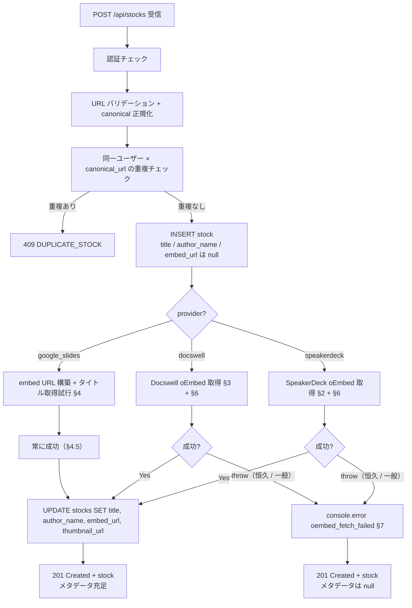

# oEmbed メタデータ取得仕様

## 1. 概要

ユーザーが URL を登録すると、`POST /api/stocks` のリクエスト内で oEmbed / メタデータ取得を**同期実行（best-effort）**する。取得が成功すれば `title` / `author_name` / `embed_url` を埋めて返し、失敗すれば**メタデータを `null` のまま 201 を返す**（stock は元 URL を保持した状態で残る）。元 URL 自体が「あとで開けばよい」価値を持つため、メタデータ未取得を 5xx とは扱わない。

Cloudflare Queues / Queue Consumer / `pending` / `failed` ステータスは使用しない（ADR-004 で削除済み、`stocks.status` カラムも migration 0003 で削除済み）。本仕様の根拠は ADR-004（Queue 廃止）、`ui-spec.md` §5.3.1 / §7.3、`stock-api-spec.md` §3 を参照。

本仕様では以下を定義する:
1. 各プロバイダの oEmbed エンドポイントとレスポンス仕様（§2 / §3）
2. Google Slides の embed URL 構築ルール（§4）
3. 同期取得処理フロー（§5）
4. タイムアウトとエラー分類（§6）
5. メタデータ取得失敗時のフォールバック（§7）

### 前提ドキュメント

- [docs/adr/004-remove-queue.md](adr/004-remove-queue.md) — Queue 廃止と同期化の決定記録（本仕様の根拠）
- [docs/architecture.md](architecture.md) — スライド登録フロー（シーケンス図）
- [docs/database.md](database.md) — stocks テーブル（status カラムは廃止）
- [docs/provider-spec.md](provider-spec.md) — プロバイダ検出・URL 正規化
- [docs/stock-api-spec.md](stock-api-spec.md) — `POST /api/stocks` の処理フロー

---

## 2. SpeakerDeck oEmbed

### 2.1 エンドポイント

```
GET https://speakerdeck.com/oembed.json?url={canonical_url}
```

| パラメータ | 必須 | 説明 |
|-----------|------|------|
| `url` | Yes | 公開スライドの canonical URL（`https://speakerdeck.com/{user}/{slug}`） |

- 認証不要（パブリックエンドポイント）
- レスポンス形式は JSON 固定（`.json` サフィックス）
- `maxwidth` / `maxheight` パラメータは送信しない（デフォルトサイズを使用）

### 2.2 レスポンス例

```json
{
  "type": "rich",
  "version": "1.0",
  "provider_name": "Speaker Deck",
  "provider_url": "https://speakerdeck.com/",
  "title": "Atom",
  "author_name": "John Nunemaker",
  "author_url": "https://speakerdeck.com/jnunemaker",
  "html": "<iframe id=\"talk_frame_282032\" class=\"speakerdeck-iframe\" src=\"https://speakerdeck.com/player/31f86a9069ae0132dede22511952b5a3\" width=\"710\" height=\"399\" style=\"aspect-ratio:710/399; border:0; padding:0; margin:0; background:transparent;\" frameborder=\"0\" allowtransparency=\"true\" allowfullscreen=\"allowfullscreen\"></iframe>",
  "width": 710,
  "height": 399,
  "ratio": 1.7777777777777777
}
```

### 2.3 フィールド抽出マッピング

| oEmbed フィールド | 抽出方法 | → stocks カラム |
|-------------------|---------|-----------------|
| `title` | 直接取得 | `title` |
| `author_name` | 直接取得 | `author_name` |
| `html` 内の iframe `src` 属性 | 正規表現で抽出 | `embed_url` |
| （なし） | — | `thumbnail_url` = `null` |

### 2.4 embed_url の抽出

`html` フィールドから iframe の `src` 属性を正規表現で抽出する:

```typescript
function extractEmbedUrl(html: string): string | null {
  const match = html.match(/src="(https:\/\/speakerdeck\.com\/player\/[a-f0-9]+)"/);
  return match ? match[1] : null;
}
```

抽出結果例: `https://speakerdeck.com/player/31f86a9069ae0132dede22511952b5a3`

### 2.5 エラーケース

| HTTP ステータス | 意味 | 処理 |
|----------------|------|------|
| 200 | 正常 | フィールド抽出 → §5 の UPDATE で stock にメタデータを反映 |
| 404 | スライドが存在しない / 非公開 | 恒久エラー: `PermanentError` を throw → §7 のフォールバック（メタデータ null のまま stock 維持） |
| 403 | アクセス拒否 | 恒久エラー: 同上 |
| 5xx | SpeakerDeck 側障害 | 一般エラー: throw → §7 のフォールバック |
| タイムアウト | ネットワーク／プロバイダ遅延（10 秒、§6） | 一般エラー: throw → §7 のフォールバック |

---

## 3. Docswell oEmbed

### 3.1 エンドポイント

```
GET https://www.docswell.com/service/oembed?url={canonical_url}&format=json
```

| パラメータ | 必須 | 説明 |
|-----------|------|------|
| `url` | Yes | 公開スライドの canonical URL（`https://www.docswell.com/s/{user}/{slideId}`） |
| `format` | No | `json`（明示的に指定する） |

- 認証不要（パブリックエンドポイント）

### 3.2 レスポンス例

```json
{
  "type": "rich",
  "version": 1,
  "provider_name": "ドクセル",
  "provider_url": "https://www.docswell.com/",
  "title": "Windows Server 2025 新機能おさらい",
  "url": "https://www.docswell.com/slide/59VDWM/embed",
  "author_name": "Kazuki Takai",
  "author_url": "https://www.docswell.com/user/takai",
  "html": "<iframe src=\"https://www.docswell.com/slide/59VDWM/embed\" allowfullscreen=\"true\" class=\"docswell-iframe\" width=\"620\" height=\"349\" style=\"border: 1px solid #ccc; display: block; margin: 0px auto; padding: 0px; aspect-ratio: 620/349;\"></iframe>",
  "width": 620,
  "height": 349
}
```

> **注意:** `version` が数値 `1` で返る（oEmbed 仕様では文字列 `"1.0"` が正式）。実装では両方許容すること。

### 3.3 フィールド抽出マッピング

| oEmbed フィールド | 抽出方法 | → stocks カラム |
|-------------------|---------|-----------------|
| `title` | 直接取得 | `title` |
| `author_name` | 直接取得 | `author_name` |
| `url` | 直接取得 | `embed_url` |
| （なし） | — | `thumbnail_url` = `null` |

> **設計判断:** Docswell は `url` フィールドに embed URL（`https://www.docswell.com/slide/{slideId}/embed`）を返す。
> `html` 内の iframe `src` からも同じ URL を取得できるが、`url` フィールドを優先使用する（パースが不要でシンプル）。

### 3.4 エラーケース

| HTTP ステータス | レスポンス | 処理 |
|----------------|-----------|------|
| 200 | 正常な oEmbed JSON | フィールド抽出 → §5 の UPDATE で stock にメタデータを反映 |
| 404 | `{"status": 404, "errors": "Slide not found or private"}` | 恒久エラー: `PermanentError` を throw → §7 のフォールバック（メタデータ null のまま stock 維持） |
| 403 | アクセス拒否 | 恒久エラー: 同上 |
| 5xx | サーバーエラー | 一般エラー: throw → §7 のフォールバック |
| タイムアウト | ネットワーク／プロバイダ遅延（10 秒、§6） | 一般エラー: throw → §7 のフォールバック |

---

## 4. Google Slides（oEmbed 非対応）

### 4.1 方針

Google Slides は oEmbed に対応していない。以下の方法でメタデータを取得する:

1. **embed_url**: canonical URL から機械的に構築（外部リクエスト不要）
2. **title**: 公開ページの HTML `<title>` タグから取得を試みる（取得失敗時は `null`）
3. **author_name**: 公開ページには含まれないため、常に `null`
4. **thumbnail_url**: MVP では常に `null`

### 4.2 embed URL 構築ルール

```
https://docs.google.com/presentation/d/{presentationId}/embed
```

`presentationId` は canonical URL（`https://docs.google.com/presentation/d/{presentationId}`）から取得済み。

```typescript
function buildGoogleSlidesEmbedUrl(canonicalUrl: string): string {
  // canonicalUrl = "https://docs.google.com/presentation/d/{presentationId}"
  return `${canonicalUrl}/embed`;
}
```

> **注意:** embed パラメータ（`start`, `loop`, `delayms`）は付与しない。
> フロントエンドの iframe 生成時に必要に応じてパラメータを追加する設計とする。

### 4.3 タイトル取得

公開設定の Google Slides ページの `<title>` タグからタイトルを取得する。

**取得手順:**

1. canonical URL に対して HTTP GET を実行
2. レスポンス HTML から `<title>` タグの内容を抽出
3. ` - Google スライド` または ` - Google Slides` サフィックスを除去
4. 取得できた場合は `title` に設定、取得できなかった場合は `null`

```typescript
async function fetchGoogleSlidesTitle(canonicalUrl: string): Promise<string | null> {
  try {
    const res = await fetch(canonicalUrl, {
      headers: { "Accept-Language": "ja" },
      redirect: "follow",
    });
    if (!res.ok) return null;

    const html = await res.text();
    const match = html.match(/<title>(.+?)<\/title>/);
    if (!match) return null;

    return match[1]
      .replace(/ - Google (スライド|Slides)$/, "")
      .trim() || null;
  } catch {
    return null;
  }
}
```

**制約:**
- 非公開のプレゼンテーションでは 401/403 が返り、タイトル取得不可（`null`）
- Google のレスポンスは JavaScript レンダリング前提のため、`<title>` タグが空の場合がある（`null`）
- タイトル取得失敗は stock の `status` には影響しない（`embed_url` が構築できれば `ready`）

### 4.4 処理まとめ

| 項目 | 値 | 取得方法 |
|------|----|---------|
| `embed_url` | `{canonicalUrl}/embed` | 機械的構築（常に成功） |
| `title` | プレゼンタイトル or `null` | HTML `<title>` スクレイピング |
| `author_name` | `null` | 取得手段なし |
| `thumbnail_url` | `null` | MVP では取得しない |

### 4.5 成功判定

Google Slides は embed URL が canonical URL から機械的に構築できるため、**外部リクエストの結果に関わらず stock 作成は成功する**（§4.4 のとおり `embed_url` だけは必ず取れる）。タイトル取得の HTTP 失敗・タイムアウトは title=null として処理を続行する（catch して `console.warn` ログのみ）。

---

## 5. 同期取得処理フロー

### 5.1 全体フロー（optimistic insert + best-effort 取得）

`POST /api/stocks` のハンドラは、認証・URL バリデーション・重複チェックを通過したら、まず stock を INSERT してからプロバイダの oEmbed / メタデータ取得を試みる。取得成功時は `UPDATE` でメタデータを反映、失敗時は stock をそのまま残してメタデータ null で 201 を返す。


```mermaid
flowchart TD
    Req[POST /api/stocks 受信] --> Auth[認証チェック]
    Auth --> Validate[URL バリデーション + canonical 正規化]
    Validate --> Dup[同一ユーザー × canonical_url の重複チェック]

    Dup -->|重複あり| C409[409 DUPLICATE_STOCK]
    Dup -->|重複なし| Insert[INSERT stock<br/>title / author_name / embed_url は null]

    Insert --> Switch{provider?}

    Switch -->|speakerdeck| SD[SpeakerDeck oEmbed 取得 §2 + §6]
    Switch -->|docswell| DW[Docswell oEmbed 取得 §3 + §6]
    Switch -->|google_slides| GS[embed URL 構築 + タイトル取得試行 §4]

    SD --> CatchSD{成功?}
    DW --> CatchDW{成功?}
    GS --> ParseGS[常に成功（§4.5）]

    CatchSD -->|Yes| Update[UPDATE stocks SET title, author_name, embed_url, thumbnail_url]
    CatchDW -->|Yes| Update
    ParseGS --> Update

    CatchSD -->|throw（恒久 / 一般）| Log[console.error oembed_fetch_failed §7]
    CatchDW -->|throw（恒久 / 一般）| Log

    Update --> C201[201 Created + stock<br/>メタデータ充足]
    Log --> C201null[201 Created + stock<br/>メタデータは null]
```

> **設計判断（INSERT を先に置く）:** 元 URL 自体が「あとで開けばよい」という価値を持つため、メタデータ取得失敗を 5xx として扱わない。stock は INSERT 済み・メタデータ null の状態で残し、ユーザーには元 URL リンクのみのカードを表示する（ui-spec.md §5.3.3）。詳細は ADR-004 §2「エラーハンドリング」を参照。

### 5.2 取得処理のシグネチャ

```typescript
async function fetchMetadataByProvider(
  provider: Provider,
  canonicalUrl: string,
): Promise<StockMetadata> {
  switch (provider) {
    case "speakerdeck":
      return await fetchSpeakerDeckMetadata(canonicalUrl);
    case "docswell":
      return await fetchDocswellMetadata(canonicalUrl);
    case "google_slides":
      return await fetchGoogleSlidesMetadata(canonicalUrl);
  }
}

interface StockMetadata {
  title: string | null;
  authorName: string | null;
  thumbnailUrl: string | null;
  embedUrl: string | null;
}
```

各プロバイダ関数は単一の `fetch` 試行を行い、失敗時に例外を throw する（§6 のエラー分類）。リトライは行わない（個人ツールに過剰な複雑性を持ち込まない、ADR-004 §「課題」）。

### 5.3 INSERT と UPDATE

```sql
-- 1. 重複チェック通過後、すぐ INSERT（メタデータは未取得）
INSERT INTO stocks (
  id, user_id, original_url, canonical_url, provider,
  created_at, updated_at
)
VALUES (?, ?, ?, ?, ?, ?, ?);

-- 2. oEmbed 取得が成功した場合のみ UPDATE
UPDATE stocks
SET title = ?, author_name = ?, embed_url = ?, thumbnail_url = ?, updated_at = ?
WHERE id = ?;
```

INSERT 文に `status` カラムは含めない（migration 0003 で削除済み、database.md）。

### 5.4 oEmbed レスポンス検証

oEmbed レスポンスを受信した際、以下を検証する:

1. HTTP ステータスが 200 であること
2. embed URL が抽出できること（SpeakerDeck: `html` 内 iframe src、Docswell: `url` フィールド）
3. Docswell の場合は `url` フィールドが `https://*.docswell.com` であること（SSRF / オープンリダイレクト対策、§9.1）

検証失敗時は `PermanentError`（§6.3）または一般 `Error` を throw する。`POST /api/stocks` のハンドラが catch してログを残し、UPDATE を行わずに 201 + メタデータ null を返す（§7）。

---

## 6. タイムアウトとエラー分類

### 6.1 タイムアウト

実装は単一試行・固定タイムアウトでシンプルに保つ。

| 項目 | 値 | 備考 |
|------|----|------|
| 試行回数 | **1**（リトライしない） | ADR-004 §「課題」のとおり、個人ツールに指数バックオフは過剰 |
| 1 回あたりタイムアウト | **10 秒** | `AbortController` + `setTimeout(10_000)` で `fetch` を中断 |
| 失敗時の扱い | catch してログ + メタデータ null で 201 を返す（§7） | DB ロールバックや 5xx 返却は行わない |

```typescript
const FETCH_TIMEOUT = 10_000;  // 10 秒（worker/lib/oembed.ts:8）

async function fetchWithTimeout(url: string, maxSize: number): Promise<Response> {
  const controller = new AbortController();
  const timeoutId = setTimeout(() => controller.abort(), FETCH_TIMEOUT);
  try {
    const res = await fetch(url, { signal: controller.signal });
    clearTimeout(timeoutId);
    // Content-Length が maxSize を超えるなら PermanentError
    return res;
  } catch (e) {
    clearTimeout(timeoutId);
    throw e;
  }
}
```

> **設計判断（リトライなし）:** ADR-004 で同期化した時点で「個人ツールに retry / DLQ / バックオフは過剰」と判断済み。oEmbed が 1 回で取れなければ、ユーザーは同じ URL を再送信するだけで再試行できる（重複は 409 を返すので、stock が既にあれば「すでにストック済み」と表示される）。リトライをサーバー側に実装するより、UX をシンプルに保つ方が個人ツールには合う。

### 6.2 エラー分類

`worker/lib/oembed.ts` は 2 種類の例外を投げる。

| クラス | 用途 | 投げる場面 |
|--------|------|-----------|
| `PermanentError` | リトライしても無駄な恒久エラー | 404 / 403 / `Content-Length` がサイズ上限超過 / oEmbed レスポンスから embed URL が抽出できない / Docswell の embed URL が `*.docswell.com` ドメイン外 |
| 一般 `Error` | ネットワーク／プロバイダ側の一時的問題 | 5xx / fetch エラー / タイムアウト |

現状はリトライを行わないので両者の区別は呼び出し側ではログ出力のためだけに使う。将来リトライを再導入する場合に備えて型を分けてある（`worker/lib/oembed.ts` の `PermanentError` クラス）。

### 6.3 エラー処理マッピング

| ケース | 例外 | `POST /api/stocks` の処理 | レスポンス |
|--------|------|---------------------------|-----------|
| oEmbed エンドポイント 200（正常） | — | UPDATE でメタデータ反映 | 201 + 完成済み stock |
| oEmbed エンドポイント 404 / 403 | `PermanentError` | catch → `console.error` ログ → UPDATE せず | 201 + メタデータ null の stock（元 URL は保持） |
| oEmbed エンドポイント 5xx | 一般 `Error` | catch → `console.error` ログ → UPDATE せず | 同上 |
| ネットワークエラー / タイムアウト | 一般 `Error` | catch → `console.error` ログ → UPDATE せず | 同上 |
| oEmbed レスポンスパース失敗 / embed URL 抽出失敗 | `PermanentError` | catch → `console.error` ログ → UPDATE せず | 同上 |
| Docswell embed URL ドメイン外 | `PermanentError` | catch → `console.error` ログ → UPDATE せず | 同上（SSRF 対策、§9.1） |
| Google Slides の HTML タイトル取得失敗 | 内部 catch | `console.warn` ログ → title=null で続行 | 201 + embed_url 充足 + title null |

> **設計判断（5xx / 4xx を返さない）:** メタデータが取れなくても元 URL は保持されるため、ユーザーが「あとでクリックして開く」価値は残る。201 で「stock は作成された」ことだけを伝え、メタデータ未取得は UI 側の表示分岐（タイトルなし → 元 URL 表示）に任せる（ui-spec.md §5.3.3）。これにより同じ URL の再 POST も 409 で安全に扱える。

---

## 7. メタデータ取得失敗時のフォールバック

### 7.1 stock は残す（INSERT 済みのまま）

§5.1 のとおり、メタデータ取得失敗時は **stock を削除せずそのまま残す**。`title` / `author_name` / `embed_url` は INSERT 時の null のまま。トランザクションは使わない（`INSERT` と `UPDATE` は別トランザクション扱い、UPDATE が走らなければ初期状態のレコードが残る）。

```typescript
try {
  metadata = await fetchMetadataByProvider(provider, canonicalUrl);
  await env.DB.prepare(`UPDATE stocks SET title = ?, ... WHERE id = ?`)
    .bind(metadata.title, ..., stockId).run();
  console.log(JSON.stringify({ action: "oembed_success", stockId, provider }));
} catch (error) {
  console.error(JSON.stringify({
    action: "oembed_fetch_failed",
    stockId,
    provider,
    error: String(error),
  }));
  // メタデータなしで続行（stock は INSERT 済み）
}

return Response.json({
  id: stockId,
  original_url: url,
  canonical_url: canonicalUrl,
  provider,
  title: metadata.title,           // 失敗時は null
  author_name: metadata.authorName, // 失敗時は null
  thumbnail_url: metadata.thumbnailUrl,
  embed_url: metadata.embedUrl,    // 失敗時は null
  memo_text: null,
  created_at: now,
  updated_at: now,
}, { status: 201 });
```

### 7.2 ユーザーへの表示

stock 作成は INSERT 段階で確定し、201 が返る。メタデータ取得の成否に関わらず、クライアントは新しいストックカードを一覧の先頭に追加する（`pending` / `failed` 状態は UI に存在しない、ui-spec.md §5.3.3）。

| API レスポンス | クライアントの表示（ui-spec.md §7.4） |
|---------------|--------------------------------------|
| 201 Created（メタデータ充足） | 完成済みカード: タイトル / 著者 / embed プレビュー |
| 201 Created（メタデータ null） | フォールバックカード: 元 URL のリンクを「タイトル」位置に表示、provider バッジは付ける、embed プレビューなし |
| 400 `INVALID_URL` / `UNSUPPORTED_PROVIDER` / `INVALID_FORMAT` / `UNSUPPORTED_URL_TYPE` | フォーム下に API の `error` 文をそのまま表示 |
| 409 `DUPLICATE_STOCK` | 「このスライドは既にストック済みです」 |
| 401 `UNAUTHORIZED` | `/login` にリダイレクト |

### 7.3 再取得 UI は不要

メタデータ未取得の stock も「ストック済み」として `canonical_url` で重複判定されるため、ユーザーが同じ URL を再送信しても 409 が返るだけで再取得は走らない。再取得を行いたい場合は DELETE → 再 POST の手順になる（MVP では再取得 UI を提供しない、ADR-004）。

将来再取得 UI を追加する場合は、stock の `embed_url` / `title` が null のものに対して「再取得」ボタンを出し、`POST /api/stocks/:id/refetch` 等の専用エンドポイントを追加する設計になる（MVP スコープ外）。

---

## 8. oEmbed 取得のタイムアウト

§6.1 に記載のとおり、同期モデルでは単一試行・固定タイムアウトを使う。

| 対象 | タイムアウト | 備考 |
|------|-----------|------|
| SpeakerDeck oEmbed | 10 秒 | `worker/lib/oembed.ts:8` の `FETCH_TIMEOUT` |
| Docswell oEmbed | 10 秒 | 同上 |
| Google Slides HTML fetch（タイトル取得） | 10 秒 | 失敗しても `embed_url` は機械的に作れるため stock 作成自体は成功する（§4.5） |

`AbortController` + `setTimeout(10_000)` の組み合わせで実装。タイムアウトは一般 `Error` として throw され、`POST /api/stocks` のハンドラ側で catch して §7 のフォールバックに移行する。

---

## 9. セキュリティ考慮事項

### 9.1 SSRF 対策

API ハンドラが外部 URL にリクエストを送信するため、以下を考慮する:

- oEmbed エンドポイントのホスト名は固定（`speakerdeck.com`, `www.docswell.com`, `docs.google.com`）
- API ハンドラは **canonical URL のみ** を使用してリクエストを送信する
- canonical URL は `detectProvider` でバリデーション済みのため、任意 URL へのリクエストは発生しない

### 9.2 レスポンスサイズ制限

oEmbed レスポンスが異常に大きい場合に備え、レスポンスボディの最大サイズを制限する:

- oEmbed JSON: 最大 **100 KB**
- Google Slides HTML（タイトル取得用）: 最大 **500 KB**（HTML 全体を読む必要はなく、`<title>` が含まれる先頭部分のみ必要）

```typescript
const MAX_OEMBED_RESPONSE_SIZE = 100 * 1024;  // 100 KB
const MAX_HTML_RESPONSE_SIZE = 500 * 1024;     // 500 KB
```

---

## 10. 実装タスクとの対応

| タスク | 本仕様の該当セクション | 実装ファイル |
|--------|----------------------|------------|
| T-521 oEmbed フェッチサービス実装 | §2, §3, §4（プロバイダ別メタデータ取得）+ §6（タイムアウト + エラー分類） | `worker/lib/oembed.ts` |
| T-522（廃止） | ADR-004 で Cloudflare Queues 廃止 | — |
| T-523（廃止 → POST /api/stocks ハンドラへ統合） | §5（同期取得処理フロー）+ §7（失敗時のフォールバック） | `worker/handlers/stock-create.ts` |
| T-524 oEmbed ユニットテスト | §2〜§4（プロバイダ別レスポンスモック）、§6.3（PermanentError / 一般 Error の分類）、§7（メタデータ取得失敗時も stock が残ること） | `worker/lib/oembed.test.ts`, `worker/handlers/stocks.test.ts`（一部 stock-create のテスト） |
