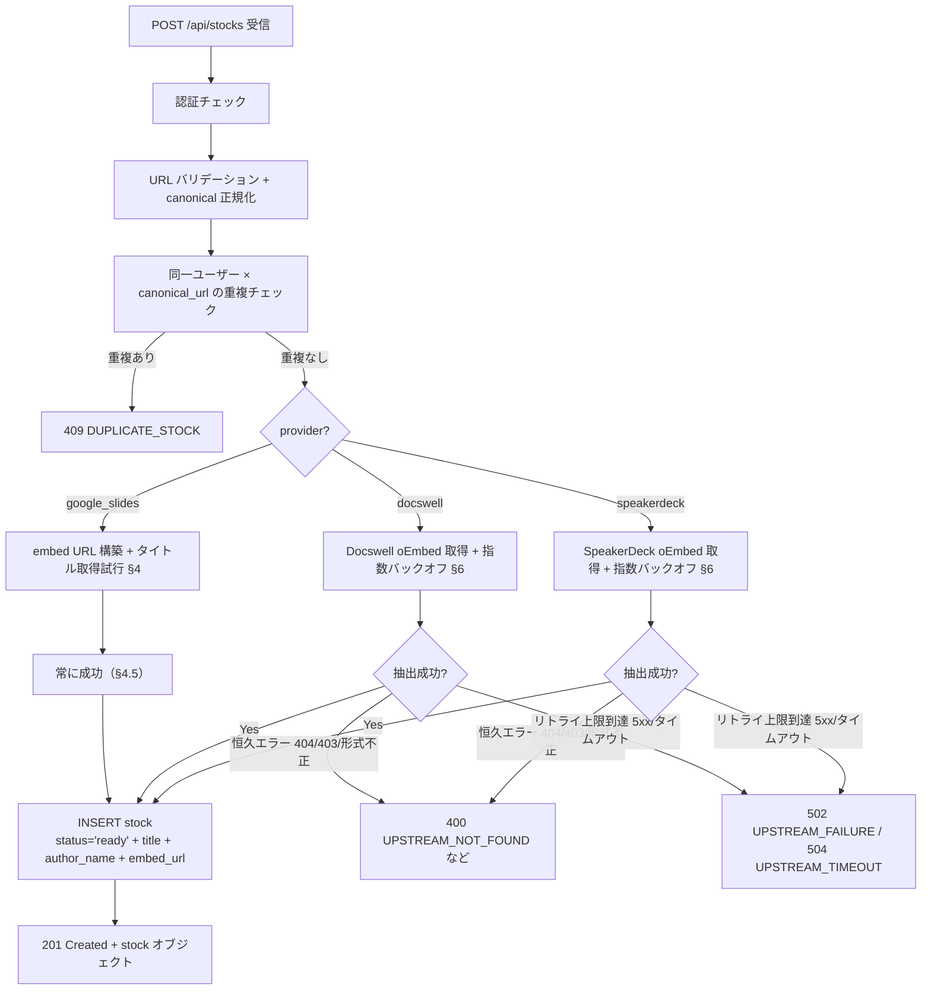

# oEmbed メタデータ取得仕様

## 1. 概要

ユーザーが URL を登録すると、`POST /api/stocks` のリクエスト内で oEmbed / メタデータ取得を**同期実行**してから 201 を返す。取得が成功した時点で stock は `title` / `author_name` / `embed_url` が揃った状態で永続化される。取得が失敗した場合は DB ロールバックでストックを作成せず、502 / 504 をクライアントに返す。

Cloudflare Queues / Queue Consumer / `pending` / `failed` ステータスは MVP では使用しない（将来非同期化する余地を残してスキーマには `status` カラムを残すが、MVP では常に `ready`）。同期モデルを採用する根拠は `ui-spec.md` §5.3.1 / §7.3 / `stock-api-spec.md` §3 を参照。

本仕様では以下を定義する:
1. 各プロバイダの oEmbed エンドポイントとレスポンス仕様（§2 / §3）
2. Google Slides の embed URL 構築ルール（§4）
3. 同期取得処理フロー（§5）
4. 指数バックオフリトライポリシー（§6）
5. 失敗時の DB ロールバックとユーザー応答（§7）

### 前提ドキュメント

- [docs/architecture.md](architecture.md) — スライド登録フロー（シーケンス図）
- [docs/database.md](database.md) — stocks テーブル（status は MVP では常に `ready`）
- [docs/provider-spec.md](provider-spec.md) — プロバイダ検出・URL 正規化
- [docs/stock-api-spec.md](stock-api-spec.md) — `POST /api/stocks` の処理フロー

---

## 2. SpeakerDeck oEmbed

### 2.1 エンドポイント

```
GET https://speakerdeck.com/oembed.json?url={canonical_url}
```

| パラメータ | 必須 | 説明 |
|-----------|------|------|
| `url` | Yes | 公開スライドの canonical URL（`https://speakerdeck.com/{user}/{slug}`） |

- 認証不要（パブリックエンドポイント）
- レスポンス形式は JSON 固定（`.json` サフィックス）
- `maxwidth` / `maxheight` パラメータは送信しない（デフォルトサイズを使用）

### 2.2 レスポンス例

```json
{
  "type": "rich",
  "version": "1.0",
  "provider_name": "Speaker Deck",
  "provider_url": "https://speakerdeck.com/",
  "title": "Atom",
  "author_name": "John Nunemaker",
  "author_url": "https://speakerdeck.com/jnunemaker",
  "html": "<iframe id=\"talk_frame_282032\" class=\"speakerdeck-iframe\" src=\"https://speakerdeck.com/player/31f86a9069ae0132dede22511952b5a3\" width=\"710\" height=\"399\" style=\"aspect-ratio:710/399; border:0; padding:0; margin:0; background:transparent;\" frameborder=\"0\" allowtransparency=\"true\" allowfullscreen=\"allowfullscreen\"></iframe>",
  "width": 710,
  "height": 399,
  "ratio": 1.7777777777777777
}
```

### 2.3 フィールド抽出マッピング

| oEmbed フィールド | 抽出方法 | → stocks カラム |
|-------------------|---------|-----------------|
| `title` | 直接取得 | `title` |
| `author_name` | 直接取得 | `author_name` |
| `html` 内の iframe `src` 属性 | 正規表現で抽出 | `embed_url` |
| （なし） | — | `thumbnail_url` = `null` |

### 2.4 embed_url の抽出

`html` フィールドから iframe の `src` 属性を正規表現で抽出する:

```typescript
function extractEmbedUrl(html: string): string | null {
  const match = html.match(/src="(https:\/\/speakerdeck\.com\/player\/[a-f0-9]+)"/);
  return match ? match[1] : null;
}
```

抽出結果例: `https://speakerdeck.com/player/31f86a9069ae0132dede22511952b5a3`

### 2.5 エラーケース

| HTTP ステータス | 意味 | 処理 |
|----------------|------|------|
| 200 | 正常 | フィールド抽出 → 後続フローで stock を INSERT（§5） |
| 404 | スライドが存在しない / 非公開 | 恒久エラー: リトライ不要、即座に 400 `UPSTREAM_NOT_FOUND` を返す（§6 / §7） |
| 5xx | SpeakerDeck 側障害 | 一時的エラー: 指数バックオフでリトライ（§6） |
| タイムアウト | ネットワーク／プロバイダ遅延 | 一時的エラー: 指数バックオフでリトライ（§6） |

---

## 3. Docswell oEmbed

### 3.1 エンドポイント

```
GET https://www.docswell.com/service/oembed?url={canonical_url}&format=json
```

| パラメータ | 必須 | 説明 |
|-----------|------|------|
| `url` | Yes | 公開スライドの canonical URL（`https://www.docswell.com/s/{user}/{slideId}`） |
| `format` | No | `json`（明示的に指定する） |

- 認証不要（パブリックエンドポイント）

### 3.2 レスポンス例

```json
{
  "type": "rich",
  "version": 1,
  "provider_name": "ドクセル",
  "provider_url": "https://www.docswell.com/",
  "title": "Windows Server 2025 新機能おさらい",
  "url": "https://www.docswell.com/slide/59VDWM/embed",
  "author_name": "Kazuki Takai",
  "author_url": "https://www.docswell.com/user/takai",
  "html": "<iframe src=\"https://www.docswell.com/slide/59VDWM/embed\" allowfullscreen=\"true\" class=\"docswell-iframe\" width=\"620\" height=\"349\" style=\"border: 1px solid #ccc; display: block; margin: 0px auto; padding: 0px; aspect-ratio: 620/349;\"></iframe>",
  "width": 620,
  "height": 349
}
```

> **注意:** `version` が数値 `1` で返る（oEmbed 仕様では文字列 `"1.0"` が正式）。実装では両方許容すること。

### 3.3 フィールド抽出マッピング

| oEmbed フィールド | 抽出方法 | → stocks カラム |
|-------------------|---------|-----------------|
| `title` | 直接取得 | `title` |
| `author_name` | 直接取得 | `author_name` |
| `url` | 直接取得 | `embed_url` |
| （なし） | — | `thumbnail_url` = `null` |

> **設計判断:** Docswell は `url` フィールドに embed URL（`https://www.docswell.com/slide/{slideId}/embed`）を返す。
> `html` 内の iframe `src` からも同じ URL を取得できるが、`url` フィールドを優先使用する（パースが不要でシンプル）。

### 3.4 エラーケース

| HTTP ステータス | レスポンス | 処理 |
|----------------|-----------|------|
| 200 | 正常な oEmbed JSON | フィールド抽出 → 後続フローで stock を INSERT（§5） |
| 404 | `{"status": 404, "errors": "Slide not found or private"}` | 恒久エラー: リトライ不要、即座に 400 `UPSTREAM_NOT_FOUND` を返す（§6 / §7） |
| 5xx | サーバーエラー | 一時的エラー: 指数バックオフでリトライ（§6） |
| タイムアウト | ネットワーク／プロバイダ遅延 | 一時的エラー: 指数バックオフでリトライ（§6） |

---

## 4. Google Slides（oEmbed 非対応）

### 4.1 方針

Google Slides は oEmbed に対応していない。以下の方法でメタデータを取得する:

1. **embed_url**: canonical URL から機械的に構築（外部リクエスト不要）
2. **title**: 公開ページの HTML `<title>` タグから取得を試みる（取得失敗時は `null`）
3. **author_name**: 公開ページには含まれないため、常に `null`
4. **thumbnail_url**: MVP では常に `null`

### 4.2 embed URL 構築ルール

```
https://docs.google.com/presentation/d/{presentationId}/embed
```

`presentationId` は canonical URL（`https://docs.google.com/presentation/d/{presentationId}`）から取得済み。

```typescript
function buildGoogleSlidesEmbedUrl(canonicalUrl: string): string {
  // canonicalUrl = "https://docs.google.com/presentation/d/{presentationId}"
  return `${canonicalUrl}/embed`;
}
```

> **注意:** embed パラメータ（`start`, `loop`, `delayms`）は付与しない。
> フロントエンドの iframe 生成時に必要に応じてパラメータを追加する設計とする。

### 4.3 タイトル取得

公開設定の Google Slides ページの `<title>` タグからタイトルを取得する。

**取得手順:**

1. canonical URL に対して HTTP GET を実行
2. レスポンス HTML から `<title>` タグの内容を抽出
3. ` - Google スライド` または ` - Google Slides` サフィックスを除去
4. 取得できた場合は `title` に設定、取得できなかった場合は `null`

```typescript
async function fetchGoogleSlidesTitle(canonicalUrl: string): Promise<string | null> {
  try {
    const res = await fetch(canonicalUrl, {
      headers: { "Accept-Language": "ja" },
      redirect: "follow",
    });
    if (!res.ok) return null;

    const html = await res.text();
    const match = html.match(/<title>(.+?)<\/title>/);
    if (!match) return null;

    return match[1]
      .replace(/ - Google (スライド|Slides)$/, "")
      .trim() || null;
  } catch {
    return null;
  }
}
```

**制約:**
- 非公開のプレゼンテーションでは 401/403 が返り、タイトル取得不可（`null`）
- Google のレスポンスは JavaScript レンダリング前提のため、`<title>` タグが空の場合がある（`null`）
- タイトル取得失敗は stock の `status` には影響しない（`embed_url` が構築できれば `ready`）

### 4.4 処理まとめ

| 項目 | 値 | 取得方法 |
|------|----|---------|
| `embed_url` | `{canonicalUrl}/embed` | 機械的構築（常に成功） |
| `title` | プレゼンタイトル or `null` | HTML `<title>` スクレイピング |
| `author_name` | `null` | 取得手段なし |
| `thumbnail_url` | `null` | MVP では取得しない |

### 4.5 成功判定

Google Slides は embed URL が canonical URL から機械的に構築できるため、**外部リクエストの結果に関わらず stock 作成は成功する**（§4.4 のとおり `embed_url` だけは必ず取れる）。タイトル取得の HTTP 失敗・タイムアウトは title=null として扱い、502 / 504 を返さない（同期モデルでも DB ロールバックの対象外）。

---

## 5. 同期取得処理フロー

### 5.1 全体フロー

`POST /api/stocks` のハンドラは、認証・URL バリデーション・重複チェックを通過した後、**stock を INSERT する前に**プロバイダ別の oEmbed / メタデータ取得を実行する。取得が成功したらメタデータを揃えた状態で stock を INSERT して 201 を返す。リトライ上限まで取得できなかった場合は INSERT せず（DB ロールバック相当の効果）502 / 504 を返す。


```mermaid
flowchart TD
    Req[POST /api/stocks 受信] --> Auth[認証チェック]
    Auth --> Validate[URL バリデーション + canonical 正規化]
    Validate --> Dup[同一ユーザー × canonical_url の重複チェック]

    Dup -->|重複あり| C409[409 DUPLICATE_STOCK]
    Dup -->|重複なし| Switch{provider?}

    Switch -->|speakerdeck| SD[SpeakerDeck oEmbed 取得 + 指数バックオフ §6]
    Switch -->|docswell| DW[Docswell oEmbed 取得 + 指数バックオフ §6]
    Switch -->|google_slides| GS[embed URL 構築 + タイトル取得試行 §4]

    SD --> ParseSD{抽出成功?}
    DW --> ParseDW{抽出成功?}
    GS --> ParseGS[常に成功（§4.5）]

    ParseSD -->|Yes| Insert
    ParseDW -->|Yes| Insert
    ParseGS --> Insert

    ParseSD -->|恒久エラー 404/403/形式不正| C400[400 UPSTREAM_NOT_FOUND など]
    ParseDW -->|恒久エラー 404/403/形式不正| C400
    ParseSD -->|リトライ上限到達 5xx/タイムアウト| C5xx[502 UPSTREAM_FAILURE / 504 UPSTREAM_TIMEOUT]
    ParseDW -->|リトライ上限到達 5xx/タイムアウト| C5xx

    Insert[INSERT stock<br/>status='ready' + title + author_name + embed_url] --> C201[201 Created + stock オブジェクト]
```

### 5.2 取得処理のシグネチャ

```typescript
async function fetchProviderMetadata(
  provider: Provider,
  canonicalUrl: string,
  signal: AbortSignal,
): Promise<StockMetadata> {
  switch (provider) {
    case "speakerdeck":
      return await fetchSpeakerDeckMetadata(canonicalUrl, signal);
    case "docswell":
      return await fetchDocswellMetadata(canonicalUrl, signal);
    case "google_slides":
      return await fetchGoogleSlidesMetadata(canonicalUrl, signal);
  }
}

interface StockMetadata {
  title: string | null;
  authorName: string | null;
  thumbnailUrl: string | null;
  embedUrl: string | null;
}
```

`signal` は §6.2 の合計タイムアウト制御に使う `AbortController` のもの。

### 5.3 INSERT のタイミング

メタデータ取得が成功した時点で `stocks` を INSERT する。`status` は MVP では常に `'ready'` を入れる（§7.1）。

```sql
INSERT INTO stocks (
  id, user_id, original_url, canonical_url, provider,
  title, author_name, thumbnail_url, embed_url, status,
  created_at, updated_at
)
VALUES (?, ?, ?, ?, ?, ?, ?, ?, ?, 'ready', ?, ?);
```

> **設計判断（INSERT を最後に置く）:** 旧仕様では status=pending で先に INSERT してから Queue Consumer が UPDATE していた。同期モデルでは取得失敗時に stock を残さない（ユーザー一覧に「失敗カード」が並ばない）ことを優先し、INSERT を最後に置く。これにより明示的な DELETE / UPDATE は不要で、失敗時は単に何も書かない。

### 5.4 oEmbed レスポンス検証

oEmbed レスポンスを受信した際、以下を検証する:

1. HTTP ステータスが 200 であること
2. Content-Type が `application/json` であること
3. `type` フィールドが `"rich"` であること
4. embed URL が抽出できること（SpeakerDeck: `html` 内 iframe src、Docswell: `url` フィールド）

検証失敗の扱いは §6.3 のエラー分類に従う（5xx / タイムアウトは一時的エラー、404 / 403 / 形式不正は恒久エラー）。

---

## 6. リトライポリシー（同期内・指数バックオフ）

### 6.1 リトライ機構

Cloudflare Queues は使用しない。`POST /api/stocks` のハンドラ内で `for` ループ + `setTimeout` による指数バックオフを実装する。

| 項目 | 値 | 備考 |
|------|----|------|
| 最大試行回数 | **3** | 初回 + 2 リトライ |
| バックオフ間隔 | 0ms → 500ms → 1500ms | 1回目失敗後 500ms wait、2回目失敗後 1500ms wait |
| 1 回あたりタイムアウト | **3 秒** | プロバイダごとの `fetch` に `AbortSignal.timeout(3000)` を渡す |
| **合計タイムアウト予算** | **12 秒** | 試行 3×3秒 + バックオフ 0.5+1.5秒 = 11秒 + 余裕 |
| 最終失敗時のレスポンス | 502 `UPSTREAM_FAILURE` / 504 `UPSTREAM_TIMEOUT` | DB ロールバック相当（INSERT しない、§7） |

```typescript
async function fetchWithRetry(
  fetcher: (signal: AbortSignal) => Promise<StockMetadata>,
  totalBudgetMs: number = 12_000,
): Promise<StockMetadata> {
  const totalDeadline = AbortSignal.timeout(totalBudgetMs);
  const backoffsMs = [0, 500, 1500];

  let lastError: unknown;
  for (let attempt = 0; attempt < 3; attempt++) {
    if (attempt > 0) {
      await sleep(backoffsMs[attempt]);
    }
    if (totalDeadline.aborted) {
      throw new UpstreamTimeoutError("total budget exhausted");
    }
    try {
      const perAttemptSignal = AbortSignal.any([
        AbortSignal.timeout(3_000),
        totalDeadline,
      ]);
      return await fetcher(perAttemptSignal);
    } catch (err) {
      if (err instanceof PermanentError) {
        // 404 / 403 / 形式不正 → リトライしない
        throw err;
      }
      lastError = err;
    }
  }
  throw new UpstreamFailureError("max retries exhausted", { cause: lastError });
}
```

> **設計判断:** Workers の CPU 時間制限（無料枠で 10ms / 有料枠で 30 秒）を考慮しても、`fetch` 自体は CPU 時間に計上されないため 12 秒の wall-clock 予算は実装可能。ユーザー側の体感は ui-spec.md §7.3（3 秒で進捗表示、8 秒で「もう少々お待ちください」）でカバーする。

### 6.2 合計タイムアウトの実装

`AbortSignal.timeout(12_000)` を 1 つ作り、各試行の `fetch` に組み合わせて渡す。`AbortSignal.any([...])` で「個別タイムアウト」と「合計タイムアウト」のどちらかが先に切れた時点で abort する。

### 6.3 エラー分類

| ケース | 分類 | 処理 | レスポンス |
|--------|------|------|-----------|
| oEmbed エンドポイント 5xx | 一時的 | リトライ | リトライ上限到達時 502 `UPSTREAM_FAILURE` |
| oEmbed エンドポイント タイムアウト | 一時的 | リトライ | リトライ上限／合計予算到達時 504 `UPSTREAM_TIMEOUT` |
| ネットワークエラー（DNS 失敗等） | 一時的 | リトライ | リトライ上限到達時 502 `UPSTREAM_FAILURE` |
| oEmbed エンドポイント 404 | 恒久 | リトライしない | 即座に 400 `UPSTREAM_NOT_FOUND`（スライドが存在しない／非公開） |
| oEmbed エンドポイント 403 | 恒久 | リトライしない | 即座に 400 `UPSTREAM_FORBIDDEN`（アクセス拒否） |
| oEmbed レスポンスパース失敗 | 恒久 | リトライしない | 即座に 502 `UPSTREAM_INVALID_RESPONSE`（プロバイダの仕様変更を疑う） |
| Google Slides の HTML タイトル取得失敗 | 軟性失敗 | リトライしない | title=null で stock を作成（embed_url は機械的に取れる、§4.5） |

> **設計判断:** 旧仕様では DLQ に積んで運用者が後追いで対処する想定だったが、同期モデルではユーザーが即座にエラーメッセージを受け取り再操作する形になるため、DLQ は不要。ログ（`console.error`）でプロバイダ仕様変更などを検知する運用に変える。

---

## 7. 失敗時の処理

### 7.1 DB ロールバック（実態は INSERT しない）

§5.3 のとおり、メタデータ取得が成功するまで `stocks` への INSERT は実行しない。失敗時は単に INSERT が走らず、ユーザーには 4xx / 5xx を返すだけで「半端なレコード」は残らない。

> **設計判断:** トランザクションでの明示的 ROLLBACK は不要（INSERT がそもそも発行されないため）。ただしテーブル設計上 `status` カラムは残してあるので、将来非同期化に切り替える際に `'pending'` の挿入と Queue による UPDATE を再導入できる（database.md `status` カラムの説明を参照）。

### 7.2 ユーザーへの表示

stock 作成は成功か失敗の二択。`pending` / `failed` カードは存在しない。

| API レスポンス | クライアントの表示（ui-spec.md §7.4） |
|---------------|--------------------------------------|
| 201 Created | 完成済みカード（title / author_name / embed_url が揃った状態）を一覧の先頭に追加 |
| 400 `INVALID_URL` / `UNSUPPORTED_PROVIDER` 等 | フォーム下に API の `error` 文をそのまま表示 |
| 400 `UPSTREAM_NOT_FOUND` / `UPSTREAM_FORBIDDEN` | 「スライドが見つかりません／公開されていません。URL を確認してください」 |
| 409 `DUPLICATE_STOCK` | 「このスライドは既にストック済みです」 |
| 502 `UPSTREAM_FAILURE` / `UPSTREAM_INVALID_RESPONSE` / 504 `UPSTREAM_TIMEOUT` | 「プロバイダから応答がありません。時間をおいて再度お試しください」+ 入力値はフォームに保持 |

### 7.3 再取得 UI は不要

旧仕様の「failed → pending 再取得ボタン」は同期モデルで不要になった（失敗時はそもそも stock が存在しない）。ユーザーは同じ URL を再送信するだけで再試行できる。

---

## 8. oEmbed 取得のタイムアウト

§6.1 に記載のとおり、同期モデルでは個別リクエストのタイムアウトを **3 秒**、合計予算を **12 秒** で運用する。プロバイダ別の値は以下:

| 対象 | 1 回あたり | 合計予算（試行 3 回） |
|------|-----------|---------------------|
| SpeakerDeck oEmbed | 3 秒 | 12 秒 |
| Docswell oEmbed | 3 秒 | 12 秒 |
| Google Slides HTML fetch（タイトル取得） | 3 秒 | 9 秒（embed URL は機械的に作れるためリトライしない / §4.5） |

`AbortSignal.timeout(3_000)` と合計予算用の `AbortSignal.timeout(12_000)` を `AbortSignal.any([...])` で合成して `fetch` に渡す（§6.2）。タイムアウト発生時は一時的エラーとしてリトライ対象（§6.3）。

---

## 9. セキュリティ考慮事項

### 9.1 SSRF 対策

API ハンドラが外部 URL にリクエストを送信するため、以下を考慮する:

- oEmbed エンドポイントのホスト名は固定（`speakerdeck.com`, `www.docswell.com`, `docs.google.com`）
- API ハンドラは **canonical URL のみ** を使用してリクエストを送信する
- canonical URL は `detectProvider` でバリデーション済みのため、任意 URL へのリクエストは発生しない

### 9.2 レスポンスサイズ制限

oEmbed レスポンスが異常に大きい場合に備え、レスポンスボディの最大サイズを制限する:

- oEmbed JSON: 最大 **100 KB**
- Google Slides HTML（タイトル取得用）: 最大 **500 KB**（HTML 全体を読む必要はなく、`<title>` が含まれる先頭部分のみ必要）

```typescript
const MAX_OEMBED_RESPONSE_SIZE = 100 * 1024;  // 100 KB
const MAX_HTML_RESPONSE_SIZE = 500 * 1024;     // 500 KB
```

---

## 10. 実装タスクとの対応

| タスク | 本仕様の該当セクション |
|--------|----------------------|
| T-521 oEmbed フェッチサービス実装 | §2, §3, §4（プロバイダ別メタデータ取得）+ §6（同期リトライ） |
| T-522（廃止） | 同期モデル化により Cloudflare Queues 設定タスクは不要 |
| T-523（廃止 → POST /api/stocks ハンドラへ統合） | §5（同期取得処理フロー）+ §7（失敗時の処理）。実装は stock-api-spec.md §3 のハンドラ内で完結 |
| T-524 oEmbed ユニットテスト | §2〜§4（レスポンスモック）、§6（リトライシナリオ・タイムアウト・恒久エラー）、§7（DB に書かれないこと）|
